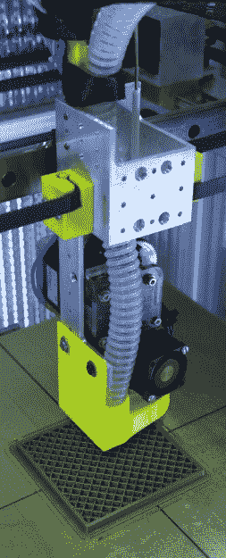

# CPAP 黑进了超级充电 3D 打印机冷却器

> 原文：<https://hackaday.com/2018/02/06/cpap-hacked-into-super-charged-3d-printer-cooler/>

在普通桌面 3D 打印机的所有部件中，喷嘴本身可以说是真正神奇的地方。在喷嘴上方，塑料被加热到所需的精确温度，以使其平稳流动。喷嘴正下方有一个风扇吹着，让塑料再次冷却下来。这种加热和冷却的精心平衡安排是高质量熔融沉积成型(FDM)印刷成为可能的秘密。

 但事实证明，让塑料变热比再次冷却要容易得多。残酷的现实是，大多数小到可以挂在 3D 打印机喷嘴旁边的风扇都非常脆弱。它们缺乏推动空气量的能力，而空气量是让塑料足够快地冷却下来所必需的。但是通过他的最新项目，[马克·雷霍斯特]希望改变这种情况。他没有使用更适合在树莓派的散热器上吹风的贫血的小风扇，而是使用一台被黑客入侵的 CPAP 机器来传递一些严重的气流。

使用 CPAP 机器进行这种攻击有两个好处。首先，这台机器使用了一个强大的离心风扇，而不是我们通常在 3D 打印机上看到的懦弱的轴向“松饼”风扇。第二，CPAP 将空气推下一根轻便灵活的软管，这意味着设备本身不必物理安装到打印机头上。你所需要的只是连接到 CPAP 软管的打印机喷嘴周围的歧管。这种“远程”风扇设置意味着打印头更轻，这(潜在地)转化为更高的速度和加速度。

[Mark]能够将他打印机的 SmoothieBoard 控制器上的风扇 MOSFET 连接到 CPAP 电机的无刷电机驱动器，从而让打印机控制这个巨大的新风扇。就软件而言，什么都没变。

他还没有想出一个真正优化的歧管设计，但初步测试看起来很有希望。但即使没有高度优化的空气出口，这种设置也已经优于传统的零件冷却器设计，因为它有更多的功率，并使风扇电机脱离打印头。

让你的 3D 打印部件冷却下来[是一件严肃的事情](https://hackaday.com/2017/11/11/fluid-simulations-in-the-kitchen-sink/)，随着打印机变得更快，这[只会变得更难。如果像这样的风扇设置在高端打印机上变得越来越普遍，我们不会感到惊讶。](https://hackaday.com/2017/12/09/mit-is-building-a-better-3d-printer/)