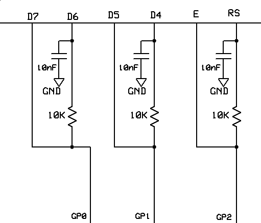

# 有史以来最疯狂的节省引脚的 LCD 技巧！

> 原文：<https://hackaday.com/2016/12/01/craziest-pin-saving-lcd-trick-ever/>

我们喜欢从一个小小的芯片中榨出最后一点硅质，或者至少我们乐于看到这样的事情发生。今天的模拟/数字黑客是我们在一段时间内见过的最甜蜜的黑客之一。这也是一个小难题，所以不要向下滚动到答案，直到你已经给了原理图一个很好的思考。

[克劳迪奥·拉里奥斯]制造了一个带 LCD 显示的[转速表](http://blog.larios.tecnologia.ws/iBlog/archives/8461)，只用了一个 8 引脚 PIC 微控制器作为大脑。([平移线](https://translate.google.com/translate?sl=auto&tl=en&js=y&prev=_t&hl=en&ie=UTF-8&u=http://blog.larios.tecnologia.ws/iBlog/archives/8461&edit-text=&act=url))。)两个引脚被电源占用，一个读取霍尔传感器，只留下三个引脚来驱动需要六个信号的 LCD 显示器。要解决的问题是基本的数学问题，即三小于六。现在看一下原理图。

 如果您以前没有玩过日立 [HD44780](https://en.wikipedia.org/wiki/Hitachi_HD44780_LCD_controller) 液晶控制器，它有四位和八位数据模式。在这里使用的四位格式中，您只需要发送关于 D4、D5、D6 和 D7 的数据。RS 在命令和数据模式之间选择，E 是在下降沿锁存数据的时钟信号。在阅读下一段之前，仔细考虑一下。

剧透！

[Claudio]所做的实际上是使用 10 nF 电容作为小存储器！(如果这个类比对你来说有点牵强，那就看看 DRAM 。)

在第一次通过时，PIC 的引脚在一段较长的时间内(500 微秒)设置为高或低，足够长的时间通过 10K 电阻对电容器进行充电或放电。在第二遍中，设置 D5 和 D7 的值，并且几乎立即上下选通 E 线，以锁存无电容线上的值。

第二遍发生得如此之快，以至于电容无法完全充电或放电，rs、D4 和 D6 读取第一遍中设置的任何逻辑值。太棒了。(哦，是的，这个项目是关于一个转速计。我们被闪亮的针拉伸把戏分散了注意力。我们确信这是一个很好的转速计。)你看到他只用三个大头针就成功了吗？！也没有移位寄存器？！？

读者[danjovic]给我们发来了提示，并对代码做了一点工作，验证了该技术有效，并提供了他的娱乐活动的横幅照片。非常非常感谢！