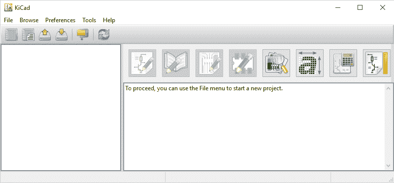
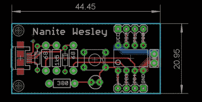
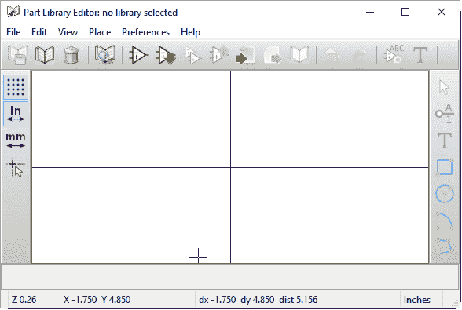
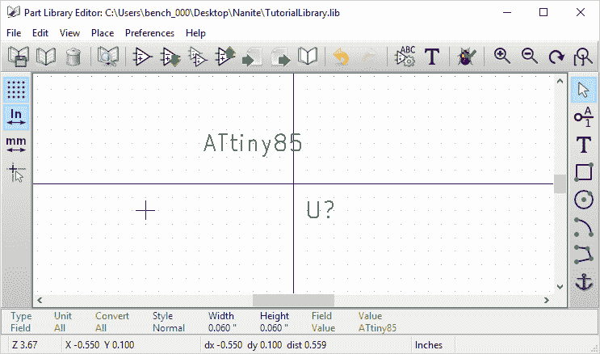
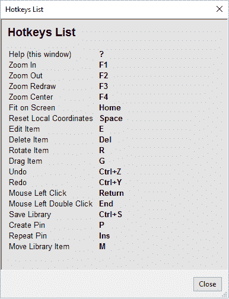
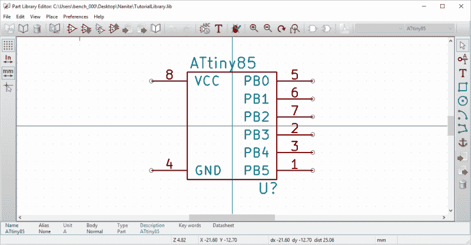
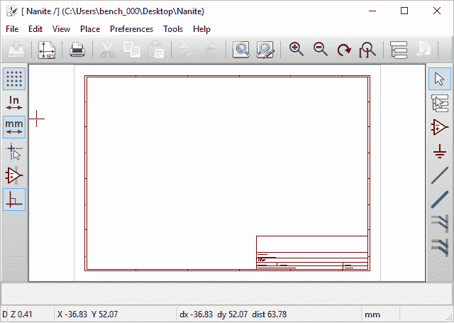
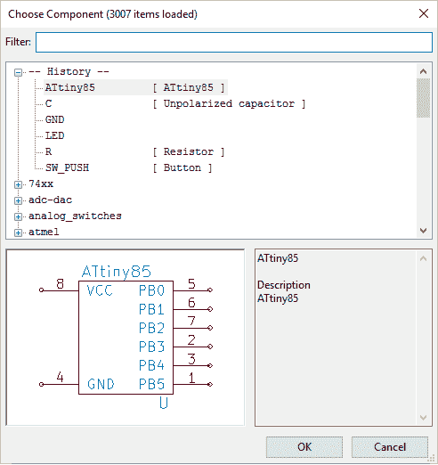
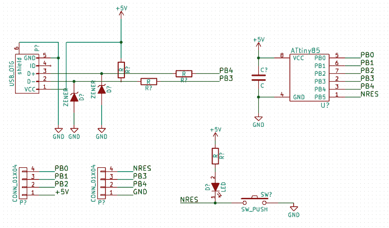

# 在所有事物中创建 PCB:KiCad，第 1 部分

> 原文：<https://hackaday.com/2016/11/17/creating-a-pcb-in-everything-kicad-part-1/>

这是演示如何在所有东西中创建 PCB 的系列文章的继续。在本系列中，我们采用标准参考电路和 PCB 布局——一个简单的 ATtiny85 板——并用不同的 PCB 设计工具构建。我们已经用 Protel Autotrax 看了一下 PCB 设计[的前期历史，我们了解到](http://hackaday.com/2016/11/10/creating-a-pcb-in-everything-protel-autotrax/) [Fritzing 是 PCB 设计的一个笑话](http://hackaday.com/2016/10/11/creating-a-pcb-in-everything-friends-dont-let-friends-use-fritzing/)，我们已经对 Eagle 做了[的深入研究。每个教程都有两个目的。首先，它快速介绍了各种 PCB 设计工具。其次，本系列提供了不同 PCB 设计工具之间的总体比较。](http://hackaday.com/2016/09/22/making-a-pcb-eagle-part-1/)

现在，终于，在许多抱怨之后，是大家期待已久的教程的时候了。该是 [KiCad](http://kicad.org/) 的时候了。

### 不，像巴约兰神职人员的头

虽然 KiCad(读作“Kai-Cad”像巴约兰神职人员的头，而不是“Key-Cad”像锁里的东西)是 PCB 设计的新热点。在过去的几年中，KiCad 安装的惊人增长是一个漫长的过程。自 1992 年开发以来，KiCad 已经成为首屈一指的开源 PCB 设计套件，自 2013 年以来 [CERN 一直为项目](https://home.cern/about/updates/2015/02/kicad-software-gets-cern-treatment)做出贡献。最近，KiCad 项目展示了一些令人惊奇的新特性。这些功能包括电路板的 3D 渲染、[交互式布线](https://www.youtube.com/watch?v=CCG4daPvuVI)、推-推、模拟和其他几十种功能，这些功能使它走上了与顶级 EDA 套件并驾齐驱的道路。再加上一些伟大的社区贡献，你会发现一些非常非常惊人的东西。所有这些都包含在一个开源许可中，就像演讲和啤酒一样免费。如果你在寻找 PCB 设计的未来， [Eagle 将会变得非常好](https://hackaday.com/2016/07/05/the-future-of-eagle-cad/)，但是 KiCad 现在几乎已经是开源的了。

### KiCad 概述

正如我在本系列文章的[介绍中所说，本教程将分为三个主要部分。首先是如何创建一个零件，特别是 DIP8 ATtiny85，作为原理图符号，以及如何创建我们需要的原理图。本 KiCad 教程的第二部分将为我们的符号分配封装外形，并将原理图转换成电路板，您可以发送到 fab house。最后，我们将看看 KiCad 的一些很酷的特性，比如推推走线和 3D 渲染。](https://hackaday.com/2016/09/21/creating-a-pcb-in-everything-introduction/)

对于 KiCad 教程的这一部分，我们将只关心如何在 85 年制作 DIP8 零件。[下载 KiCad](http://kicad.org/) 让我们开始吧。

Your first view of KiCad

就像 Eagle 和其他 PCB 设计工具一样，KiCad 中有几个不同的编辑器。它们是:

ee schema–原理图编辑器

原理图库编辑器-用于编辑零件库

PCB new——“董事会”编辑

PCB 封装外形编辑器——用于编辑零件的封装外形(物理封装)

可能需要介绍一下 PCB 设计的术语。一个**原理图**是抽象的设计文件，显示了电路中所有元件之间的电气连接。原理图不会发送到工厂。

一个 **PCB** 或**板**描述了元件、孔、焊盘、迹线、连接、机械设计和丝网印刷的布局。设计电路板是所有 PCB 设计工作的最终阶段，正是这个文件被送到工厂进行生产。

The schematic for our project

The board we will eventually build in KiCad. This board was made in Eagle.

在制作原理图和设计电路板之前，我们必须了解如何构建自己的器件。首先，安装 KiCad，选择文件->新项目，并将其命名为“Nanite”，或“一些我永远不会做的垃圾”

### 制造零件

所有这些教程都要求从头开始制作零件。现在，这意味着在 85 年为 DIP8 制造一个零件和一个脚印。从主 KiCad 窗口中，打开零件库编辑器，您会看到一个如下所示的窗口:

首次打开零件库编辑器时，不会加载任何库。你可能认为简单地*创建一个新的库*，并设计一些部分是可能的，但是 KiCad 很奇怪。要在 KiCad 中创建您自己的库，您必须首先选择一个现有的库，并将其另存为您自己的库。是的，这有点奇怪，是 T2 UX 的众多奇怪之处之一，但至少比油炸要好。

 保存您刚刚‘创建’的这个库，选择文件- >当前库，选择您刚刚保存的库。现在我们可以开始制造零件了。

单击“创建新元件”运算放大器图标，会出现一个窗口，要求您为器件命名。对于小而简单的 jellybean 组件，除了名称之外，您不需要考虑任何事情。将零件命名为 85，然后单击“确定”。零件的名称和代号将被放到窗口中。现在，我们准备添加引脚到我们的部分。

### 哦，上帝，一切都颠倒了，我的鼠标什么也没做

 如果你跟随本教程，这将是你第一次真正使用 KiCad 界面。KiCad 素有初学者难以理解的名声。想要证据吗？单击“ATtiny85”标签，并尝试移动它。你可能认为点击它就能做些什么，但这只是为文本打开了一些选项(粗体、斜体、大小、对齐)。如果‘attin i85’和‘U？重叠，单击它们会打开一个对话框。

这是有原因的:KiCad 和几乎所有其他 PCB 设计工具一样，都是基于热键的。这就是 KiCad 被认为不友好的原因，但是有一个解决方案:只需输入一个问号。热键列表将会弹出，现在你将永远知道你需要按什么键来做你想做的事情。要移动“ATtiny85”和“U？”标签放在一边，鼠标悬停在每个标签上时点击“M”。

现在是添加图钉的时候了。单击窗口右侧的“将管脚添加到组件”按钮。接下来，单击零件库编辑器窗口上的任意位置。

在“接点特性”窗口中，您可以为零件示意图中的所有接点指定名称、编号和图形样式。我们正在做一个非常简单的部分，电源和地在一边，所有的 IO 在另一边。只要引脚名称正确，并且所有引脚都与封装上的正确数字相对应，就不会有太多问题。唯一可能绊倒你的是大头针的方向；这里，每个引脚末端的圆圈表示引脚连接到原理图上网络的位置。

放下八个图钉，让你的零件看起来像我们在 Eagle 教程中制作的一样。你会得到这样的结果:

将引脚放入窗口并正确标记后，我们需要做的就是绘制一个矩形来完成该部分。单击“绘制矩形”图标，单击一角，拖动，然后再次单击以完成矩形。点击 File -> Save Current Library，我们就完成了这个零件的原理图符号的制作。

### 从符号到示意图

既然我们已经有了将在此板上使用的 ATtiny85 的符号，那么就该制作原理图了。从主 KiCad 窗口，打开电子原理图编辑器，您将看到以下窗口:

再说一次，热键会杀了你。要添加组件，请按“A”。你可能也想打“？”调出热键列表。

在这个阶段，我们不关心最终要放在电路板上的元件的尺寸。我们想要的只是符号。有数百种不同的 USB 连接器，但现在我们不在乎。我们只需在原理图上放置一些电阻、二极管、连接器和其它器件。为此，请按“A ”,下面的窗口将会弹出。

由于我们直接从本系列的简介中复制参考原理图[，我们需要以下组件:](https://hackaday.com/2016/09/21/creating-a-pcb-in-everything-introduction/)

*   两个 1×4 连接器
*   两个齐纳二极管
*   四个电阻
*   一个 LED
*   一个 USB 端口(OTG)
*   一顶非极化的帽子
*   一次一个 85
*   一些+5V 和 GND 符号

对于这些组件中的每一个，按“A”添加一个部件，搜索该部件，并将其放到原理图上。如果你真的很好，你可以使用' P '热键来添加电源和地面部分。完成后，您应该会看到如下所示的内容:

That looks about right

需要知道的重要热键是“A”添加一个部件，“M”移动一个部件，现在“W”在部件之间添加一条线。再次按下“？”显示热键列表。特别有趣的是“K”热键停止绘制电线。

 所有的电线都画好了，是时候给这些电线贴上标签，将它们连接成“网络”了。请看右边的参考原理图。原理图中从 USB/齐纳二极管/电阻块引出的电线标有“PB4”和“PB3”。这些网络连接到 ATtiny 上的 PB4 和 PB3 引脚，用于 USB 通信。1×4 接头直接连接到 ATtiny 上的每个引脚，因此我们对其进行相应标记。

要标记这些线并将其转换成网络，请使用“L”热键，并为每个网络选择一个名称。将此标签放在每根电线的开路连接上，将它们变成网络。完成后，您将得到如下所示的内容:

 我们*的示意图差不多做完了。我们现在要做的就是给相关部分增值。电阻必须标有正确的值，电容应为 22nF 左右，齐纳二极管的标签应为“3.6”。又到了热键的时间了，这次是由字母“V”带给你的。在所有的电容、电阻、二极管和 LED 上按下“V ”,并赋值。这考虑了每个部分的*值*，但是我们仍然需要给每个部分一个*名称*。为此，我们将使用顶部工具栏中的“注释原理图”工具。*

 *“注释原理图”工具会自动为每个零件分配一个字母(D 代表二极管，L 代表电感，R 代表电阻，Q 代表晶体管……)和一个数字。有选项来设置如何分配这些数字，但这是一个非常简单的电路，只需按下“注释”就足够了。

这样，我们的原理图就完成了。我们还没有为每个部分设置任何足迹，我们甚至还没有在板上开始。这篇文章已经有 2000 字长了，但是整个互联网都没有注意广度。

在本 KiCad 教程的下一部分，我们将了解如何为原理图中的器件分配封装外形(器件的物理表示)。我们将制作一个板，之后我们将看看 DRC，以及 KiCad 中的一些巧妙的技巧，包括 3D 渲染，将板变成一堆 Gerbers，并发送到 fab house。*