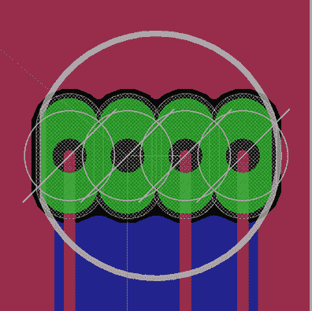
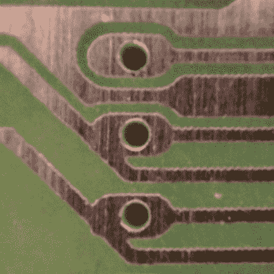
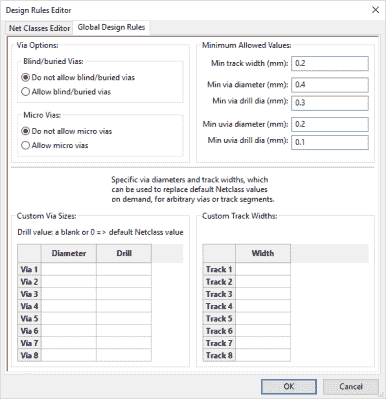
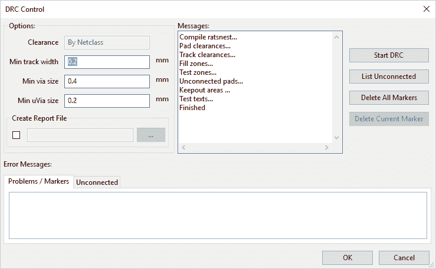
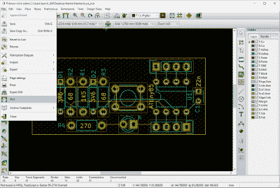
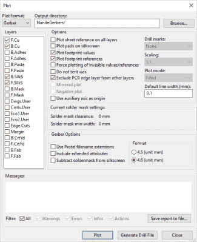
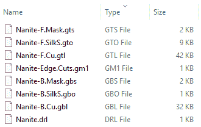
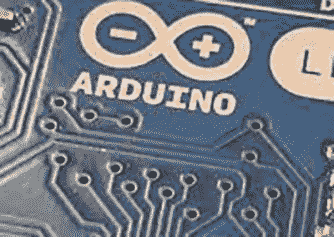
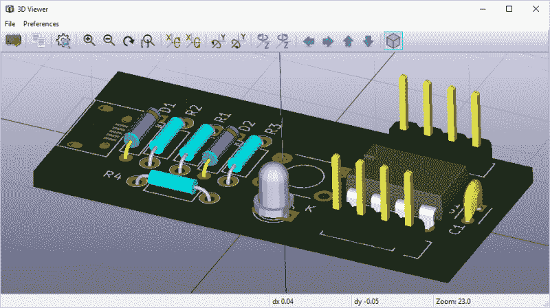
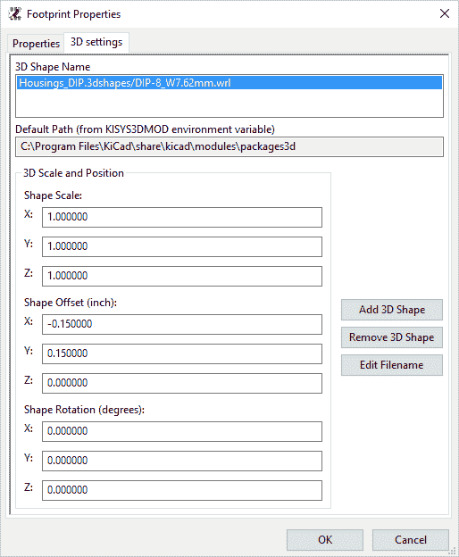

# 在所有事物中创建 PCB:KiCad，第 3 部分

> 原文：<https://hackaday.com/2016/12/23/creating-a-pcb-in-everything-kicad-part-3/>

这是关于如何在 KiCad 中创建 PCB 的系列文章的第三部分也是最后一部分，也是我在几十种不同的软件工具中制作相同原理图和电路板的系列文章[的一部分。几周前，我们看了看](https://hackaday.com/2016/09/21/creating-a-pcb-in-everything-introduction/)[在 KiCad](https://hackaday.com/2016/11/17/creating-a-pcb-in-everything-kicad-part-1/) 中制作原理图，最近又把原理图[变成了准备制作的电路板](http://wp.me/pk3lN-Yls)。

对于我们的 KiCad 教程，我们已经做了基础。我们知道如何制作 PCB，从零开始制作一个零件，然后把它变成电路板。这是被认为能够胜任 KiCad 的最低要求，但是这个神奇的工具还能提供更多的功能。

在本 KiCad 教程的第三部分，我们将看看如何将我们的电路板变成 Gerbers。这将允许我们发送板到任何 fab 房子。我们要去看看 DRC，这样我们就能确保一旦从 fab 收到电路板，它就能正常工作。我们还将看看 KiCad 必须提供的一些更酷的功能，包括推和推路由(用我们非常简约的板尽可能做到最好)和 3D 渲染。

### 刚果民主共和国

DRC，即设计规则检查，是一个自动化过程，软件检查电路板文件的设计。如果迹线靠得太近，DRC 会标记出来。如果孔太小，DRC 也会注意到。如果网络*应该*连接但没有连接，DRC 会发现并告诉你。我们最后一次看 DRC [是在老鹰](https://hackaday.com/2016/09/29/creating-a-pcb-in-everything-eagle-drc-and-gerber-files/)的时候。是的，Eagle 有 DRC，这里有两个很好的例子:

  Guess what’s wrong here?  What happens when you don’t run DRC in Eagle. Image credit: Quinn Dunki

 在左边，你看到一个带有特定问题的鹰库。注意该元件的所有焊盘是如何接触的？不，那没用，而且不，老鹰没抓到那个。在右边，您可以看到在 Eagle 中不运行 DRC 时会发生什么。

凯德比鹰更宽容。你不能简单地连接不同网络上的轨迹。KiCad 不允许你移动一个轨迹到一个焊盘上，它不应该像[Quinn]上面的例子那样连接。这并不意味着在设计 PCB 时你可以逃避任何责任；工厂仍然有设计规则，比如最小 6 密耳的走线宽度、最小钻孔直径以及对盲孔、埋孔和微孔的支持。

在开始布局 PCB 之前，最好先检查一下板房的设计规则，然后再放置器件和绘制走线。Seeed Studio 的设计规则可以被认为是最小公分母——如果你可以用这些规则进行设计，你就可以在任何地方制造你的主板。实际上，这意味着最小走线宽度为 10 密耳，最小间距为 10 密耳，最小孔尺寸为 0.3 毫米。

设计规则设定后，在从工具-> DRC 菜单生成 Gerbers 之前，构建您的电路板并运行 DRC。任何问题都会自动出现。

### 出口嘉宝

在过去的几个月里， [OSHPark 已经接受了原生的 KiCad 上传](https://blog.oshpark.com/2016/06/08/native-kicad-uploads/)。如果你想把你的冲浪板送到 OSHPark，你需要做的就是把你的冲浪板文件放到他们的上传界面上。如果你把你的板子送到 [Seeed 工作室](https://www.seeedstudio.com/fusion_pcb.html)、 [DirtyPCB](http://dirtypcbs.com/) 或任何其他板房会怎么样？在那里，你会有麻烦。你需要为这些板房生成 Gerber 文件。

Gerbers 是 2D 图像的矢量文件，每个单独的文件代表纸板的一层。一个 Gerber 文件告诉板房如何制作顶层铜层，而另一个文件告诉板房在哪里放置底层丝印等等。这些层的标准名称(更准确地说，文件扩展名)是:

*   **顶层**文件名。GTL
*   **顶部阻焊膜**文件名。全球电信系统(Global Telecommunication System)
*   **顶部丝印**文件名。矩形脉冲断开
*   **底层**文件名。GBL
*   **底部阻焊膜**文件名。GBS
*   **底部丝印**文件名。货物损坏
*   **电路板轮廓**文件名。GKO
*   **钻取**文件名。文本文件（textfile）

这很好，但是如何创建这些文件呢？从 PCBnew，转到 File -> Plot，检查弹出的窗口。

绘图窗口提供了几个选项。要生成 Gerbers，请为两层板选择以下层:

*   **F.Cu** 和**B . Cu**——这是你的前后铜层，会有文件扩展名*。GTL* 和*GBL* 。
*   **F .帛**和 **B .帛**——这是前后丝印，文件扩展名为*。GTO* 和。 *GBO* 。
*   **F .掩膜**和 **B .掩膜**——这是正面和背面阻焊掩膜。丝网印刷和阻焊膜有什么区别？去看看树莓派或者 Arduino。丝网是白色的，阻焊膜是绿色或蓝色的。丝网印刷(大部分)是为了显示轮廓和元件名称。阻焊膜保护铜层免受腐蚀，并(令人惊讶地)使焊料远离走线。文件扩展名为*。GTS* 和。 *GBS* 。
*   **边缘。切割**–这是电路板轮廓，文件扩展名为 *.GKO.*

 选择所有这些图层，然后看看你有哪些选项。如果您想在丝印层上绘制每个零件的值和参考，选择“绘制封装外形值”和“绘制封装外形参考”。要保存您与工厂之间的电子邮件，请选择 Gerber 选项框下的“使用 Protel 文件扩展名”。选择 Gerbers 的输出目录，然后点击“绘图”。

 这还没完，因为你还需要钻锉。钻孔文件是 Gerber 格式的害群之马。我甚至不确定这是不是 Gerber 格式的一部分，但是就像语言一样，现实是由普通的说法定义的，所以我们就*说*这个钻孔文件也是一个 Gerber。

钻孔文件只是一个巨大的文件，告诉 CNC 路由器所有的通孔需要去哪里。按下“生成钻孔文件”按钮，不要担心选项，并保存一个钻孔文件与您的 Gerbers 的其余部分。

右边是你将得到的结果:一堆带有奇怪文件扩展名的文件。将所有这些文件放在一个 ZIP 存档中，并放到 [OSHPark](https://oshpark.com/) 、 [DirtyPCB](http://dirtypcbs.com/store/pcbs) 或 [Seeed Studio](https://www.seeedstudio.com/fusion_pcb.html) 的上传页面上。即使是先进的电路也需要 Gerbers。

此外，在生成 Gerbers 时，还有一些更有趣的选项可供选择。“从丝印中去除阻焊膜”为丝印本身提供了更多的定义，如果你打算尝试 PCB 制造的艺术方面，你最好在你的电路板修订中选择该选项。

此外，KiCad 内置了对帐篷式和非帐篷式过孔的支持。什么是拉幅过孔？看看这个:

    

标准的 Arduino Leonardo 实际上是一块非常漂亮的电路板，在阻焊层下有明显的蜿蜒痕迹。这些走线的过孔覆盖有阻焊膜。这就是所谓的帐篷通孔。这样做的原因是为了防止过孔的环形圈意外短路。在 Arduino 板上，帐篷状过孔的价值是显而易见的——孩子们会在过孔中插入引脚，通常会把事情搞得一团糟。另一方面，未测试的过孔在环形圈上没有阻焊层。这有利于返工电路板，但成品并不美观。

是的，您可以在其他 PCB 设计程序中设计有孔或无孔的过孔。我已经在 Eagle 中完成了，但是这个过程有点倒退，没有太多的意义。在 KiCad 中，一个按钮就可以打开(或打开)过孔，这是一个非常好的特性。

### 交互式路由器和 3D

KiCad 有很多功能都在“创建 PCB”的常规工作流程之外，但其中一些工具非常非常酷。从 Pcbnew 窗口中，选择 View -> 3D Viewer，您将看到类似如下的内容:

 那是我们一直在做的棋盘的 3D 模型，大部分零件都自动放置在各自的位置上。有了这个模型，你可以导出到 VRML，导入到 OpenSCAD，把你的电子设计变成一个*机械*设计。PCB 和机械设计的交叉是工程师的圣杯，很少有工具能够像 KiCad 一样在物理空间中模拟电子元件。Altium 能做到(而且能做得很好)，Eagle 很快也会获得这种能力(因为 Autodesk)。如果你需要为你的 PCB 做一个外壳，这就是你要做的。

关于 3D 视图，我想提一个技巧。首次打开 3D 视图时，有些零件没有 3D 模型。这很容易解决——只需点击 Pcbnew 中的器件，然后使用热键“E”。这将打开“封装外形属性”窗口，带有一个用于 3D 设置的选项卡。在这里，您可以从[标准 KiCad VRML 文件](https://github.com/KiCad/kicad-library/tree/master/modules/packages3d)中选择一个 3D 形状，并缩放和偏移这些形状以适合您的电路板。

最后，让我们看看 KiCad 的交互式路由器。这是 KiCad 的一个非常强大的特性，它使得布局巨大的电路板变得更加容易。通过选择一条迹线并在电路板上移动它，交互式布线器会将其他迹线移开。它还会使用最有效的路径将轨迹从 A 点路由到 B 点，而不会与其他轨迹相交。最好的例子来自 KiCad 开发人员之一:

 [https://www.youtube.com/embed/CCG4daPvuVI?version=3&rel=1&showsearch=0&showinfo=1&iv_load_policy=1&fs=1&hl=en-US&autohide=2&wmode=transparent](https://www.youtube.com/embed/CCG4daPvuVI?version=3&rel=1&showsearch=0&showinfo=1&iv_load_policy=1&fs=1&hl=en-US&autohide=2&wmode=transparent)

我会在我的小而简单的板上演示这一点，但没有太多的轨迹让交互式路由器变得有趣。

### 对基卡德来说就是这样

在 KiCad 教程的第一部分，我讲述了如何创建原理图。[第二部分](https://hackaday.com/2016/12/09/creating-a-pcb-in-everything-kicad-part-2/)讲述了如何从零开始制作一个器件，然后将原理图转化为 PCB，准备投入生产。现在，经过 6000 字的学习，你知道如何制作原理图、尺寸、封装和 PCB，并确保一切都是正确的。

我们已经完成了 KiCad，满足了我从开始这个系列文章以来不断收到的请求。现在，我终于可以把我的努力转向开源 PCB 设计工具，你*不应该*使用。在本系列的下一篇文章中，我将报道一些前所未有的事情。我将有一个关于如何从零开始在烧结*中创建一个部分的教程。这以前从未被记录，甚至 Fritzing devs 说这是不可能的。如果你想知道，是的，我放在一个从零开始创建一个部分的教程的奖金已经被认领了。在那之前，请不要使用 Fritzing，因为它仍然很糟糕。使用 KiCad。*