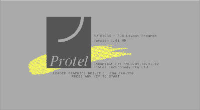
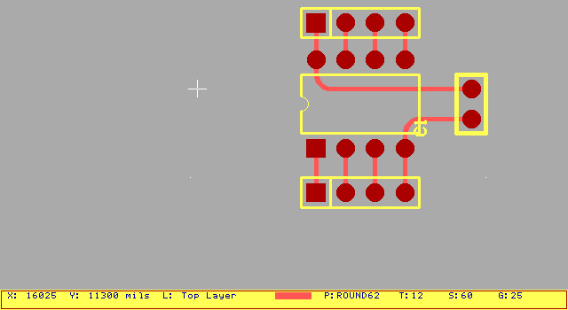
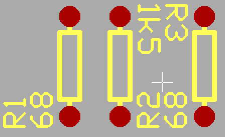
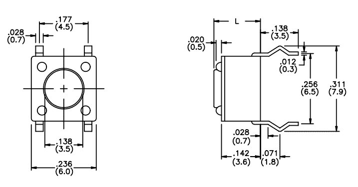
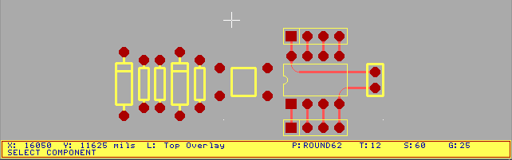
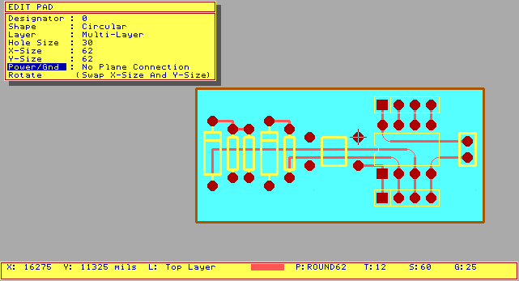

# 在一切事物中创造 PCB:Protel auto trax

> 原文：<https://hackaday.com/2016/11/10/creating-a-pcb-in-everything-protel-autotrax/>

Protel Autotrax 是 80 年代中期首次为 DOS 发布的 PCB 设计工具。考虑一下 PCB 设计软件的历史。我并不建议任何人真正使用 Protel auto trax——更好的工具和更好的支持是存在的。但重要的是要知道我们从哪里来，以了解现在可用的 EDA 工具。我正在卷起袖子(大约有 30 年的历史)，用这个工具构建我们的标准化测试 PCB。除此之外，我建议观看 [EEVblog #747](https://www.youtube.com/watch?v=iwRhvhKJlzs) ，在那里【戴夫】挖掘他的一个旧项目，Borland Pascal 和 Protel Autotrax。

这是演示如何在所有东西中创建 PCB 的系列文章的继续。在本系列中，我们采用标准参考电路和 PCB 布局——一个简单的 ATtiny85 板——并用不同的 PCB 设计工具构建。[我们已经在这个系列中介绍过老鹰](http://hackaday.com/2016/09/22/making-a-pcb-eagle-part-1/)。我们了解到 [Fritzing 对于 PCB 设计来说是一个笑话](http://hackaday.com/2016/10/11/creating-a-pcb-in-everything-friends-dont-let-friends-use-fritzing/)，尽管它对于制作电路的试验板图形来说非常好。每篇教程都是对特定 PCB 设计工具的快速介绍。总的来说，本系列提供了不同 PCB 设计工具之间的比较。让我们深入了解 Protel Autotrax。

### Protel、Altium 和 Autotrax 简史

我们今天所知的 Altium 公司在成立后的前 15 年名为 Protel。在过去的日子里，在计算机上设计 PCB 需要一个专用的工作站、大量的硬件、光笔，所有的东西都非常昂贵。Protel 是对此的反应，第一个产品 Autotrax 是一个基于 DOS 的程序，它将 PCB 设计带到了 PC 上。Autotrax [的免费版本仍然可以在 Altium 网站](http://techdocs.altium.com/display/ALEG/Freeware+downloads)上获得，并且可以在 DOS 虚拟机或 DOSBox 中运行。

有趣的是，Protel Autotrax 并不是唯一一款名为 Autotrax 的 PCB 设计软件。一家叫 DEX 2020 的公司有[也有一款 PCB 设计软件叫 AutoTRAX](http://www.dexpcb.com/) 。这很奇怪，令人困惑，我想不通这怎么不违反商标。如果有人对 Protel / Altium 法务部几十年前在做什么有任何见解，欢迎在评论中发表您的智慧。

The splash screen for Protel Autotrax.

Autotrax’ main screen

### 现代和古代的工作流程

在任何软件中创建 PCB 都有三个主要步骤。首先，创建原理图。这个示意图只是用网络连接在一起的部件和符号的集合。第二，将原理图转换成电路板文件，放置器件和焊盘，将网络转换成走线，并创建电路板的机械定义。第三，这个板被导出成绘图仪、激光打印机或 OSH Park 可以理解的东西。这三个过程在每一个 PCB 设计工具中都有不同程度的体现。

Autotrax 是古老的，因此，我们应该期待一些怪异。Autotrax 没有“原理图创建”模式。相反，应在另一个 CAD 程序中创建原理图(Protel 原理图是 Autotrax 的最佳选择)，导出网表，并由此构建电路板。或者，纸笔 DaveCAD 就足够了。

如果这个教程是关于从零开始设计电路板，这将是一件非常糟糕的事情。好消息是我们已经知道[电路是什么，电路板看起来像什么](https://hackaday.com/2016/09/21/creating-a-pcb-in-everything-introduction/)。无论如何，这是一条简单的赛道。因此，我们可以使用标准 Autotrax 库中的大部分部件，复制我们的电路板，并且所有的*应该*工作。

### 如何自动跟踪

The first few components placed. Here, you can see the ATtiny85, a decoupling cap, and a 1×4 pin headers found in the reference board for this series.

Autotrax 是多层聚酯薄膜、胶带和 Xacto 刀的数字等价物。要放置零件，您需要放置一个*包*。与现代 PCB 设计工具相比，这是非常不寻常的，但有了 Autotrax，让电路*正确*的责任就落在了设计师身上。在上图中，我已经放置了 ATtiny85、引脚接头和去耦电容。下一个任务是为电阻放置一些 0.3”轴向元件，为二极管放置一些封装，一个按钮和一个 USB 微型端口。

为该电路放置电阻非常简单，只需使用**P**lace**C**component 热键并在库中查找即可。在这里，你可以找到所有你期望从 80 年代的设计工具中得到的包。当时 PGA 很流行，虽然 SMD 电阻可以在标准元件库中找到，但显然通孔轴向元件是主流。

选择所需元件后，需要选择一个*元件代号*。这是器件名称，通常按顺序编号，前缀通常为一个字母(R 代表电阻，C 代表电容，U 代表某种芯片，L 代表电感等)。一旦组件标志符被分配，你给零件一个*注释*——一个值。我使用 68ω和 1.5kΩ电阻，因此我对这些电阻的评价是“68”和“1k5”。为了保持清醒和清晰，我将从现在开始删除这些指示器和注释。

### 制造零件

本系列的所有文章都涉及到从零开始制作零件。通常，这意味着在我正在使用的任何软件包中重新创建 ATtiny。不过，Autotrax 很奇怪，我在组件库中已经有了一个 DIP8。因此，我将为参考设计中使用的通用轻触开关创建一个包。

The ubiquitous tact switch. This is taken from the Apem Inc. MJTP-series datasheet

为了保存我目前所做的工作，我需要清除 Autotrax 窗口中的所有内容。然后，这是一个简单的问题，把垫和顶部覆盖(顶部丝印)轨道应该去的地方。我想我已经很接近了。

将衬垫和轨道的集合转换成一个零件需要定义一个新的*块*，在零件周围画一个矩形，并创建一个新的库来存储新的零件。之后，我加载我正在处理的 PCB 文件，并将器件放入:

I will not be adding the USB port to this board. That’s not to say I *can’t* add the USB port, I just don’t want to.

由于我不会添加一个微型 USB 端口到这个板，我已经完成放置零件。我需要做的就是在每个部分之间画出痕迹，并画出一个板的轮廓。

### 按指定路线发送

像放置组件一样，放置跟踪是热键疯狂中的一次冒险。选择 **P** 蕾丝， **T** 种族，并在它们应该去的地方画线。完成后，您可以为接地层和电源层添加填充，最后通过编辑单个焊盘将焊盘连接到这些层。

### 结论

虽然这一系列帖子的标题是“在所有东西中创建 PCB”，但这个具体的帖子并没有一步一步地讲述如何在 Protel Autotrax 中创建参考电路和 PCB。说实话，我已经完全忽略了参考电路上的 USB 口，电路本身是不行的，把这个设计变成 PCB 需要一个我没有的物理绘图仪或者软件。这是故意的。你不应该在 2016 年使用 Autotrax for Real Work。请将这篇文章视为 1988 年 PCB 设计的标杆。

Protel Autotrax 是将 PCB 设计带给大众的首批软件之一。因此，UX 是最接近磁带，聚酯薄膜，夏普斯，敏化覆铜板，和西克托刀，DOS 必须提供的东西。这是整个行业的开始。在过去的三十年里，PCB 设计水平有了巨大的提高。现在，我们有了包含*部件*的部件库，而不仅仅是包。我们有*推挤*路由。我们有两个按钮的鼠标和分辨率高于 EGA 的显示器。不过，Autotrax 是它开始的地方，在我找到 Rubylith 或那些整洁的 IC 胶带贴纸的来源之前，这将仍然是如何在所有东西中创建 PCB 的预史。