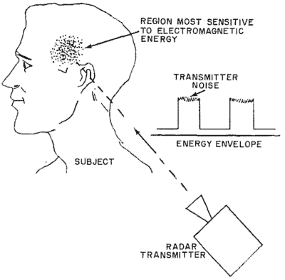

# 古巴大使馆袭击和微波听觉效应

> 原文：<https://hackaday.com/2017/09/25/cuban-embassy-attacks-and-the-microwave-auditory-effect/>

如果你一直在关注新闻，你可能已经看到了一系列关于美国驻古巴工作人员的文章。似乎有 21 名员工遭受了一系列奇怪的伤害，从听力丧失到头晕到类似脑震荡的创伤性脑损伤。一些工作人员报告说在大使馆和他们的酒店房间里听到了使人丧失能力的声音。这些报告包括咔哒声、研磨声、嗡嗡声，甚至刺耳的声音。一名员工描述说，他被一声可怕的巨响惊醒，但他一离开床，声音就消失了。当他回到床上时，那个神秘的声音又出现了。

古巴否认有任何不当行为。然而，美国已经开始采取行动——在 5 月份驱逐了两名古巴外交官。问题是到底是什么导致了这些伤害。媒体疯狂地谈论着声波武器、隐藏的窃听器、电子设备、毒药等等理论。就连朱利安·阿桑奇(Julian Assange)也加入了进来，称“症状的多样性表明，这是一种在孤立的外交使团中结合了偏执的病原体。”

这是怎么回事？离奇事故？斗篷和匕首歪了？美国国务院中的大规模歇斯底里，或者完全是别的什么？

流传最广的理论是某种听觉或声波武器。像[远程声学装置(LRAD)](https://en.wikipedia.org/wiki/Long_Range_Acoustic_Device) 这样的声学(超声波)非致命武器是众所周知的，因为它们被执法部门用来驱散抗议活动，或在远洋船只上用来威慑海盗和环保主义者。LRAD 装置发出非常响亮的聚焦声束。通常，这种声音是警笛声，尽管该系统也可以用作一个巨大的扩音器。光束中的任何人都有动力摆脱它。

LRAD 设备的特点是它们不小也不轻。即使使用超声波，你也无法打败物理。制造大量噪音意味着振动大量空气。这需要一个相对较大的扬声器。最小的便携式设备大约有 15 磅重。由于 LRAD 仍然在振动空气，它不会很好地穿透墙壁。LRAD 风格的设备也不是很隐秘。它们发出 30 到 60 度宽的光束，所以肯定不是声音激光。它们也有很多溢出物——站在设备后面的操作者总是需要佩戴听力保护装置。

## 打开你的锡纸帽子

一个我没怎么见过的理论是微波听觉效应。这是一种指向人体头部的 RF 能量被转换成目标可感知的声音的现象。艾伦·h·弗雷在 1961 年发表了第一篇关于这种效应的论文。弗雷在纽约康奈尔大学的通用电气高级电子中心工作。

需要注意的是，这里的微波指的是所传输的 RF 信号的波长。微波包括从 1 米波长(300 MHz)到 3 毫米波长(100 GHz)的任何信号

Images from Frey’s paper

弗雷的文章描述了当发射器指向他们的头骨时，测试对象如何能够听到嗡嗡声、滴答声、嘶嘶声甚至敲门声。奇怪的是，一些测试对象部分失聪，但仍然能够听到微波的声音。此外，受试者可以感受到微波束的影响。根据发射器的设置，受试者会感到“头部剧烈抖动”。进一步的递质变化导致受试者报告“发麻”的感觉。

这篇论文的目的是引起人们对这一现象的注意。弗雷没有资源来完全探索微波听觉效应，所以他希望其他人开始研究它。这在科学上相当于说“嘿，这很棒，你应该看看！”

如果你还没有猜到，听到微波声音所需的功率水平相当高。弗雷使用了几种不同功率的发射器。发射机是脉冲式的，就像磁控管一样，所以虽然平均功率很低，峰值功率却很高。

例如，Frey 使用的最弱的发射器能够在 1310 Mhz 下输出 4 w/m 的功率密度。峰值功率为 2670 w/m。美国在该频率下的人体辐射指南为 6.55 w/m。Frey 使用的另一种发射机在 425 MHz 下测得的功率为 71 w/m，峰值功率为 2540 w/m。与 FCC 在该频率下的指南 2 w/m 进行比较。

到底是什么原因导致射频能量转化为声音？微波听觉效应背后的机制尚未得到科学证明。主导理论是脉冲射频能量加热内耳组织，导致它们快速扩张。这些膨胀引起微小的冲击波，然后被大脑解释为声音。

弗雷指出，“人们可以用一块 2 英寸见方的飞屏屏蔽一部分(太阳穴)并完全切断射频声音。”防蝇网是用于纱门的精细金属网格。弗雷可能不知道，但他提供了锡纸帽人群需要的所有证据。

当然，如果没有人尝试用它来制造武器，这样的技术是不可能存在的。在 21 世纪初，美国海军资助了使用无声音频(美杜莎)对暴徒过度威慑的研究。这是一种“低致命武器”,利用微波听觉效应来控制人群。它利用了一个电子控制的天线，可以发射宽或窄的射频波束。美杜莎甚至可以同时“聚焦”多个目标。

美杜莎从未成为一种野战武器。该项目的初步结果很有希望，但其安全性存在问题。在所用的高能量水平下，微冲击波真的会伤害敏感的脑组织吗？敏感神经元的射频暴露呢？这个项目最终被取消了。

回到今天，微波听觉效应能在古巴发挥作用吗？很有可能。这种技术肯定是存在的——其效果已经在 20 世纪 60 年代的发射机上得到了证明。有了足够的能量和窄波束天线，攻击者甚至不需要和他们的目标在同一个房间或建筑里。功率水平高到足以让人听得见，甚至引起疼痛，也可能导致头晕、恶心，甚至创伤性脑损伤。我们所能做的就是等待目前的调查结果，并随身携带一顶锡纸帽。