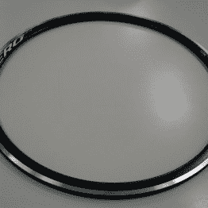
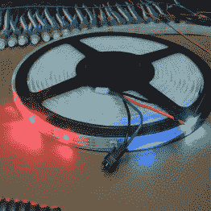
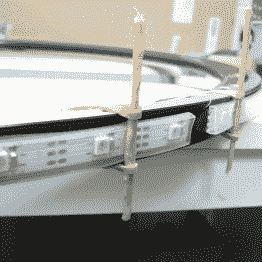

# 自行车手的 LED 像素时钟中间没有脂肪

> 原文：<https://hackaday.com/2016/07/27/cyclists-led-pixel-clock-has-no-fat-around-the-middle/>

如果你喜欢 LED 时钟和照明自行车车轮，[Harald Coeleveld]正好有适合你的周末项目。他的 [RGB 像素 LED 时钟](https://coeleveld.com/arduino-nano-rgb-pixel-led-clock/)既简单又漂亮，而且它可以在任何时间内建成:极简和运动的设计只不过是一个缠绕在自行车轮圈上的 LED 灯条。

[Harald]将 2 米长的可寻址 WS2812 LED 条(我们假设每米有 30 个 LED)缠绕在一个 27 英寸的自行车轮圈上，轮圈上填充了泡沫条，并在一个环上获得了 60 个等距的 RGB LEDs，非常适合显示时间。显然，这个特殊的 27”自行车轮的轮辋胶带周长足够接近 2 米，所以它完美地排列在一起。

在电子方面，该项目采用了 Arduino Nano 和 DS3231 precision RTC 模块。为了在白天和夜晚两种照明模式之间切换，【Harald】还增加了一个光敏电阻。白天，圆环周围的彩色圆点显示时间:一个红色圆点代表秒，一个蓝色圆点代表分，一组 3 个绿色 led 代表小时。在晚上，整个戒指闪烁着有效的红色光芒，更容易阅读。

      

这个版本的 Arduino 代码可以从[项目页面](https://coeleveld.com/arduino-nano-rgb-pixel-led-clock/)下载，任何人都可以在一个小时内毫不费力地复制这个设计。