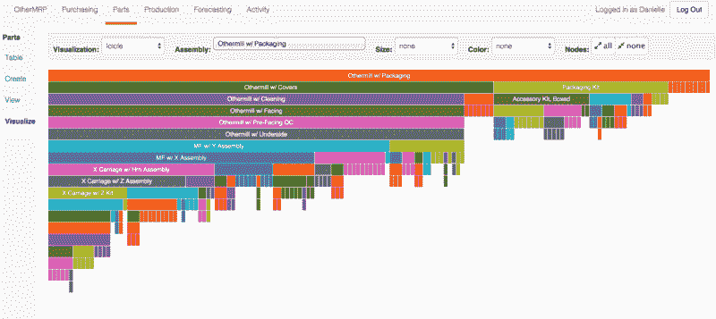

# 丹妮尔·阿普尔斯通和其他磨坊的故事

> 原文：<https://hackaday.com/2015/12/14/danielle-applestone-and-the-story-of-every-othermill/>

我们中的许多人可能有资格成为“制造者”，但是“机器制造者”又如何呢[Danielle Applestone]告诉我们在开始硬件创业冒险时应该注意哪些问题。Other Machine Co 是一家制造公差精确到千分之一英寸的 PCB 工厂的公司，该公司的创始人之一，[Danielle]拥有麻省理工学院和德克萨斯大学奥斯汀分校的化学和材料科学学位。虽然她可能会告诉你，经营一家硬件公司的数学很简单，但知道要处理哪些数字并记录下来，一直是她成功的关键。所以，花上 20 分钟，给自己一点时间从她在[hack aday super conventi on](http://hackaday.io/superconference)的演讲中吸取【丹妮尔】的建议，在硬件创业的土地上战胜未来的障碍。

 [https://www.youtube.com/embed/LNidIy7t0DQ?version=3&rel=1&showsearch=0&showinfo=1&iv_load_policy=1&fs=1&hl=en-US&autohide=2&wmode=transparent](https://www.youtube.com/embed/LNidIy7t0DQ?version=3&rel=1&showsearch=0&showinfo=1&iv_load_policy=1&fs=1&hl=en-US&autohide=2&wmode=transparent)

### 小 Co；“大”数据

像许多创业公司一样，Other Machine 的发布日期不断逼近，迫使团队未经测试就发布了他们的产品。被剥夺了寻找 bug 的时间，OtherMachine 用一个聪明的计划向前推进，这个计划使他们能够从他们的用户那里学到最多的东西:精明地记录每一个售出的磨坊的生产数据。谁组装了这个磨坊？检查。这家工厂的零件是由哪些供应商提供的？检查。用于组装该磨机的组装说明是什么版本？检查。有了详细的元数据集群，其他机器可以根据单个用户报告的故障跟踪甚至预测特定批次的机器中的问题。有了这么多现成的数据，他们甚至开发了一个内部应用程序来简化工厂数据的记录过程。

有了这些数据，推出一款未经测试的产品并不是漫无目的地向未知领域跳跃。这是一个适时的跳跃，钩子深深地嵌入到过程中，使其他机器能够在现场学习他们的产品。

### 作为版税的客户

在一个充满未经测试的机器的领域，OtherMachine 的 Kickstarter 支持者成为了发布会上的第一批试验品。更复杂的是，另一家工厂在出售时改变了设计。随着团队继续迭代设计，零件被交换、修改或添加。为了补充机器未经测试的历史和持续的变形，Other Machine 的团队随时准备解决客户的问题。他们最大的资产？通过广泛的日志记录基础设施，对每台机器的历史记录进行精确跟踪。当然，机器可能有不同的物料清单或 CAD 模型，但因为其他机器可以非常详细地讲述每台机器的故事，所以它们可以为在野外失败的机器提供即时的个人支持。

### 经过社区检验的胜利

凭借记录每个工厂故事的聪明远见，Other Machine Co .进行了——并将继续进行——一项产品范围的实验，以生产一个不仅在他们的工作台上，而且在他们每个客户的工作台上工作的 PCB 工厂。对于未来的潜在买家，不要害怕！OtherMill 是一个众筹和社区测试的成功，对于真正持怀疑态度的人，[Matt]给了我们关于这个工具到底有多闪亮的内幕消息。