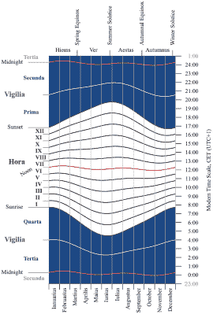
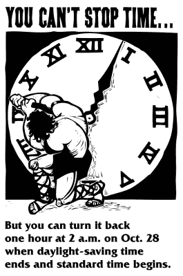
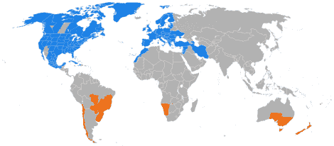
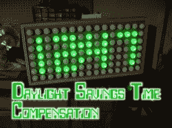

# 夏令时——为什么和为什么不

> 原文：<https://hackaday.com/2016/11/28/daylight-saving-time-whys-and-why-nots/>

我们最近经历了一年两次的公共发泄期，称为调整夏令时(DST)，在英国称为英国夏令时(BST)。但是我们为什么要改变时间呢？说真的，这一切是谁造成的？它有用吗？我们还需要它吗？我们能做些什么呢？正如你将在下面看到的，事实证明，我们大多数人都想要它。

## 我们生活在美好的时代

 

古罗马守时，由 darekk 2–自己的工作【CC BY-SA 4.0】，via [维基共享](https://en.wikipedia.org/wiki/File:Ancient_Roman_time_keeping_hora_vigilia.png)

它可能会帮助你知道我们做起来很容易，或者至少程序员是这样做的。在古罗马时代，他们不是一年两次减去或增加一个小时，而是每天改变一个小时的长度。从黎明到黄昏的白天被分成 12 个小时，但是由于一年中白天的长度是变化的，这 12 个小时的长度会相应地调整。因为白昼的长度也随着纬度的变化而变化，所以时间的长度也会随着纬度的变化而变化。想象一下，必须在你的软件中考虑到这一点，并且没有 GPS 的帮助来告诉你你的纬度。

## 夏令时的谬误

一个常见的误解是，夏令时是为了帮助农民。但是，农民们实际上已经反对了。农民们必须根据太阳何时升起来完成大部分农活。将时钟调回到秋天，也就是收获季节，意味着作物上市的时间减少了。奶牛也不能很好地适应挤奶时间表的变化，但雇佣的工人按照时钟工作。

另一个误解是本杰明·富兰克林发明了夏令时。在一封匿名信中，富兰克林只建议他的同胞们白天工作，晚上睡觉。这是为了节省清晨蜡烛的费用。然而，他没有提到调整时钟。

第一个现代的日光节约建议来自于 1895 年的新西兰昆虫学家乔治·哈德逊和 1905 年的英国建筑师和户外运动者 T2·威廉·威利特。两人都喜欢晚上在户外度过白天的时光。哈德逊提议在 10 月 1 日将时钟拨快两小时，然后在 3 月 1 日再拨回来。有趣的是，Willett 建议将时钟移动 80 分钟，每周四次，每次 20 分钟。两人都未能成功实现变革。

## 去打仗和节省时间

1918 poster – US Congress passes DST

时间调整的广泛采用不得不等到第一次世界大战。1916 年 4 月，德意志帝国和奥匈帝国都是第一个为了节约煤炭而将时钟向前调整的国家。到 1918 年，许多其他国家纷纷效仿。然而，除了一些例外，包括加拿大、英国、法国和爱尔兰，这种做法在战后被放弃了。在接下来的几年里，包括在二战期间，许多国家偶尔会采用或放弃它。

在美国，从 1945 年到 1966 年，没有关于夏令时的联邦法律，因此由地方决定是否继续使用夏令时。但在 1962 年，运输业发现不同时间的拼凑存在问题，并推动联邦立法，导致了 1966 年的统一时间法案。从 1967 年开始，标准时间被强制在四月的最后一个星期天和十月的最后一个星期天调整时间，尽管各州可以选择不调整。

统一时间法案在 1986 年进行了修订，通过在四月的第一个星期日而不是最后一个星期日改变夏令时，使夏令时持续更长时间。1986 年改革的最大游说者是烧烤架和木炭行业以及高尔夫行业，他们都将从额外的户外活动中受益。

然后在 2005 年，美国的夏令时又增加了一个月，这次是把它移到 3 月的第二个星期日和 11 月的第一个星期日。游说者包括体育用品制造商协会，全国便利店协会(NACS)，有趣的是，还有全国[视网膜色素变性](https://en.wikipedia.org/wiki/Retinitis_pigmentosa)抗盲基金会(视网膜色素变性的症状包括夜间视力下降)。NACS 既服务于便利店，也服务于燃油零售行业，这也意味着在白天晚上有更多的休闲时间会促使更多的人外出从事户外活动，从而使这些行业受益。

总而言之，为什么我们要有夏令时？最初是为了在战时节省能源。在美国，它后来被刺激来清理不同时间的拼凑物，最近则让那些从户外夜间活动中赚钱的行业受益。

## 我们还需要它吗？

有些人可能会说，随着技术和城市社会的发展，我们可能不再需要它，农业正变得越来越自动化。然而，正如我们上面指出的，引入夏令时的原因与节能和鼓励晚间户外活动有关，而与农业无关。

它真的能节约能源吗？为了应对美国 2005 年的变化，延长了一个月，美国能源部为国会做了一项研究，研究 2007 年与没有延长夏令时的前几年相比的影响。根据对 35 家公用事业公司输出数据的分析，统计分析显示，2007 年全国总耗电量为 3，900 太瓦时，节电率为 0.03%，相当于延长日光的每一天节电 0.46%至 0.48%。地区对比，北方每日节省 0.51%，南方每日节省 0.42%。因此，尽管储蓄存在地区差异，但总的来说储蓄很少。

该研究还通过统计分析发现，2007 年对乘用车汽油消耗量或交通量没有可测量的影响。

Enjoying the outdoors

至于晚间户外活动，衡量的一个方法是看电视的人数。每年傍晚看电视的时间都会随着时钟的前进而同步下降。这是用美国的电视收视率来衡量的。最能说明问题的是，这种情况甚至发生在新闻节目中，因为新闻节目的主题相当固定。据报道，2015 年 3 月，美国广播公司、哥伦比亚广播公司和全国广播公司晚间新闻节目与 DST 前一周相比，总共损失了 350 万观众。显然，人们确实利用了白天的额外时间。

如果便利店出售汽油的数据可靠的话，2005 年的变化导致汽油销售额增加了 10 亿美元。同样，烧烤架和木炭行业称他们额外赚取了 2 亿美元。

因此，与其说我们仍然需要夏令时，倒不如说我们似乎仍然需要夏令时，不管我们多么抱怨调整时钟。我们用它去看体育比赛，打高尔夫球，或者拜访朋友吃烤牛排。至少数据是这么表明的。

## 健康，幸福，甚至犯罪

Turning back to standard time

但这都与美国的纬度有关。在更北的纬度地区，如加拿大、英格兰甚至更北的苏格兰，冬季时间变得更受关注。12 月 21 日，苏格兰爱丁堡最短的一天只有 6 小时 57 分钟。人们在黑暗中上班，在黑暗中回家。在这种情况下，可以主张全年保持夏令时，在英国称为英国夏令时(BST)。

夏令时似乎确实对犯罪有影响。斯坦福大学 2012 年一项关于春季时间变化对犯罪影响的研究发现，当比较白天多的时段和晚上少的时段时，抢劫减少了 40%。

也有研究表明它会有负面的医疗效果。丹麦对 1995 年至 2012 年精神病院的抑郁症病例进行的一项研究发现，当时钟回拨，一天结束时天黑得更早时，重度抑郁症患者在变化后的一段时间内增加了 11%，10 周后逐渐减少。阿拉巴马大学也有一项研究发现，在春季将时钟拨快后，周一和周二心脏病发作的风险增加了 10%，一些人将其归因于睡眠不足。

还有多项研究表明，随着夏令时的转换，周一工作场所的工伤事故增加了。密歇根州立大学(Michigan State University)的博士生进行了一项研究，分析了向煤矿安全与健康管理局(Mine Safety and Health Administration)报告的伤害，发现周一平均多发生 3.6 起伤害，因此多损失了 2，649 天，增加了 68%。

Image source: Wikimedia Commons

世界其他地方呢？我们中的一些人如此沉迷于这些一年两次的变化，以至于我们没有意识到世界上有很多地方没有发生变化，如下图所示。蓝色和橙色是制造它们的区域(不同的颜色代表不同的半球)，浅灰色区域不再是，但曾经是，深灰色区域从来没有。

## 黑客的机会

所以这里似乎有一个机会。我们需要夏令时来在晚上户外度过时光，但是我们不喜欢调整我们的时钟。除了 Hackaday 社区，还有谁能更好地将所有这些时钟修改为自我调整呢？

然而，在 Hackaday 上搜索却很少发现这一点。希斯基特时钟有一个[修正，它强迫你只向前循环](http://hackaday.com/2013/11/01/heatkit-clock-updated-with-a-pic32-and-gps/)，修正否则会很麻烦的调整。然后还有我们自己的无畏领袖【迈克·什奇斯】的[自动日光补偿](http://hackaday.com/2012/07/16/automatic-daylight-savings-time-compensation-for-your-clock-projects/)为他令人愉快的乒乓球钟，就是这样！从布谷鸟钟内部顽皮地伸出来给分针额外旋转的机械臂在哪里？或者用一个主时钟来控制你所有的其他时钟，这样就只需要做一次调整，怎么样？

## 结论

最后，就个人而言，我喜欢在秋天愚弄自己，醒来时没有把时钟调回来，然后把它调回来，为一天多了一个小时而欣喜若狂。相反，我不喜欢在春天把它拨快——唉，我一天损失了一个小时。但是我利用晚上额外的时间骑自行车或者在外面看书。然而，当我写这篇文章时，是冬天，下午 4:30，外面很黑，为了在晚上保持户外活动，我必须不断提醒自己，现在不是晚上。这个问题显然既有为什么，也有为什么。