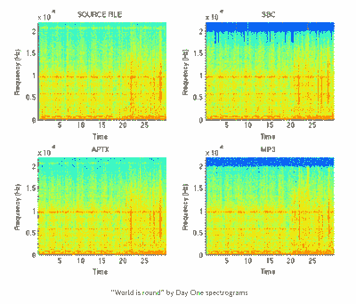
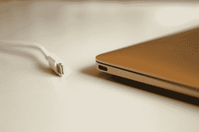

# 3.5 毫米音频插孔的死亡，无线万岁

> 原文：<https://hackaday.com/2016/10/25/death-to-the-3-5mm-audio-jack-long-live-wireless/>

苹果公司放弃传统音频插孔的举动引起了很多大惊小怪。至于我，我希望我再也不用插另一根耳机线了。这可能是在我敌人的坟墓上欢快地跳舞，甚至在洞被挖好之前；有点像。插孔一直是我的设备中的一个痛点。也许我只是运气不好。从小到大手头很紧。我会攒钱买一副好耳机或一个 mp3 播放器，只是为了把插孔拔出来。这是一种明显的背叛，从那以后，我一直对他们持怀疑态度。这是我们能做的最好的吗？

我想不出一个好的理由不立即开始倾倒耳机插孔。当然，这是少数几个全球标准之一。当然这很简单，但我愿意打赌，一旦 3.5 毫米音频插孔的时代结束，很少有人会怀念它。这是沉没成本谬论的全球插曲。

通常来说，后见之明是 20/20，3.5 毫米音频插孔可以被视为一种变通办法，直到我们不需要它为止。在更好的东西出现之前，这似乎是一次又一次黑客攻击的历史性组合。上次将以太网电缆连接到笔记本电脑是什么时候？当我们可以通过无线连接可靠地获得我们想要的所有带宽时，谁会这样做呢？此外，大多数以太网电缆甚至不能很好地满足[规格，以满足他们承诺的速度](http://hackaday.com/2016/01/30/is-your-cat-6-ethernet-cable-cat-6-probably-not/)。人们怎么能合理地期望更加主观和可变的耳机和放大器组做得更好呢？

但是，与其无所事事地抛弃它，我想提出一个反对它的理由，描绘一个可能没有痛苦、听起来更美好的未来。

#### 进入

比方说，你必须设计一个面向消费者的设备，放在某人的口袋里。一个口袋满是灰尘。潮湿多汗。你知道你的东西，所以你已经在考虑垫圈和 IP 等级。然后有人递给你规格表。他们让你知道他们想让你在箱子上钻一个洞，在箱子上钻一个无法使用的深洞。现在这个星球上的每一个便携式设备都要重复冲洗，这似乎是一种奇怪的集体幻觉。

[![I guess if someone were having a really bad day they could spill coffee at the swtichboard... [CC Joe]](img/0555c8b35581ceaacb8bd105d214f40d.png)](https://hackaday.com/wp-content/uploads/2016/10/jt_switchboard_770x540.jpg) 

我猜如果有人有一天真的很糟糕，他们可能会把咖啡洒在总机上……[[CC Joseph c .](https://en.wikipedia.org/wiki/File:JT_Switchboard_770x540.jpg)]

没有什么好方法来密封或维护 3.5 毫米耳机插孔。一些手机制造商试图通过增加一个小垫圈或翻盖，但这并不持久。也有可能是密封的，但由于它内部必须有小弹簧和支架，它仍然容易受到液体和灰尘的损害。我甚至看到一些被汗水中的盐分腐蚀得无法修复。

这就像我们都同意忽略这样一个事实，即这些连接器是设计用于开关板。一个干净整洁的专业配电盘，由训练有素的人员使用并定期维护。它被设计成一个易于使用的连接器，可以快速插入和拔出，用于低质量的音频电话切换。它从未被设计成高质量音频信号的终极连接器。将它推广到世界上可能只是一个快速的破解。当家庭音响开始变得普遍时，使用已经被采用并以足够大的规模制造的连接器。

因为我们已经摆脱了移动设备上的键盘(这很遗憾，但那是另一篇文章)。因为每个制造商似乎都可怕地致力于不可替代的电池。没有理由不转向完全防水和防尘的设备。至少会有好的一面。音频端口阻碍了我们。

#### 电缆应变

 

这不是脐带的错。它被送到前线却没有合适的设备。保罗·赫西

接下来是线缆紧张。人们喜欢抱怨 iPhone 耳塞经常在连接处断裂。这是真的，其他品牌有更好的应变救济。然而，同样真实的是，所有放入口袋的音频电缆都会在任何其他组件达到其使用寿命之前断裂。从本质上来说，一个口袋超过了公差内电缆应变的所有合理预期。这是一个充满敌意的环境。我上一套耳机在常规使用过程中经历了两条线缆。这就引出了下一个设计缺陷，力。

#### 力

如前所述，音频连接器被设计成易于插入配电盘室。它看不到任何戏剧性的力量。因此，这是一个很高的连接器，易于握持和使用。它也被认为是一个低插入力连接器。因此，期望它能够可靠地固定电缆是不合理的。

然而，当把它放进口袋时，它突然受到垂直于其轴线的力。这可能会在非常小的塑料和弹簧金属插座上产生非常大的力矩。我们都知道，我们拥有手机的时间越长，我们的耳机插座就越不能将插孔固定住。根本没有办法设计这么小的东西来承受这么大的力并保持成本效益。相反，看起来我们只是调整了我们的预期，然后忘记了我们甚至做了调整。

从设计的角度来看，这似乎更疯狂，当你考虑到这个具有巨大作用力的连接器实际上是连接到你设备的主板上的(公平地说，大多数智能手机确实使用弹簧连接器来连接主板，但想想笔记本电脑和其他设备)。焊料连接不灵活。我们用于焊接的金属在循环力的作用下很容易加工硬化和断裂。因此，不仅要弯曲端口与电路板本身的连接，还要弯曲所有周围的元件。因此，移动设备上最常见的维修之一就是音频和 USB 端口，这并不奇怪。

#### 品质优良

Bluetooth’s codecs perform comparably 320kbps mp3\. Which is beyond the ability of most listeners (including the author) to distinguish. From [Serene Audio](http://www.sereneaudio.com/blog/how-good-is-bluetooth-audio-at-its-best).

现在蓝牙和有线的音质还是有区别的。没有理由期待它会持续很久。蓝牙现在能够提供一些令人印象深刻的带宽，随着耳机实际市场的爆发，用不了多久这就会成为一个争论点。我选择蓝牙是因为它是唯一一个通用的标准，至少是用来连接外设的。

3.5 毫米耳机插孔的音质方面存在很大争议。坦率地说，我认为他们中的大多数反对过渡是没有意义的。如果你静静地坐在家里的试听室里，一个完美调谐的前置放大器连接到优质耳机上，同时从你专用的音乐电脑上听 FLAC 音频，你可能会听到用蓝牙耳机直接连接到你的手机上的明显区别。但你不是。你有一个嘈杂的连接，从一个破旧的端口到一个低质量的电缆，没有放大的信号到一些成本工程耳机。我认为这是一次清洗。

此外，切换到无线标准并不会完全扼杀有线耳机市场。当电线有问题时，你仍然可以得到有线耳机。为有线耳机的高质量声音支付 100 多美元的人仍然会拥有他们的玩具。这个市场离死亡还很远。那些花十块钱买任何东西的人根本不会注意到。

大多数手机和便携式设备试图以一种有意义的方式放大信号，而不浪费任何能量。因此，如果你想要你的耳机的全部范围，你必须添加一个放大器。还有一个事实是，它们已经是 D 类音频放大器，试图最大限度地延长设备的电池寿命。当它传到你耳朵里的时候，它已经被数字化了三倍。幸运的是，我们现在对贺卡的处理能力超出了我们合理的处理能力，所以大多数人不太可能注意到这种差异。

然而，现代蓝牙音频芯片实际上真的很棒，[它们只会变得更好](http://www.sereneaudio.com/blog/how-good-is-bluetooth-audio-at-its-best)。它们是超低功率 D 类放大器，专为音质打造和优化。有了耳机里的锂电池，没有理由不期待工程师们利用这一点，停止设计世界上每一个驱动程序来运行手机愿意给它的两三个魔法精灵。实际上，无线耳机应该比有线耳机听起来更好。

#### 便利性和用户体验

It’s a cross-cultural joke at this point.

我在亚马逊上买了一套很便宜的蓝牙耳机。我很少对一件商品如此满意。他们听起来不错吗？不完全是，但是我不期望任何十美元的耳机听起来很好。在电池需要充电之前，我得到的是平均 10 天的开关使用时间。我可以去攀岩馆，在攀岩的时候把手机留在地上。当我在黑客空间做项目时，我可以走到离手机 30 英尺远的地方，不会错过有声读物的一个字。它自动连接了。它玩得很好。从各方面来看，这都是一次更好的经历。

戴着耳机，我总是在和线缆斗争。我总是把手机放在口袋里，这样电线就不会弯曲太多。耳机知道的结比我们多，这是一种文化模因。

当然，蓝牙也有一些缺陷。我们会在几年后讨论电池更换的问题吗？大概吧。会有成长的烦恼吗？当然了。这些问题会在未来几年内得到解决吗？很有可能。

#### 过渡:

那么我们如何过渡呢？好了，第一步完成了。有一个大玩家终于放弃了港口。是时候了。但是有线耳机的所有优点呢？全球标准？事实上，你可以通过按磅廉价购买它们，而不是作为一个成年人来持有和照顾一件高质量的物品，从而对我们的星球造成彻底的破坏？它们与每一个想要发出声音的设备的通用集成怎么样？

 

我们并不是没有其他真正好的全球标准来支持耳机。但是我们确实有其他可以传输声音信号的全球标准。我们有 USB。虽然我对苹果公司在 Beats 上的表现给予了过多的肯定，但在这一点上，他们也展示了一条道路。然而，加密狗是一个不雅的例子，只是作为 3.5 毫米端口的过渡。如果你的耳机的一端只有一个 USB C 端口，你可以将选择的电缆直接插入你的手机。这款手机有能力为一些配件供电，只要它被设计成在充电时关闭充电电路，就没有理由不工作。我们都可以无痛过渡。我们真的不会错过。

笔记本电脑肯定可以同时充电和玩游戏。如果你的电池快没电了，就把它接到 USB 上。您将获得我们都喜欢的线缆体验和通用标准体验。只是少了一个电子产品诞生以来怪异的模拟连接器。所有的乐高积木都在那里，我们只需要建造[宇宙飞船](https://www.youtube.com/watch?v=7TYJyCCO8Dc)。

所有这些都是学究式的。便携式音频从来就不是一个耗电的游戏，最终我认为人们不会注意到电缆的问题。我以为我会，但我没有。我已经非常习惯于在情况需要时插上东西，我只是这样做，仅此而已。

是时候让 3.5 毫米的传统消失了。我希望其他人效仿苹果。我希望所有主要的耳机制造商将目光转向无线音频及其提供的可能性。已经有[质量设定在那里](http://thewirecutter.com/reviews/best-bluetooth-on-or-over-ear-headphones/)，而且只会变得更好。我不会错过的。我不怀念磁性硬盘。我不怀念 CD 和迷你盘。我至少有十年没在电视上调音了。我甚至没有以太网电缆，也没有使用 DB9 串行电缆进行硬件开发。未来还在继续，这一次我认为它会向正确的方向发展。