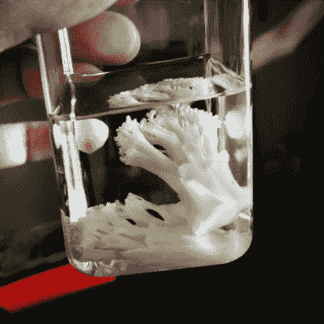
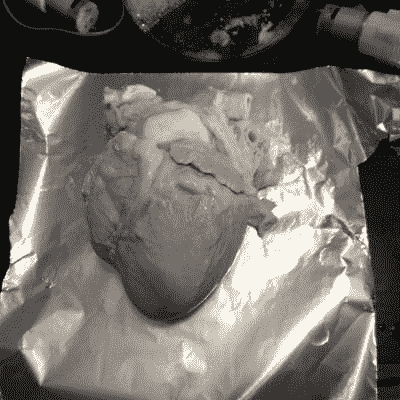

# 去细胞化:苹果到耳垂

> 原文：<https://hackaday.com/2018/04/30/decellularization-apples-to-earlobes/>

我们的身体不像乐高积木或电脑，因为我们不能一边看电视一边在客厅里交换我们的身体。器官移植和整容手术是目前我们升级、修复和增大的选择，但是由于排斥，移植后治疗可能是一生的承诺。选择性手术的费用超过了 NIB 千年猎鹰乐高套装。几十年来，实验室一直在改进这些过程和相关的治疗方法，但随着一些有创造力的人走上舞台，实验室甚至家庭实验室也开始行动起来。这些人不做外科手术，但是他们正在为没有行医执照的人做和学习提供可能。

有机材料的去细胞化和再细胞化是人类构建模块的一个有希望的途径。商业脚手架是存在的，但是它们很贵，所以一般的修补者不会在假期周末买几个来玩。

让我们来探究这一切意味着什么。当某种东西去细胞化时，这意味着细胞被移除，但保留细胞的结构仍然存在。再细胞化是新细胞在该区域生长的过程。去细胞化就像把希尔顿酒店拆成大梁。其余的结构是 ECM 或细胞外基质，通常称为支架。该结构有形状，但没有功能，就像一个剥离的酒店。脚手架可以重新填充新的细胞，就像我们被掏空的酒店可以重建为工厂、办公楼或医院一样。

### 脱细胞植物物质

当植物去细胞化时，我们只剩下纤维素，但这个支架可以重新填充动物细胞。相反，脱细胞的动物部分可以剥离成胶原蛋白，然后重新植入植物细胞。这是一些下一级的科学怪人的东西，可能会让一些素食者感到困惑。

从脚手架上剥离植物细胞似乎是一种神秘的黑暗艺术，但它使用容易找到的原料，没有比玻璃容器更奇特的东西。水泵和加热器是有帮助的，但是你可以在读完这篇文章后马上去细胞化你厨房里的一些水果和蔬菜。这个过程很好理解，并且已经有[个发布的过程](https://www.ncbi.nlm.nih.gov/pmc/articles/PMC2945869/)。第一步是通过冷冻水果或蔬菜来破坏细胞壁。切片效果很好，因为它们暴露了大量的表面区域，之后你可以清楚地看到物体的内部结构。一旦冷冻，切片可以浸泡在 SDS 和水的溶液中。SDS 是 soap 的“科学用语”。普通的洗洁精和水也许可以解决问题，但是商业 SDS 很便宜，很容易从正规渠道买到。这无疑传达了这样的信息:“在家里试试这个。”随着细胞的渗出，水将变得浑浊，所以要定期更换。

像西兰花这样的纤维材料比草莓这样的软水果需要更长的时间。[木材也是候选材料](https://hackaday.com/2016/05/19/star-trek-material-science-is-finally-real-transparent-wood/)，但它实际上是去除木质素，与[方向不同](https://hackaday.com/2016/07/12/make-your-own-transparent-wood/)。种子抵制这一过程，因为它们的外壳是用来抵御不利条件的。就像幽灵般的水果一样，可怕的白色骨架上的黑色种子非常流行。

 [https://www.youtube.com/embed/ddGR7YKuN-I?version=3&rel=1&showsearch=0&showinfo=1&iv_load_policy=1&fs=1&hl=en-US&autohide=2&wmode=transparent](https://www.youtube.com/embed/ddGR7YKuN-I?version=3&rel=1&showsearch=0&showinfo=1&iv_load_policy=1&fs=1&hl=en-US&autohide=2&wmode=transparent)

### 脱细胞动物部分

去细胞化动物部分更棘手，但它可能更有价值，这取决于你想要什么。架子上的幽灵之心可能会引发一些对话。至少，你会发现你的哪些朋友极度神经质。写这篇文章时，还没有黑光灯下脱细胞心脏的照片。只是把这个想法说出来。

动物细胞有越来越多不同的物质要溶解，所以有越来越多不同的步骤。幸运的是，许多步骤可以用便宜的原料来完成，其中一些原料仍然可以在厨房或药箱中找到。

这个过程最好由[思想商场]来解释，他成功地将一个深入的视频保持在 7 分钟之内，而没有超出我们的理解。也许不言而喻，但在去细胞化之前有心脏的片段，所以如果这种事情不是你的事情，请做好准备。此外，还有更多像逆行性冠状动脉充血这样的“科学言论”，但他解释得很好。

 [https://www.youtube.com/embed/SjcMyicfrL8?version=3&rel=1&showsearch=0&showinfo=1&iv_load_policy=1&fs=1&hl=en-US&autohide=2&wmode=transparent](https://www.youtube.com/embed/SjcMyicfrL8?version=3&rel=1&showsearch=0&showinfo=1&iv_load_policy=1&fs=1&hl=en-US&autohide=2&wmode=transparent)

### 借我你的耳朵

[The Thought Emporium]做了一项非凡的工作，将令人发指的科学带到了任何好奇的黑客的门前，但如果我们想挑战这些支架的极限，我们可以求助于[Andrew Pelling]，他在 TED 演讲中展示了他在重新细胞化植物物质方面的工作创新。他最著名的工作是在苹果支架上培养人耳形状的哺乳动物细胞。在最基本的情况下，苹果被去细胞化，雕刻成耳朵的样子，然后植入细胞。

生长成支架的细胞属于受体，因为它们是宿主的细胞，它们不会像供体材料那样产生排斥。仅仅这一点就使研究变得重要，但是为等候名单上的人制造新的器官更为重要。在黑客层面，我们可能会在有生之年看到一只本土的斯波克耳朵被移植。[Pelling]发现芦笋和人类脊髓之间有显著的相似之处。

 [https://www.youtube.com/embed/a38TMpr7ft8?version=3&rel=1&showsearch=0&showinfo=1&iv_load_policy=1&fs=1&hl=en-US&autohide=2&wmode=transparent](https://www.youtube.com/embed/a38TMpr7ft8?version=3&rel=1&showsearch=0&showinfo=1&iv_load_policy=1&fs=1&hl=en-US&autohide=2&wmode=transparent)

去细胞化和再细胞化在未来是否会有医学用途尚待研究。不过，很清楚的是，你现在就可以在自己的厨房里摆弄这种尖端生物技术。开始吧。