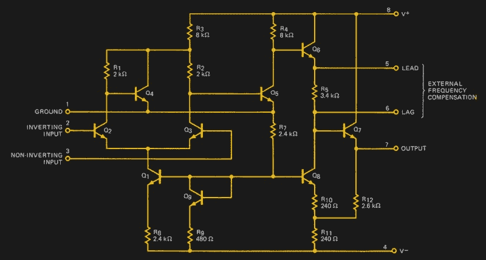

# 解构一个简单的运算放大器

> 原文：<https://hackaday.com/2018/02/20/deconstructing-a-simple-op-amp/>

也许你对运算放大器非常熟悉，因为它是一种功能极其丰富的器件，你知道如何用一个器件快速构建各种各样的电路。也许你甚至有一两个最喜欢的运算放大器用于不同的应用，涵盖了许多可能的领域。反相放大器等标准电路是你的面包和黄油，公式 *gain=-Rf/Ri* 纹在你的前臂上。

但是你可以知道如何使用运算放大器，而不必真正知道它们是如何工作的。你有没有在运算放大器的引擎盖下仔细观察过里面发生了什么？你愿意吗？让我们拿一个简单的装置，一件一件地检查它。

## 首款 IC 运算放大器

飞兆μA702 是首款集成电路运算放大器，是 Bob Widlar 设计的革命性器件，于 1964 年首次推向市场。虽然它很久以前就从半导体目录中删除了，但它有一个非常简单的内部电路的优势，这可以在像这篇文章这样的文章中很容易地解释。

The μA702’s internal circuit, as shown on its data sheet.

即使只有 9 个晶体管，μA702 电路也不是最简单的运算放大器电路，因为它包含了 Bob Widlar 的一些改善性能的技巧。不过，它可以分为两部分，一部分是由 Q2 至 Q4 构成的差分放大器，另一部分是由 Q5 至 Q7 构成的 A 类输出级。

## 长尾对

这里由 Q2 和 Q3 形成的差分放大器电路(有时也称为 [*长尾对*](https://en.wikipedia.org/wiki/Differential_amplifier#Long-tailed_pair) )是运算放大器的标志，所有集成电路运算放大器都会以某种形式集成一个。它是一个差分放大器，也就是说，它在 Q3 集电极上的输出取决于两个输入电压之间的*差*，而不是它们的电平。

在集成电路出现之前，简单的长尾对已经有很长的历史了，始于 20 世纪 30 年代的电子管电路，并随着晶体管的发明而被重新创造。它们在第一批电子计算机中用作快速开关，也用于仪表放大器，但由于集电极和发射极电路中只有电阻，它们的增益较低，共模信号抑制较差，也就是说，当两个输入端的电压串联时，它们也会产生输出响应。

## 其余的

后来，差分放大器电路用电流镜取代了这些电阻，我们在这里看到的电路处于设计中一个有趣的中间点。发射极电阻已被 Q1 的电流镜取代(特别是与 Q8 和 Q9 一起形成了著名的 [Widlar 电流镜](https://en.wikipedia.org/wiki/Widlar_current_source)，这是发射极电路中采用的一种巧妙设计，用来取代难以在芯片上制造的高值电阻)，而集电极电阻则保留了下来。

然而，Q4 代表了这种设计的中途站。它不是后来的运算放大器中的电流镜，但它是经典长尾对的一个非常聪明的补充，解决了此类电路的一个固有问题，即它们的增益只有单端放大器的一半。如果你把它看作一个简单的共发射极放大器，它[放大 Q2 集电极的电压变化，通过其基极到达 R1 和 R2 顶部的发射极](https://www.calvin.edu/~pribeiro/courses/engr332/Handouts/ho18opamp.pdf)，这反过来影响 Q3 集电极的电压，从而也把 Q2 的一些增益转移到 Q3 集电极的输出。

输出级从简单的增益级 Q5 和 Q6 开始，但问题是 Q6 的发射极电压较高。因此，R5 是一个降压器，将电压降低到 Q7 基极所需的电压。这个最后的信号晶体管是一个为输出馈电的射极跟随器，而其基极电路中的 Q8 是与 Q1 和 Q9 相同的电流镜的一部分。

简单的运算放大器用几个段落来描述。以 1964 年的标准来看，它绝不是一款好的运算放大器，因为它没有很高的增益，没有短路保护，并且需要外部电容来进行频率补偿。您可能使用的运算放大器在 1964 年的好奇心基础上已经发展了几十年，但μA702 包含任何运算放大器都有的基本构建模块，因此是学习运算放大器的便捷工具。

金属罐锯开图像:[配音【CC0】](https://commons.wikimedia.org/wiki/File:Integrated-circuit-open.jpg)。