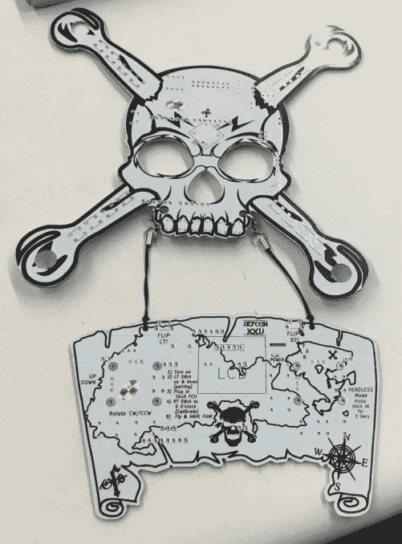
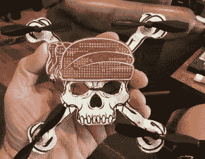
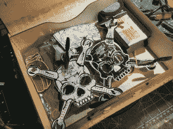
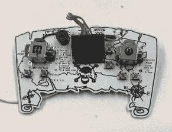
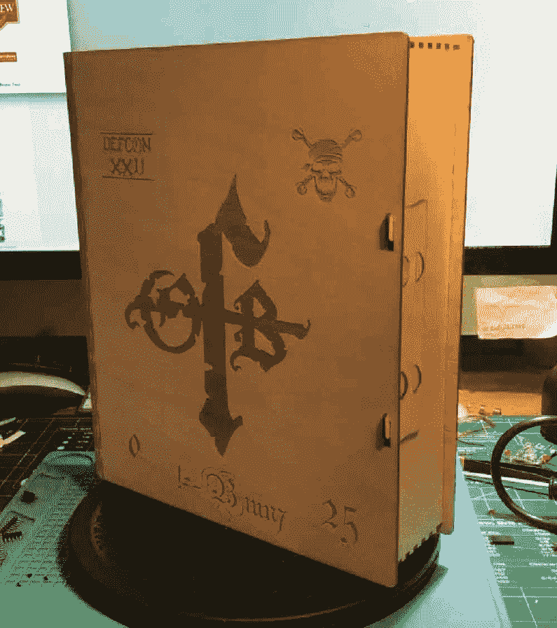
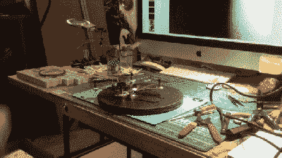

# 终于有人做到了

> 原文：<https://hackaday.com/2017/07/18/def-con-badgelife-someone-finally-did-it/>

Badgelife 是对电子会议徽章的庆祝，是一种需要花费太多时间处理电子产品制造物流的生活方式，也是 Twitter 上一个令人敬畏的标签。Badgelife 并不是一个新事物；它已经存在了几年，但每年夏天我们都会看到 Def Con 前的大幅上涨。

在过去的几年里，深入 Badgelife 的设计师和工程师已经进行了几十次同样的对话。一个人说，“你知道，有人应该建立一个四轴飞行器的徽章。”另一个人回答:“你能想象那会有多烦人吗？在 DefCon 的闭幕式上，你会把一万人放在一个房间里，几十个人会有四轴飞行器。这将是可怕的“是的，有计划建立一个四轴飞行器徽章在过去几年中，但冷静的头脑占了上风。

终于有人做到了。同样是四轴飞行器的可穿戴电子会议徽章*终于来了。这是[b1un7]的作品，而且会和你想象的一样烦人。*

  The wearable quadcopter badge with a ‘map’ controller  Yaaar matey  A box with two quads  The controller for the badge quad.  This quadcopter badge will come in a beautiful laser-cut enclosure

 这个徽章其实是两块 PCB，第一块是四轴飞行器本身，第二块是操纵杆/控制器。四方形的形状像大多数威士忌海盗徽章中常见的海盗旗([b1un7]挂在船员身上)，控制器是海盗的藏宝图，上面装有操纵杆、按钮和无线电。这个四轴飞行器的马达似乎是有刷的，而不是无刷的，看起来四轴飞行器的臂有一些空间来放置令人讨厌的明亮的发光二极管。

这是一个很棒的徽章，但这仍然是[b1un7]第一次尝试制作徽章。现在，还有一点工作要做——离 Defcon 只有一周了——但是如果运气好的话，[b1un7]将会有 25 个这样的可穿戴电子会议徽章在周围嗡嗡作响。这是一个*可怕的*想法，我们喜欢它。