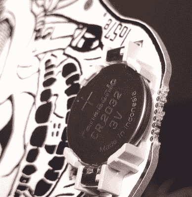
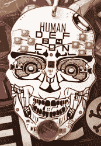
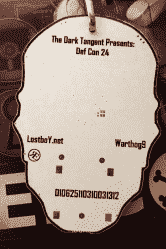
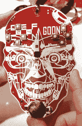
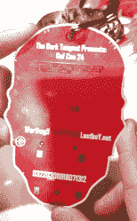

# DEF CON 的 X86 徽章

> 原文：<https://hackaday.com/2016/08/05/def-cons-x86-badge/>

今年的 DEF CON 徽章是电子的，有很多庆祝活动。今年的 DEF CON 徽章有一个 x86 处理器，有很多混乱。

These vias are connected to something.

今年、~~和每年、~~的徽章，除了 [18](http://www.grandideastudio.com/defcon-18-badge/) 、 [17](http://www.grandideastudio.com/defcon-17-badge/) 、 [16](http://www.grandideastudio.com/defcon-16-badge/) 、 [15](http://www.grandideastudio.com/defcon-15-badge/) 、 [14](http://www.grandideastudio.com/defcon-14-badge/) 的徽章，由【乔格兰】设计，【暗切线】和【平】设计的来自史前的徽章，由【1057】设计，围绕一个 x86 处理器打造。具体来说，这个徽章采用了一个[英特尔 Quark D2000 微控制器](http://www.intel.com/content/www/us/en/embedded/products/quark/mcu/d2000/overview.html)，一个以 32MHz 运行的微控制器，具有 32kB 的闪存和 8kB 的 RAM。是的，x86 徽章，但我认为 AT 主板徽章会更好地满足这一要求。

至于按钮、传感器、外围设备和 led，这个徽章非常小。有八个按钮，分为两个方向垫，五个发光二极管和一个电池。这里没有太多，但仔细观察徽章的“下巴”区域，你可以看到这个徽章是如何被编程的。

正如任何[1057]联合，这个徽章的特点是拼图丰富。其中一个谜题非常难以拍摄，因为它位于底部的铜层中。上面写着“nonpareil bimil:Icnwc lsrbcx KC HTR-yud NV ifz xdgm yduxnw YC iisto-cypzk”。另一个底铜文字写着“10000100001σa 120215”。开始吧。

下面是人类和呆子徽章的图库，点击查看我们的最佳分辨率。

这篇文章已经更新，更正了为以前的犯人设计徽章的人的记录。