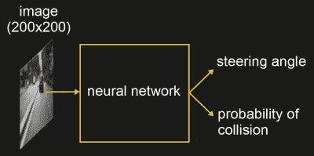

# 送货无人机可以学习驾驶和骑自行车

> 原文：<https://hackaday.com/2018/02/06/delivery-drones-can-learn-from-driving-and-cycling/>

如今，无人机越来越多地被用于城市监控、送货和检查建筑结构。自主地做到这一点通常涉及使用“地图定位计划”技术，其中首先使用 GPS 在地图上确定位置，然后基于此产生控制命令。

进行转向和碰撞预测的神经网络可以补充地图定位计划技术。然而，神经网络需要使用从实际飞行的无人机拍摄的视频进行训练。但是制作训练视频需要在街道上长时间飞行无人机，将车辆和行人置于危险之中。为了训练他们的 DroNet，来自苏黎世大学和马德里理工大学的研究人员为该视频提供了更安全的来源，即从驾驶汽车和自行车中录制的视频。

DroNet

对于无人机转向预测，他们使用了超过 70，000 张图像和相应的转向角度，这些图像和角度来自于公开的汽车驾驶数据，这些数据来自于 [Udacity 的开源自动驾驶项目](https://www.udacity.com/self-driving-car)。为了预测碰撞，他们在自行车把手上安装了一台 GoPro 相机，并在城市中行驶。当自行车远离物体时开始录像，当非常接近物体时停止录像。他们总共收集了 32，000 张图片。

为了使用训练过的网络，来自无人机前向摄像头的图像被输入网络，输出的是转向角和碰撞概率，后者被转化为速度。无人机保持在地面以上的恒定高度，尽管它在 1.5 米到 5 米的高度范围内工作良好。它成功地在道路车道上行驶，并避免了行人和自行车的移动。不过十字路口确实让它迷惑了，可能是因为开阔的空间扰乱了碰撞预测。但我们认为，当与地图定位计划技术配合使用时，这应该不成问题，因为将使用地图上的位置为它选择穿过十字路口的方向。

正如你在下面的视频中看到的，它不仅在车道上飞得很好，而且在停车场和走廊上也飞得很好，尽管它没有受过这两方面的训练。

我们离送货无人机还有多远？无人驾驶飞机运送医疗物资已经在卢旺达出现。但大多数时候，我们已经看到了客户安全操作[的实验和演示](https://hackaday.com/2017/09/15/delivery-drone-aims-to-make-package-handoffs-safer-than-ever/)，或者通过[用降落伞](https://hackaday.com/2017/06/05/amazon-gets-a-patent-for-parachute-labels/)扔下包裹，让无人机完全脱离客户的手。

 [https://www.youtube.com/embed/ow7aw9H4BcA?version=3&rel=1&showsearch=0&showinfo=1&iv_load_policy=1&fs=1&hl=en-US&autohide=2&wmode=transparent](https://www.youtube.com/embed/ow7aw9H4BcA?version=3&rel=1&showsearch=0&showinfo=1&iv_load_policy=1&fs=1&hl=en-US&autohide=2&wmode=transparent)

