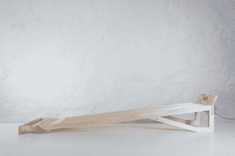
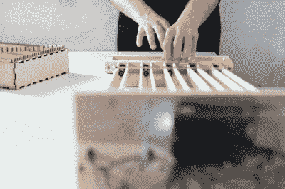
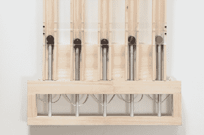
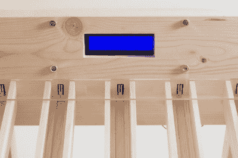

# 演示波德码

> 原文：<https://hackaday.com/2015/09/27/demonstrating-baudot-code/>

想象电子信号如何工作可能很困难。物理模型在克服这一困难方面非常有用。在最近一次名为“拆箱黑盒”的研讨会上，Julian Hespenheide 的团队发明了一种装置来显示运行中的博多代码。这是木头和 Arduino 的混合物，为了纪念 T4·米勒·博多(1845-1903 年 T5)，他们称之为 T2·米勒。

与主要用于人类交流的莫尔斯电码相比，博多发明的电码可以将电报信号从一台机器传送到另一台机器。这两种代码在整个 20 世纪都在使用。例如，那些大的咔嗒作响的机械电传打字机使用的是博多电码的一个小变体。

Baudot 是一种 5 位的固定长度代码，与 Morse 的可变长度代码相反。莫尔斯对每个字符都有一个单独的代码，而博多使用“移位”代码在字母和数字字符之间转换。例如，根据移位状态，二进制 11 将表示“A”或“A-”。如果错过了移位码，接收器就会出现乱码。

在**英里**中，博多电码是由弹珠发送的。没错，弹珠。有五个弹珠，一个代表波德码中的一位。每个弹珠都沿着轨道向 Arduino 滚动。机器如何知道发送哪些弹珠？“打卡”！这些是这个设计的一个了不起的方面。

émile

Sending a code

Pinball transmitter

Transmission line tracks

每张卡片代表一个代码。卡片中的每个位置都有一个允许弹球通过的间隙(一个设定的位)，或者没有阻挡弹球的间隙(一个未设定的位)。操作员装入 5 个弹球和一张穿孔卡片，并通过弹簧机构发射弹球。

[Julian 的]真的用这个项目创造了一个伟大的 Baudot 代码可视化！休息之后，看看**英里**的运行情况。

[https://player.vimeo.com/video/135582121](https://player.vimeo.com/video/135582121)