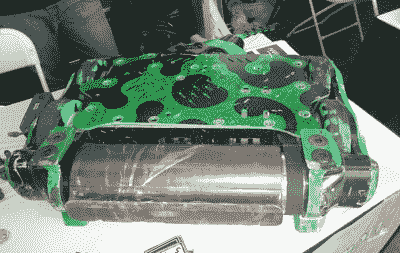
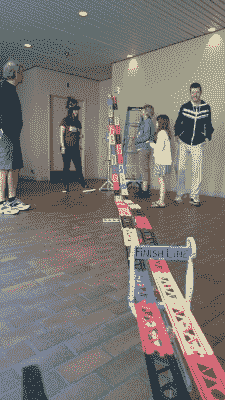
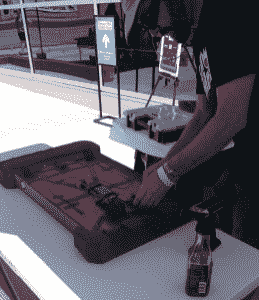
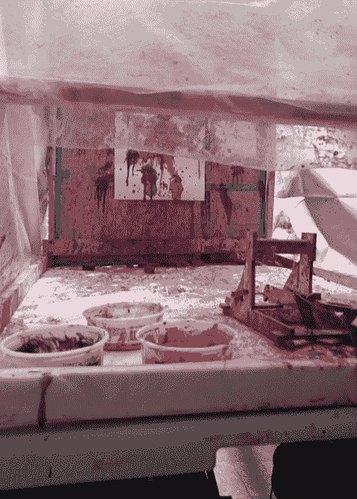

# 丹佛迷你创客集会综述

> 原文：<https://hackaday.com/2016/06/29/denver-mini-maker-faire-roundup/>

我在丹佛第三届年度迷你创客博览会上度过了一段美好时光，该博览会在丹佛自然和科学博物馆举行。今年的官方主题是“建设未来”，回顾过去，我可以告诉你，他们很好地实现了这个主题。对于建设未来至关重要的两个类别的投票率很高:来自所有年龄段教育的增长和学习变得身临其境的物理场所。

### 真正有趣的东西

腐蚀性创作公司的  【凯西】在战斗机器人第二季重启时展示了毒箭。毒箭重 250 磅。以每分钟 9000 转的速度破坏东西的鼓式旋转器。这里有一个很好的介绍视频，由他们的赞助商 Arrow 电子公司拍摄。[凯西]告诉我《毒箭》将在 6 月 30 日播出，所以把你的录像机调好。

谁知道科罗拉多州有这么多创客空间？[科罗拉多 Makerhub](http://coloradomakerhub.org/) ，就是他。他们提供了一个通往科罗拉多州一切与制造商相关的事物的门户，他们和城市半径 50 英里内的大多数人都出席了会议。丹佛自己的 Denhac 带来了他们去年为动漫展建造的大型多人钻机。它运行 Artemis，这是一个宇宙飞船舰桥模拟器游戏，划分了成功的星际旅行所必需的任务。[这里有一段 Denhac 成员【Radio Shack】描述游戏的视频，并给出了一个控制台](https://www.youtube.com/watch?v=bhQogjffICA)的参观。该小组在博物馆的一个较暗的区域找到了一个空间，这使得闪光灯无法抗拒，尤其是对某一年龄范围的男孩来说。

### 科罗拉多制造

SparkFun 和 Aleph Objects (Lulzbot)都位于科罗拉多州，都在尽力吸引未来的制造商。SparkFun 展台的徽章制作站总是很忙，但我确实有机会和他们的黄色循球机器人玩了一把。值得注意的是，他们没有带一堆烙铁——徽章是用铜带制作的。我敢肯定，这节省了很多担心和电力。当然，Aleph Objects 带来了他们的新 Lulzbot TAZ6，并与 Lulzbot Mini 一起运行。

我们在去年秋天的一个链接帖子中告诉过你关于 NixCore 的事情。这是一个基于 Linux 的小型路由器板，带有开发板附加选项。[Drew]亲自到场进行现场演示并出售电路板。30 美元对于这个小 SBC 来说是一个非常好的价格，它不完全是 Pi 或 Arduino 或 ESP8266。

艺术家兼金属匠艾拉·谢尔曼代表了更艺术的一面。除了他的前卫金属雕塑，艾拉还带来了一些与人玩耍的玩具。这些是由木板，有时是毛皮和其他会走路和说话的玩具制成的。[Ira]使用这些电路控制气动技术进行惊人的创作。

### 这个茎很结实

没有太多针对儿童的东西可以让我真的哦和啊，但我在 System 76 的展位上找到了一个。他们带来了加州大学戴维斯分校的[Oliver Kreylos]创建的开源增强现实沙盒。听起来很酷。一台投影仪和一台 Kinect 将 200 磅真正细白的沙子转换成一张形状多变的地形图，在这张地图上，山脉、山谷、湖泊和河流在  的存在中忽隐忽现。随着沙子的堆积，海拔的颜色接近红色。当沙子被移走时，它向蓝色移动，表示有水。这是最精彩的部分:把手平放在地图上，模拟下雨。

另一个繁忙的摊位就像一个快速松木德比。有抱负的赛车手可以造一辆车，让它在双槽赛道上飞驰。临近终点的传感器和灯光毫无疑问地决定了获胜者。

 一个更引人注目的显示器属于 [mcSquares](http://www.mcsquares.com/) ，一个协作的、模块化的白板系统。mcSquares 的有趣之处在于，它不涉及传统的白板表面。该系统由不到 12 英寸 x 12 英寸的薄型瓷砖组成。一个透明的塑料表面咬合在一个支撑背景的背衬上。这可以是任何东西，从一张白纸到篮球场布局，再到一个简单的点网格。每个 mcSquare 背面的钕磁铁与视觉上吸引人的壁挂支架相扣，便于四处移动。

### 它不是创造者大会。。。

蒸汽朋克珠宝。人体足球。一些展示纺织艺术的摊位。至少有一个 R2D2 跑来跑去。这一切都是为了完成一个伟大的黑客，制作和学习的周末。一定要看看下面的画廊。

  TinkerMill’s booth – a ‘space in Longmont, CO  I met this owl at the Raptor Education Foundation booth.  DMMF mascot Pokey the Fire-Breathing Dragon  Packin’ heat [![[Ira Sherman]'s bike that can be controlled with Furbies](img/e48b8a08bc047f5f35d46df0733f68ac.png "ira sherman bike")](https://i0.wp.com/hackaday.com/wp-content/uploads/2016/06/ira-sherman-bike.jpg?ssl=1) [Ira Sherman]’s bike that can be controlled with Furbies [![[Ira Sherman]'s pneumatic circuit](img/c705ecbd2bac41eb42ddce24824cacd9.png "ira sherman pneumatics")](https://i0.wp.com/hackaday.com/wp-content/uploads/2016/06/ira-sherman-pneumatics.jpg?ssl=1) [Ira Sherman]’s pneumatic circuit  Sandbox for junior roboticists  Steampunk brooch  A monthly subscription for education  A tasty way to travel  The underbelly of a Solar Roller  Retired derby cars  Splatapult!  A DIY light box for great-looking seller photos  Creations that came out of BLDG 61, the Boulder Library makerspace [![One of [Ira Shermans]'s creations](img/8df691dcd7ab9b1d428f02386f751b7f.png "ira sherman")](https://i0.wp.com/hackaday.com/wp-content/uploads/2016/06/ira-sherman.jpg?ssl=1) One of [Ira Shermans]’s creations  CNC guitars! [![[Ira Sherman]'s Toys That Play With People](img/1f024841d295ed3cb3cc80c27ffe1391.png "ira sherman setup")](https://i0.wp.com/hackaday.com/wp-content/uploads/2016/06/ira-sherman-setup.jpg?ssl=1) [Ira Sherman]’s Toys That Play With People  The SparkFun booth was always crowded  A liquid nitrogen demonstration