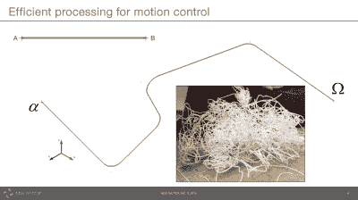
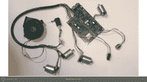
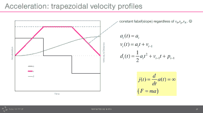
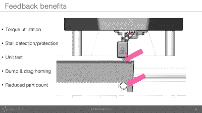

# 德里克·舒尔特:3D 打印机的路径规划

> 原文：<https://hackaday.com/2017/01/03/derek-schulte-path-planning-for-3d-printers/>

[Derek Schulte]设计并销售了一款消费级 3D 打印机，这让他对它们的运作有了更多的了解。他的打印机 [New Matter MOD-t](https://newmatter.com/mod-t/) ，与你现在使用的 3D 打印机在几个方面有所不同。最有趣的是，它使用闭环反馈和 DC 电机而不是步进器，它使用一个相当强大的 32 位 ARM 处理器而不是运行许多打印机的荣耀的 Arduino Uno。

第一个选择意味着[Derek]必须编写自己的运动控制和路径规划软件，第二个选择意味着他有处理能力来支持它。在他的演讲中，他详细讲述了他们是如何完成路径规划系统的，以及它是如何工作的。如果你曾经认真思考过物理打印头如何利用动量产生 g 代码中告诉它的无限尖锐的拐角，这个演讲就是为你准备的。(剧透:它没有打破物理定律，通过曲线导航涉及数学。)

 [https://www.youtube.com/embed/fQcRxt9qlIY?version=3&rel=1&showsearch=0&showinfo=1&iv_load_policy=1&fs=1&hl=en-US&autohide=2&wmode=transparent](https://www.youtube.com/embed/fQcRxt9qlIY?version=3&rel=1&showsearch=0&showinfo=1&iv_load_policy=1&fs=1&hl=en-US&autohide=2&wmode=transparent)

## 问题是

 路径规划在 3D 打印机本身内部进行。这就是 3D 打印机的固件对接收到的 g 代码所做的事情，它将 g 代码转化为沿着 X、Y 和 Z 轴的电机以及挤出机的物理运动。虽然 g 代码是通用的，但它也是不现实的:它指定了 4D 空间中的一系列点(挤压机，记得吗？)以及到达那里所需的速度。路径规划融合了物理打印机的运动控制能力的知识，并试图使最终结果尽可能合理地匹配 g 代码，而不会花费太多时间。作为理想化的 g 代码和真实打印机之间的接口，规划固件需要考虑打印机本身的设计，以及其所有的物理限制。

 你可以用 unobtainium、龙鳞和一年周末的免费劳动制作自己的一次性 3D 打印机。但是，如果你想制造一种产品，以合理的价格出售给大众，它必须使用商品部件制造，并且工作稳定。这就是促使[Derek]使用带编码器的 DC 电机，而不是大多数其他 3D 打印机使用的无处不在、笨重且相对昂贵的步进电机的原因。以开环反馈的方式驱动 DC 汽车公司意味着没有任何“标准”的打印机固件可以工作——他需要推出自己的产品。这就是我们如何谈论，从 A 到 C，在 B 的拐角处，尽可能快和准确。

## 梯形和接吻原则

有几种方法可以将一段 g 代码“以 50 毫米/秒的速度向北走，然后以 50 毫米/秒的速度向西走”转换为机器运动。一种是全速向北，猛地停下来，然后全速向西。这就是最早版本的 DIY 3D 打印机固件所做的事情——结果是打印头产生噪音和振动，打印质量下降。这是丑陋的时代。

 【德里克】和 [grbl](https://github.com/gnea/grbl/wiki) 中的路径规划者选择了下一个最复杂的解决方案——在路径的每一段以恒定加速度移动，从而产生梯形速度分布。事实证明，这在实践中相当有效，并且易于计算。[Derek]在例程中添加了圆角:在 g 代码说要形成锐角的地方，固件会采用足够近的弯曲角，这样看起来不会很差，但也不需要喷嘴减速停止。将两者结合起来基本上是最简单的解决方案，也能很好地工作。

下一步是将几段连接在一起，但它最终会让打印机停下来，无论是在路径的尽头还是因为用户按下了暂停按钮。

## 闭环控制

大多数步进驱动的 3D 打印机以开环控制模式运行。固件告诉步进电机驱动器向前走十步，并希望一切顺利。当打印机丢失步骤时，各层会相互错位，如果你在打印过程中灾难性地遇到这种情况，你就会知道为什么会这样。

 【德里克】的打印机运行在闭环模式下，这意味着如果打印头离它应该在的位置太远，固件可以判断出这种情况，并向电机施加更多的功率，使其恢复正常。[Derek]再次选择了一个最简单的可行方法:带前馈的 PID 控制。当然，这意味着根据机器来校准算法，但是一个调整良好的 PID 算法是一种享受。

并且闭环控制提供了额外的好处。为了避免可怕的漏步，步进电机的规格必须大大提高，闭环 DC 电机可以在较低的扭矩下运行。然而,[Derek]利用反馈玩的最酷的把戏是利用检测电机失速的能力来启动打印机。三个物理轴上没有限位开关。相反，当电机达到其移动能力的极限时，固件会检测到失速，并使用它来将坐标轴归零。这减少了部件并简化了设备。我们都赞成。

## 结论

 【德里克】在我们都在使用的相同工具上设计他的运动规划例程，并且基本上使用可能工作良好的最简单的算法，为了避免“学术”上的复杂。最终，这使他能够优化速度，向前看 15 步，包括一些必要的特殊调整，如处理非常短的片段的逻辑，并以合理的价格推出产品。闭环系统中的运动规划和控制从来都不简单，但“尽可能地应用 KISS 原则，然后在以后调整性能”是我们所有黑客都可以忍受纹在身体某个适当长的部位的东西。更好的是，让我们感谢[Derek]的提醒和例证！