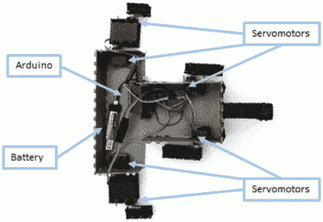

# 具有交互式 Robogami 的设计和 3D 打印机器人

> 原文：<https://hackaday.com/2017/08/26/design-and-3d-print-robots-with-interactive-robogami/>

3D 打印“打印和折叠”机器人的内部结构。[图片来源:麻省理工学院 CSAIL]

机器人设计传统上将身体几何形状与步态力学分开，但它们都对彼此有着深远的影响。如果你可以同时使用这两种技术，并且用任何一台旧的 3D 打印机廉价地制作出有用的原型，会怎么样？这就是互动机器人的用武之地。这是麻省理工学院计算机科学和人工智能实验室(CSAIL)的一个工具，旨在让人们用“3D 打印，然后折叠”的方法设计，模拟，然后建造简单的机器人。该系统背后的想法部分是利用 3D 打印机提供的快速原型制作，但主要是改变设计工作的完成方式。

为了制造一个机器人，身体几何形状和肢体设计都是在 Robogami 工具中完成和模拟的，不同的组合可以对运动产生巨大的影响。一旦选择了设计，最终结果是一个 3D 可打印平板包装，然后与电源、Arduino 和伺服电机组装成最终形式。

网上有一份白皮书，下面有一段演示视频。这些设备本身是否有资格成为“机器人”还存在争议，因为它们没有传感器，但作为一种快速原型化机器人身体几何形状和步态的工具，这是一个令人兴奋的聪明想法。

 [https://www.youtube.com/embed/zvNUpQWft1I?version=3&rel=1&showsearch=0&showinfo=1&iv_load_policy=1&fs=1&hl=en-US&autohide=2&wmode=transparent](https://www.youtube.com/embed/zvNUpQWft1I?version=3&rel=1&showsearch=0&showinfo=1&iv_load_policy=1&fs=1&hl=en-US&autohide=2&wmode=transparent)

也许有机会增强 Robogami 使用的“3D 打印，然后折叠”方法，用这种概念用非柔性材料制作柔性打印件，或者结合简单的 3D 打印电路。

感谢[亚当]的提示！