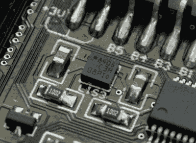
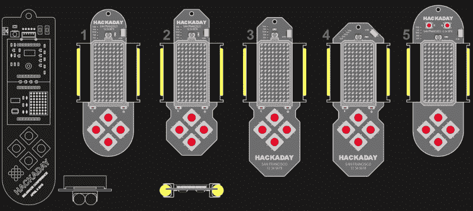
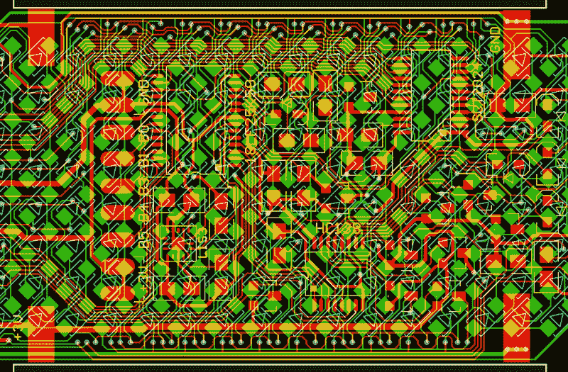
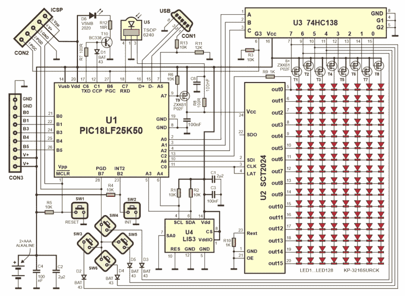
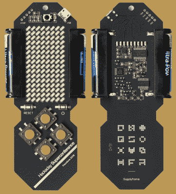

# 设计和黑客钻取明细:SuperCon 徽章

> 原文：<https://hackaday.com/2016/10/17/design-and-hacking-drilldown-supercon-badge/>

人们可以想象没有互动徽章的政治或商业会议，但黑客会议却不行。这是否说明了黑客是一种特殊的人群，他们总是有一些创造性的东西来展示他们的工作？是的，我想是的。

继今年 4 月的贝尔格莱德 Hackaday 大会之后，我们在 Supplyframe 办公室会面，讨论将于 11 月 5 日至 6 日在帕萨迪纳举行的 [Hackaday 超级大会](https://hackaday.io/superconference/)的徽章。贝尔格莱德会议徽章(如果你好奇的话，它在 T2 有完整的记录)出人意料地受欢迎，我也被要求设计新的徽章。

我准备提出一些全新的东西，但[Mike Szczys]建议保持该项目的基本概念不变:“没有理由改变任何东西，我们有一个工作的徽章”。对此我回应道:“好吧，下一个也行”。但后来我意识到“作品”并不代表“功能性”。关键是它受到了参观者的欢迎，他们用它来玩，用它来编码，用它来解决一个密码难题。

### 世界上没有足够的发光二极管

快进六个月——以下是对基本概念的修改。首先，由两个紧凑的 8×8 模块组成的现有 LED 矩阵被 128 个分立的 SMD LEDs 取代。这是一个非常必要的改变，有助于缩小尺寸和笨重，但也避免了另一个痛苦的经验，试图购买和运送矩阵显示器，这严重威胁到前一个徽章的生产。

这是一个很长的故事[,我在贝尔格莱德的演讲](http://hackaday.com/2016/05/06/how-to-design-manufacture-and-document-a-hardware-product/)中讨论过——事实证明我们没有从全球所有经销商那里获得足够多的公共阳极(CA)显示器。我们有一个 B 计划，也失败了，留给我们 C 计划，实际上包括两个 C:公共阴极。我们清理了五个分销商的所有供应，并设法获得了 122 个 CA 红色、340 CC 红色和 78 个 CA 绿色显示屏(仅够 270 个徽章)，这是全球供应。在那之后的几个月里，你都买不到任何一款 38 毫米的 Kingbright 显示器！唯一的问题是有两个不同版本的 PCB，一个用于 CA，另一个用于 CC 显示器，但幸运的是只有一个版本的软件，因为它可以自动检测显示器类型。

### 运动和膨胀

那么，这个概念中还有什么新的东西呢？在贝尔格莱德版本中，徽章支持加速度计模块，并包括一个未占用的足迹，以防您决定安装它，但现在徽章将 MEMS 芯片 LIS3 作为不可或缺的一部分。有九个焊盘(带有五个 I/O 端口，直接由 MCU 驱动),您可以向其中添加一个 9 针扩展连接器。在设计实验室将会有很多这样的连接器，这样任何人都可以在现场方便地扩展他们的徽章。

### 视觉设计

最大的变化是视觉设计。我们最终设计出了更小、更轻、更方便的外形，厚度还不到之前的一半。在开发过程中，我们放弃了相当多的想法(包括风格化的头骨、青蛙等)，我们只剩下几个选项，如下图所示。左手边的线框图是贝尔格莱德徽章，这里显示的是大小比较。在这一点上，会议的地点和日期还没有确定，这就是为什么你会在图片上看到旧金山。

设计编号 4 占了上风，因此可以开始 PCB 布局。我不喜欢自动布线的 PCB，所以我花了很长时间试图手动解决布线问题，电路板上只有 2 层由我处理。

### 对紧凑型 LED 矩阵进行布线

LED 矩阵如此密集，以至于 LED 层上几乎没有空间，因此元件层上的大多数走线必须像单层 PCB 一样布线。更糟糕的是，LED 层以矩阵形式布线，有一堆水平和垂直走线，否则就是使用 4 层 PCB 的好理由。为了不超出预算，所有东西都必须放在两层上，这就是为什么最终结果在电池之间的填充区域看起来如此混乱:

这基本上涵盖了变化——徽章在所有其他方面实际上与之前的徽章相同。它包括一个红外光学端口，使用 MCU 上现有的 UART，因此很容易在用户程序中实现。通信范围是数米，只要你在一个有白色墙壁和天花板的房间里，你就不用担心发射器和接收器的方向。每个徽章都有其唯一的序列号，默认红外 UART 程序将只接收报头地址字段中包含匹配号码的消息。

### 黑掉徽章

这个徽章是在我们上个月发布的视频中展示的。我们计划在整个周末用这个硬件玩得很开心。SuperConference 访客将接受挑战，使用他们的徽章来解决特殊的拼图任务，该任务将由几层组成。我们希望每个人都用固件、硬件或两者来尝试一下徽章黑客技术。

这是新徽章的示意图:

徽章是黑客友好的，因为有一个 USB 端口和引导加载程序，所以编程是快速和容易的，即使没有单独的硬件程序员。你所需要的只是你的电脑和一根 Micro-B USB 电缆，你就可以在超级会议上进行黑客攻击了。

 固件和贝尔格莱德徽章差不多，但是引导程序已经更新。我们在 Microchip [的朋友为我们](https://github.com/perkyguy/XPRESS-Bootloader/tree/HaDSuperConference2016)改装了他们的 Xpress board bootloader，这样 Hackaday SuperConference 徽章就可以充当 USB 大容量存储设备。只需插入 USB 电缆，按住电源，同时按下重置，并将您的十六进制文件拖到您的计算机上出现的驱动器。

在受保护的引导装载空间中有一个内核，它覆盖了所有的 BIOS 功能。完全支持 LED 矩阵扫描，因此您只需在软件中将 0 和 1 写入数据 RAM 中的 16 字节帧缓冲区。所有其他服务(键盘扫描、低功耗睡眠开关、亮度调节、红外串行接收和暂停屏幕)也位于定时器中断例程内，因此用户不必处理低级硬件。内核中还提供了更多的例程(32 位伪随机数发生器和加速度计支持)。

### 选择你的黑客难度:

#### 我可以眨眼

即使是那些从未接触过裸露 PCB 的人，也可以轻松地获得这个徽章来执行他们的命令。从 C 框架中的例子开始。尝试打开哪个 LED 以及如何改变时间，然后在此基础上培养你的技能。

#### 开始吧

你以为自己是程序员吗？让我们看看你在一个周末能完成什么。低级硬件服务完全由您来处理，这意味着剩下的就取决于您的创造力了。设计一个聪明且有创意的用户体验来展现你的荣耀时刻。

#### 伤害我很多

你是嵌入式开发的奇才。阅读原理图，获取一些数据手册，并将其带到裸机上。以两种方式之一完全绕过内核。从 C 框架开始，但是删除了将中断发送回内核的“goto”汇编命令，让您可以完全控制硬件。或者自带 PIC 编程器，彻底吹爆 bootloader 和内核。我们在贝尔格莱德只看到一个人这样做，但这是史无前例的！

我们刚刚发布了一个徽章黑客的 C 框架。你可以选择安装 MPLAB X 并使用[GitHub repo](https://github.com/Hack-a-Day/2016-Hackaday-SuperConference-Badge-Hacking)，或者使用[名为 MPLAB Xpress](https://mplabxpress.microchip.com/mplabcloud/Example/Details/259#) 的云 IDE 版本。

徽章的完整记录已经开始。[跟随 Hackaday.io 页面](https://hackaday.io/project/16401-supercon-ii-badge)。

这足够让你在 11 月的帕萨迪纳度过一段美好时光吗？那要看你了。如果你计划带着一些积极的和创造性的能量来，甚至带着一些想法来——那么答案中就不应该有怀疑的余地！