# 用开关代数设计电路

> 原文：<https://hackaday.com/2016/06/03/designing-circuits-with-switching-algebra/>

我们再次回到 Claude E. Shannon 博士的工作，这次是他关于继电器开关电路设计的硕士论文。这篇论文介绍了允许逻辑电路的系统设计和优化的*开关代数*。虽然香农的工作适用于开关和继电器，但它同样适用于所有现代形式的数字电路。他的论文在 1938 年作为[“继电器和开关电路的符号分析”](http://dspace.mit.edu/bitstream/handle/1721.1/11173/34541425-MIT.pdf?sequence=2)发表时受到了广泛的关注。这项工作建立在乔治·布尔发展的布尔代数和奥古斯都·德·摩根的逻辑分析的基础上，这两个数学家在 1847 年几乎同时发表了这两篇文章。在某种程度上，这是现代数字逻辑时代的开始。

# 基本规则

由于只有两个值:*开*和*关，*或*真*和*假，所以使用开关很容易将开关代数形象化。在数字系统中，我们将它们分别表示为 *1* 和 *0* 。只有两条规则构成了代数的基础。第一条规则是*非*运算，或*否定*。数学上这是:*

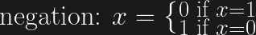

从物理上讲，*常开* (NO)开关和*常闭* (NC)开关互为反相。当 NO 开关由符号 X 表示时，NC 开关将表示为 X’，其中撇号表示否定。

[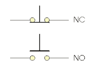](https://hackaday.com/2016/06/03/designing-circuits-with-switching-algebra/no-and-nc-switches/)

Normally Closed and Normally Open Switches

[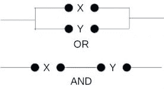](https://hackaday.com/2016/06/03/designing-circuits-with-switching-algebra/and-and-or-switches/)

OR and AND Operation Using Switches

第二条规则可以用两种不同的方式表达。一种形式是*与*运算，或 *con* *junction* ，另一种形式是*或*，或*析取*。从形式上看，这些操作是:

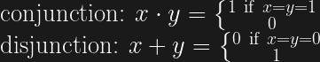

开关图有助于阐明这些规则，但我们现在将切换到逻辑门，以使用更现代的表示方法。

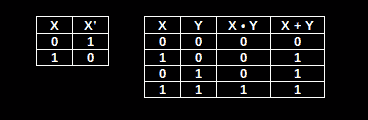

NOT, OR and AND Truth Table

真值表是定义系统操作的表示。这个真值表演示了 AND 和 OR 是如何关联的，因为如果您对其中一列求反，并将其从上到下翻转，就会得到另一列中的值。这种关系的正式表述是:

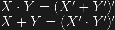

因为这些操作中的每一个都可以从另一个中导出，所以只需要一个作为交换代数中的第二个规则。AND 和 OR 运算符，用' "和'+'表示，类似于乘法和加法，它们遵循相同的规则进行[交换、关联和分配](http://www.allaboutcircuits.com/textbook/digital/chpt-7/boolean-algebraic-properties/)。注意，正如我们经常在算术中省略乘法运算符一样，AND 运算符也可以通过连接表达式中使用的变量来省略。下面是显示这些操作之间关系的数学公式:

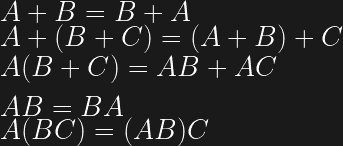

开关代数的目标之一是使用数学将表达式表示的电路简化为最简单的形式，或者在某些情况下，简化为使用特定逻辑门的形式。设计师可以使用数学恒等式和简化规则来完成这种重构。

可以在重构中使用的[代数恒等式](http://www.allaboutcircuits.com/textbook/digital/chpt-7/boolean-algebraic-identities/)有:

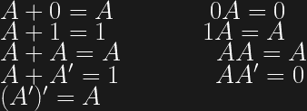

以下是一些在重构中有用的[简化规则](http://www.allaboutcircuits.com/textbook/digital/chpt-7/boolean-rules-for-simplification/):

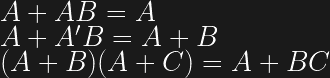

最后一个重要的考虑是操作的优先顺序。同样，它们类似于常规算术:

1.  从左到右
2.  补充(非)
3.  和
4.  运筹学

对于逻辑电路，如 XOR 或 NAND，其优先顺序没有很好地定义，它们是从三个基本电路中派生出来的。使用这些操作时，最好用括号来明确操作的顺序。

使用布尔代数作为开关代数，复杂电路被表达，以便它们可以被数学地评估。这很快提高了设计开关电路的工程师的生产力，其中一些开关电路被用于计算机。

# 半加器

让我们将开关代数应用于半加法器的设计，半加法器是 CPU 中的核心电路。半加法器接受两个二进制输入并产生两个输出。一个输出是输入的总和，而另一个是下一级的进位。真值表显示了期望的输出。

进位输出显然是两个输入的 AND。这使得设计变得简单。

根据设计人员想要使用的电路，可以通过几种不同的方式产生总和。让我们来看一种使用 OR、NAND 和 AND 门的方法。每一步都有列的真值表有助于分析。“或”列显示 X 和 y 上的运算结果。下一列是 X 和 y 上的“与非”运算结果。最后一列是“或”和“与非”列的“与”，它产生所需的和输出。

[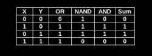](https://hackaday.com/2016/06/03/designing-circuits-with-switching-algebra/or-nand-and-truth-table/)

Half Adder Truth Table

[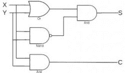](https://hackaday.com/2016/06/03/designing-circuits-with-switching-algebra/first-half-adder/)

First Half Adder

我们可以用数学方法表示为:

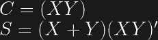

我们可以通过重构数学来简化电路，重新使用 C 来计算 s，为此，NAND 被移除，C 的输出被 NOT 门求反，作为输入传递到电路的最终 AND。半加法器现在是:

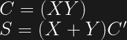

[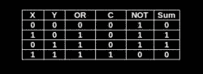](https://hackaday.com/2016/06/03/designing-circuits-with-switching-algebra/or-c-not-truth-table/)[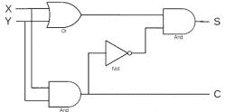](https://hackaday.com/2016/06/03/designing-circuits-with-switching-algebra/second-half-adder/)

我们可以通过引入异或门来直接提供求和操作，从而大大减少门的数量。异或运算在等式中用数学符号'⊕'来表示。半加法器现在仅使用 2 个门，数学上表现为:

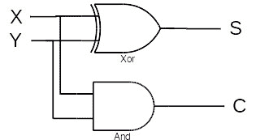 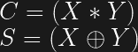

半加法器的这些不同实现说明了电路设计过程中的权衡。集成电路包含一种类型的多个门，比如与非门。如果一个 IC 中有空闲门，将其用于电路，而不是增加另一个 IC，如 XOR，可以节省设计成本和电路板空间。

# 全加器和卡诺图

一个有用的设计工具是[莫里斯·卡诺图](https://en.wikipedia.org/wiki/Maurice_Karnaugh)在 1953 年开发的 [*卡诺图*](http://www.allaboutcircuits.com/textbook/digital/chpt-8/introduction-to-karnaugh-mapping/) 。该图是另一种形式的真值表，可用于提取输入和输出值之间的数学关系。该表是通过沿顶部和左侧轴列出输入值并在表体中列出输出值来构建的。我们将使用映射来设计全加器，比设计半加法器更精确。

全加器有两个相同的 X 和 Y 输入，但也有一个输入进位，即来自前一级的 Cin。输出是相同的，总和 S 和输出进位 c。为方便起见，为了消除两个进位之间的混淆，在本分析中，我们用 Z 表示 Cin。

[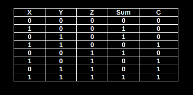](https://hackaday.com/2016/06/03/designing-circuits-with-switching-algebra/full-adder-truth-table/)

Full Adder Truth Table

[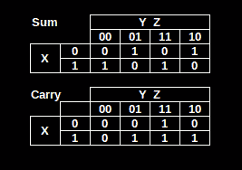](https://hackaday.com/2016/06/03/designing-circuits-with-switching-algebra/full-adder-map/)

Full Adder Karnaugh Map

定义真值表后，我们可以构建两个卡诺图，一个用于求和，另一个用于进位。X 值沿左侧向下，而穿过顶部的是 Y 和 Z 值。请注意，Y 和 Z 的值顺序为 00，01，11，10 (0，1，3，2)。当列出多个输入时，序列只能为每列或每行改变一位。这叫做 [*格雷码*](https://en.wikipedia.org/wiki/Gray_code) 。

通过复制输入的结果值来填充地图主体。例如，在求和图中，当 X = 1，Y = 0，Z = 1 时，结果为 0。相同输入的进位结果是 1。

为了开始数学分析，我们为包含 1 的单元格编写布尔表达式。使用相同的 X、Y、Z 值 1、0 和 1，我们为该单元格编写一个表达式，因为进位表中的结果是 1。我们不为 sum 表编写表达式，因为它的单元格是 0。每个表的单元格的子表达式用 or 组合成每个表的表达式。求和与进位的表达式为:

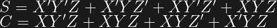

关注于总和，重构从将 X’从前两个子表达式中分解出来开始:

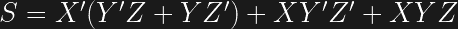

接下来，[根据参考资料](http://www.allaboutcircuits.com/textbook/digital/chpt-7/the-exclusive-or-function-xor/)，我们知道表达式(Y'Z + YZ ')是 Y 和 z 的异或。进行这种改变并在最后两个子表达式中分解出 X，我们得到:

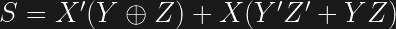

再次[基于引用](https://en.wikipedia.org/wiki/Boolean_algebra#Derived_operations)，我们知道(Y’z’+YZ)是一个*等价*，一个我们通常不使用的逻辑运算。当操作数相等时，其值为 1，这是当操作数不相等时为 1 的 XOR 的取反。接下来的两个步骤重构等价关系，并将等价关系转换为异或运算。

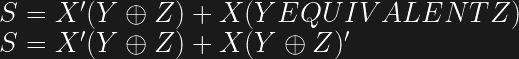

让我们通过用 k 代替(Y ⊕ Z)来简化表达式，使下一步更清楚。

这个简化的形式让我们再次看到我们有一个异或。我们重构使用 XOR 操作符，并用 K 的原始值替换它。

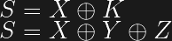

这是已知为真的和的最终表达式，因为当有奇数个输入时，多个输入的任何 XOR 都是 1。然而,[对于多输入 XOR 的这种](https://mindhunter74.wordpress.com/2011/04/25/xor-the-interesting-gate/)解释存在一些争议。

回到这里重复的进位表达式，我们对表达式重新排序，并在前两个子表达式中取出 Z。这里又有一个 XOR 运算，所以我们进行重构。

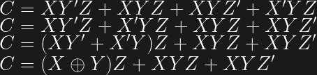

现在把 XY 从最后两个表达式中分解出来。从上面列出的恒等式中，我们知道子表达式(Z+Z’)总是 1，因此可以消除。这就完成了进位表达式的数学运算。sum 表达式是重复的，我们可以检查两个最终表达式。

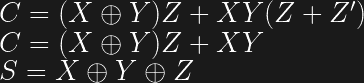

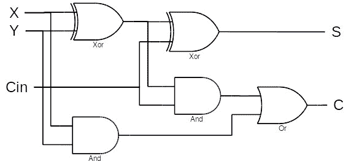

显然，在逻辑图中，我们可以用表达式(X ⊕ Y)来进行两种计算。现在我们有了最终的全加器电路设计。

尽管这种设计看起来不错，但作为累加器并不实用，例如一次添加许多位的寄存器。如果你想增加一个 32 位的数字，你需要为每一位增加一个这样的电路。电路的进位输入来自下一个低位。一旦所有 32 位的 X 和 Y 置位，来自最低有效位的进位就传播到下一个较高位。反过来，载流子向上传播，且重复这一过程，直到所有 32 个电路变得稳定。通过 32 个电路的传播需要相对较长的时间。现代多位并行累加器从一开始就被设计成一个电路，以实现高速操作。

像这样的设计曾经很有用，可能在今天有空间和功率限制的系统中也很有用。一些早期的计算机对串行数据流进行运算，如加法，而不是今天的并行运算。两个移位寄存器，每个包含 X 或 Y 输入值中的一个，将通过该加法器移位，进位保持到下一个移位周期。求和结果将被移入另一个寄存器，或者可能是 X 寄存器，以存储结果。

# 包裹

开关或布尔代数不限于硬件设计。现代软件语言提供布尔变量，这些技术同样适用。当然，编译器会做一些重构来优化布尔表达式，但是改进的程度是不确定的。如果需要一个复杂的逻辑决策，应用这些技术可能是有用的。

我在准备过程中使用的一个重要资源是 WolframAlpha 网站，它允许我验证数学表达式。给定一个表达式，站点会生成真值表、使用不同操作符的多重重构、一个图以及其他关于输入的信息。真值表允许我验证我的开始和分解表达式生成了期望的输出。

你可能会感兴趣的另一个关于开关代数的信息链接是[布尔代数的应用:Claude Shannon 和电路设计](http://www.maa.org/sites/default/filimg/upload_library/46/Pengelley_projects/Project-9/Project_9-Shannon_with_figures.pdf):开关代数概述。在整篇文章中，我还参考了网站[关于电路的所有内容，第 7 章:布尔代数介绍](http://www.allaboutcircuits.com/textbook/digital/chpt-7/introduction-boolean-algebra/)，为主题提供背景知识。整个网站对电子黑客来说是一个有用的参考。

这是我写的第四篇关于 Shannon 的文章。前两篇文章提到了他在 1948 年发表的一篇论文，这篇论文开创了信息论领域。第一个讨论了他对可以通过通信信道无误传递的[信息量](http://hackaday.com/2016/02/05/grandmas-phone-dsl-and-the-copper-they-share/)的分析。这项工作引出了关于如何使用[纠错技术](http://hackaday.com/2016/02/10/error-detection-and-correction-reed-solomon-convolution-and-trellis-diagrams/)实现最大吞吐量的研究，这也是我第二篇文章的主题。香浓的[百年诞辰庆典](http://hackaday.com/2016/04/29/centennial-birthday-of-claude-e-shannon-the-math-and-ee-pioneer/)在 4 月 30 日^日，也收到了一篇文章。

对我来说，这结束了香农之旅，但不是他所有的作品，或其他人基于他的才华所做的所有工作。有很多关于信息论和通信的文章可以写，我可能会带着其中的一些回来。