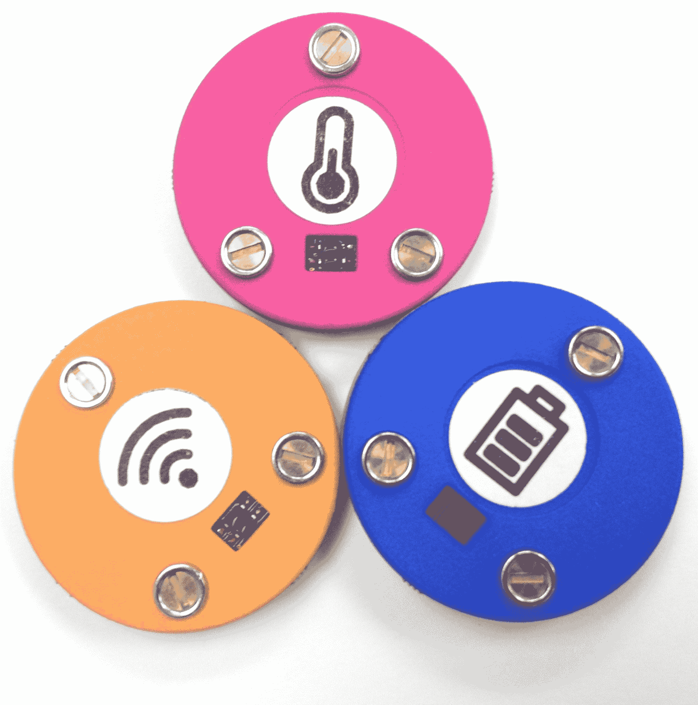
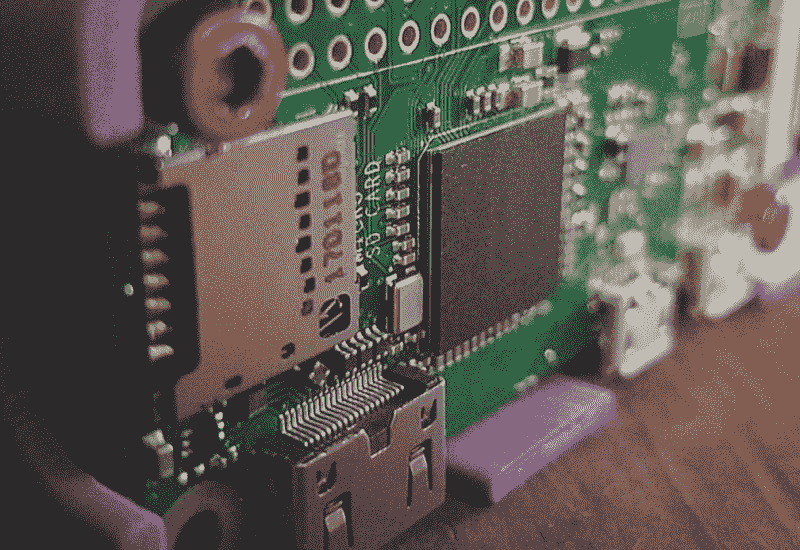
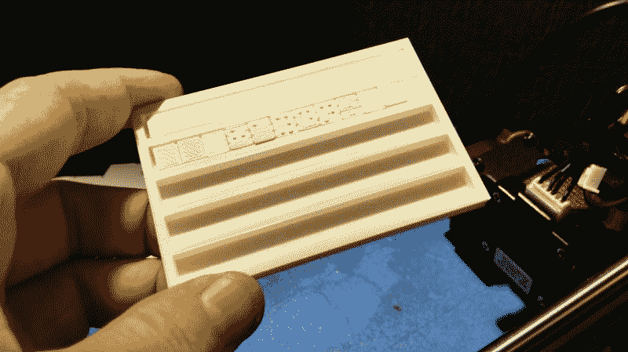
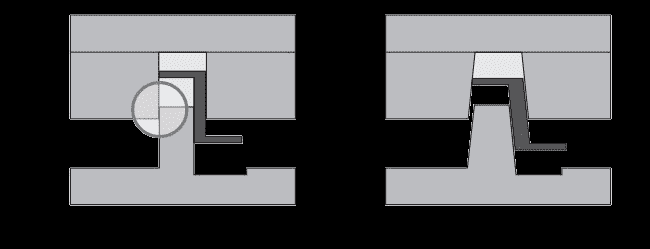
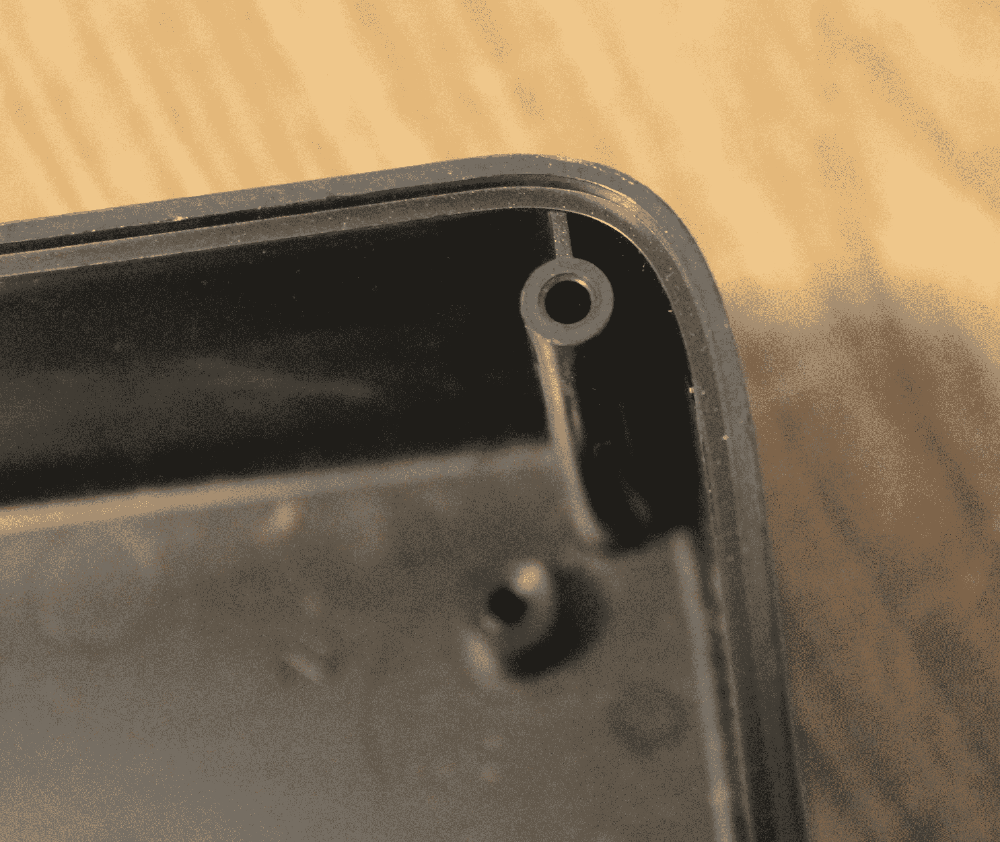

# 在设计产品时考虑注塑成型

> 原文：<https://hackaday.com/2017/06/05/designing-products-with-injection-molding-in-mind/>

3D 打印是一种我们在家里或通过 Shapeways 使用了很久的技术，但如果你正在设计一种产品，3D 打印只能让你到此为止。它粗糙、缓慢、昂贵，并且有很多局限性。虽然这对于原型阶段来说很好，但最终大规模生产的产品将使用另一种方法制造，最有可能的是注射成型。知道如何设计注射成型的零件意味着你可以开始用 3D 打印制作原型，相信你能够在不改变设计的情况下转移到模具上。

2017 年 Hackaday 奖包括最佳产品的[3 万美元奖金，因为我们寻求的产品不仅展示了一个伟大的想法，而且是为制造而设计的，并且已经考虑过如何将它们送到用户手中。](https://hackaday.io/prize/bestproduct)[一些参赛作品](https://hackaday.io/submissions/prize2017_bestproduct/list)似乎敏锐地意识到了从原型到生产的挑战。以下是在考虑未来注塑成型时进行原型设计的一些最佳实践示例。

## snap bloks–可重复使用的模具

SnapBloks 正在建造交互式模块，每个模块都有不同的功能，从电源到温度监控，播放声音，打开 led，移动电机。这些积木用磁铁扣在一起。拥有这样一个模块化的基于数据块的系统意味着要生产和储备许多产品。这意味着要采购大量库存和零件。这也可能意味着许多不同的注射成型件。SnapBloks 做得很好的一件事是，他们的每个模块都有相同的顶部，以颜色区分。使用一种颜色运行注塑模具，然后切换到不同的颜色，可以获得不同产品的外观，而不必制作额外的昂贵模具。

One mold, multiple products. Reuse your molds if possible.

只要有可能，尽量减少你需要的模具数量。SnapBloks 可能仍然需要大量的模具来制作它们的下半部分，但重复使用顶部是一个好计划。

## snapchat–简单的模具

SnappCat 是一种为你的猫拍照的设备，在互联网上没有足够的猫图片的时代，这是一种非常需要的产品。一个简单的模具将打开和关闭，并推出一个部分没有阻力。这意味着零件不能有任何将零件“锁定”在模具中的特征，如侧孔或突出物。

如果需要侧面特征，这是通过模具中的滑块来完成的，滑块是模具的第三部分，从侧面滑入，然后在零件被顶出之前出来。幻灯片可能很贵，但侧孔仍然是外壳中的必需品。这样做的方法是让您的孔位于机箱正面和背面的结合处，这样机箱的每一侧都有一个或多个孔。SnappCat 的设计将这一点嵌入了他们的 3D 打印模具中。请注意，孔的 3 个侧面在紫色部分，后面的部分将覆盖最后一个侧面，形成一个完整的孔，没有复杂的模具。

3 of the 4 sides of the holes are on one part, and the 4th side is on the other plastic part.

## 盲文紧凑型印刷机–使用大公差

这个项目的标题很有描述性；这是一台用于盲文的小型印刷机。人们可以用布莱叶盲文写一张纸条，然后在上面摩擦纸张使其凸起。不过，不一定要像印刷机那样在镜子里完成。需要注意的是，零件的公差越大，翘曲就越不重要，你就能获得越多的成功。

[海顿·琼斯]得到了惨痛的教训，当他用公差太紧的 3D 打印时，零件不能很好地装配在一起。如果你的零件需要 0.001”的公差来正确装配，那么工厂会扔掉很多不合格的零件(或者重新研磨它们)，你必须为此付出代价。

如果你的零件允许一些可变性，每个人都更高兴，零件更便宜。使用盲文紧凑型印刷机，他们使用简单的部件，只有 6 个不同的设计部件，位置不需要完美，所以公差可以相当大。

Bigger tolerances make this product easier to use, don’t affect function, and ensure manufacturing will be successful.

## 其他设计考虑

在 3D 打印中，草稿不是一个重要的概念，但在模具中它是必不可少的。这意味着所有的壁都将逐渐倾斜，这样零件就可以很容易地从模具中取出。零件应该计划至少 1 度的拔模斜度，并且应该确保拔模斜度的方向正确，这样零件就不会被锁在模具中。

No draft (left) causes wear on the mold and other problems.
Appropriate draft allows the part to come out of the mold easily.

一致的壁厚是另一个重要的设计准则。3D 打印将只是用图案填充大面积，以便保留形状和强度，但在注射成型中没有这样的等效物，因此一个大的腔体最终会有很多塑料。当它冷却时，这种塑料会收缩，留下一个称为凹痕的特征(并浪费塑料)。最好让塑料的所有壁都具有相同的厚度，任何像凸台(用于螺钉或固定某个部件)这样的特征都应该远离壁，并用肋连接。

Consistent wall thickness, bosses offset from wall with rib.

对于外部零件，使用不同的颜色或相同的模具。配色很难，在运行之间几乎不可能。你不希望有一个白色的片紧挨着一个稍微不白的片，因为制模者在不同的时间在不同的机器上制作了两半。解决这个问题的方法是设计它，使零件故意有非常不同的颜色，或者做一个家庭模具，在同一个模具中包含两个零件，这样他们可以同时得到相同颜色的塑料。

Hackaday 奖最佳产品竞赛正在升温，我们很高兴看到哪些产品将脱颖而出。我们希望看到您正在进行的设计、制造和业务决策，这些决策将使您的项目成为产品！[立即输入您的产品](https://hackaday.io/prize/bestproduct)。

The [HackadayPrize2017](https://hackaday.io/prize) is Sponsored by:   