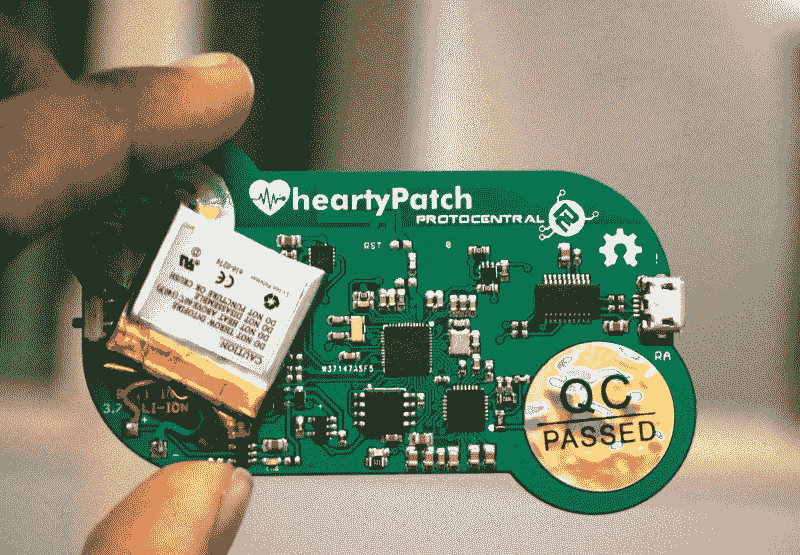
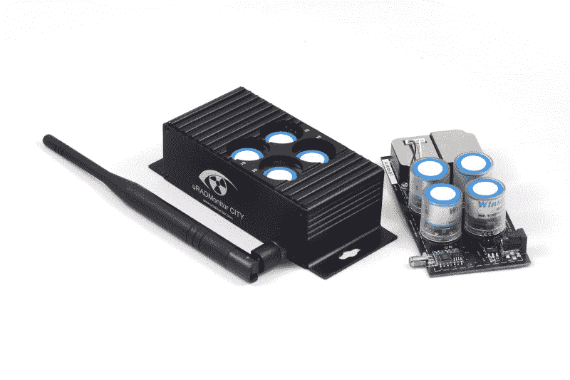

# 按比例设计您的项目:跨越鸿沟

> 原文：<https://hackaday.com/2017/06/14/designing-your-project-to-scale/>

Hackaday 是关于整洁的黑客技术和将旧组件重新用于新项目，但是许多人试图将这些项目转化为业务。我们已经看到许多人将他们的东西作为套件提供，并在 Tindie 上出售，只有极少数人继续大规模开发消费电子产品。

[Hackaday 奖 2017 最佳产品](https://hackaday.io/prize/bestproduct)突出了这一旅程。“规模”本身是一个模糊的术语，但本质上它意味着能够生产足够多的产品来满足市场需求。我们希望市场需求大约为每年 70 亿台，但现实是它在 1 到几十万台之间，每个数量级的制造都有非常大的差异。那么，如何从概念验证开始，并从一开始就设计您的产品，使其优化以满足您可以处理的任何需求呢？

## 追逐

硬件初创公司界称之为零售鸿沟，这是在你家生产最初几台设备和大规模生产数万或数十万台设备之间的巨大差距。这是大多数创业公司失败的地方，因为他们无法获得组件大批量折扣的好处，他们买不起注塑模具，如果他们能找到人来承担这项工作，组装也很昂贵。

但他们不能收取高于销量的价格，所以利润是不存在的，也很难增长。跨越这个鸿沟的诀窍是为这个鸿沟设计产品。使用易于小批量获得的部件，以及无需昂贵工具仍可获得的组装方法。

## 熟悉 SMT

电路板上的表面安装元件节省了成本、空间和组装时间，并且比通孔元件更容易获得。如果你想批量生产产品，尽可能使用 SMT。我已经有足够多的连接器从电路板上脱落，我很高兴为机械稳定性至关重要的元件破例，但 SMT 让一切变得更好。人们对这种转变和所需的技能有很多担忧，但随着更多资源如 OSH Stencil 和试验进入[回流控制器](https://hackaday.io/search?term=reflow)如[控制器](http://www.whizoo.com/)，在家制作电路板的前景已经变得更好了。

当浏览提交的[最佳产品列表](https://hackaday.io/submissions/prize2017_bestproduct/list)时，很明显，更精细和可扩展的产品都在尽可能地使用 SMT。为了验证概念，通常从各种元件的分线板开始，通过试验板将它们连接在一起，然后迅速转向 SMT，进行定制 PCB 的第一次修订。 [heartyPatch](https://hackaday.io/project/21046-heartypatch-a-single-lead-ecg-hr-patch-with-esp32) 从通过试验板布线的开发板开始，已经发展到几乎全部是表面贴装元件的小型 PCB，并且几乎全部在一侧(温度传感器在背面，并且需要在背面，但这将使组装变得复杂)。

The heartyPatch can be assembled on a hot plate.

在家里组装 PCB 很容易，通常只需要一把镊子和一个热板或烤箱。当然，制造商已经准备好做 SMT，所以扩展很简单。

## 使用现有零件

设计一个光滑小巧的定制外壳，或者从有限的供应商那里采购变压器，这很有诱惑力，但这只会给你带来麻烦。从短期来看，这意味着您将为零件支付大量费用，并且可能不得不订购超出您最初需求的最小数量。从 Polycase 或 Hammond 的外壳开始，然后根据需要进行修改。许多外壳公司也提供内部修改和打印，这意味着您可以用很少的前期成本订购完全准备好的部件。

挤压铝外壳是另一个受欢迎的选择，因为你也可以定制长度。[城市空气质量](https://hackaday.io/project/8334-city-air-quality)项目选择了这条路线，最终得到了一个坚固漂亮的外壳，而无需支付加工成本。它们内置了可扩展性。零件成本可能会更高，但所需的初始投资要低得多，这使得跨越小批量制造的鸿沟变得更加容易，直到您的需求增长到足以购买自己的模具。

另一个例子是 USB TinyTracker，其中[Paul]从外壳开始，设计了他的 [USB TinyTracker](https://hackaday.io/project/25211-usb-tinytracker) 以适合内部。如果他扩大规模，他最终可以设计自己的围栏，但在开始时，他有他所需要的一切。

The City Air Quality project uses an aluminum extrusion for the enclosure.

## 移除零件

如果你不需要它，你就不必采购或组装它。在一些工厂中，一个不为人知的制造商试图通过移除一个组件来节省资金，如果它仍然工作，他们就会发货，这并不罕见。自然，你想控制这一点，但这个想法有可取之处。

抓住每一个机会，问问自己是否需要这个组件(或者是否可以从产品中移除它，提供两个不同的版本，比如启用或不启用 WiFi)。同样重要的是，努力寻找机会将有用性加倍，这样你就可以省去一个零件或一个装配步骤或夹具。例如，设计您的外壳，使其咬合在一起，并用凸台将 PCB 固定到位。这消除了拧紧步骤、寻找螺钉以及可能的胶合步骤。添加部件和功能来使你的产品对更多的人更有吸引力是很诱人的，但是每一项添加都会增加用户的时间、成本、故障点和复杂性。

## 优化装配时间

每一分钟的组装时间都要乘以要制造的单元数量，很快就会累加起来。此外，设置和取消一个装配流程所占用的时间可能比流程时间还要多，因此对流程进行批处理至关重要。组装 100 块 PCB，然后编程 100 块 PCB，比组装 1 块，编程，组装另一块，编程，重复 100 次要好得多。尽可能使你的工作站易于安装和拆卸，这样当你需要生产另一批产品时，你就不会在开销上浪费太多时间。

花些时间看看是什么在过程中减慢了速度，或者是什么导致了生产和质量控制的不一致。几个小时解决这个问题可以很容易地节省时间和提高产量。

不过，更重要的是，在考虑装配时间的情况下改进设计。尽可能去掉零件，使用卡扣代替螺钉，并内置健全检查和定位销，这样零件只能单向装配。使微控制器的编程变得容易，并且不要将器件放置在妨碍其它器件的位置。

## 结论

跨越鸿沟确实很难，但是从一开始就将项目设计成可扩展的将会省去很多痛苦。将来扩展时，您总是可以更换零件并进行改进，但您应该在开始时就做好准备，使用更便宜的工具进行更低的产量和更耗时的组装。

你现在正在进行自己的产品之旅吗？[进入 Hackaday 奖最佳产品类别](https://hackaday.io/prize/bestproduct)。这是您与组成 Hackaday 社区的早期采用者联系的机会，并为您的产品发布产生早期反响。有现金奖励(20 名决赛选手每人获得 1000 美元，其中一名最佳产品奖为 30，000 美元)，还有一个巨大的乘数，这来自于我们社区中受欢迎的硬件制造商。

The [HackadayPrize2017](https://hackaday.io/prize) is Sponsored by:   