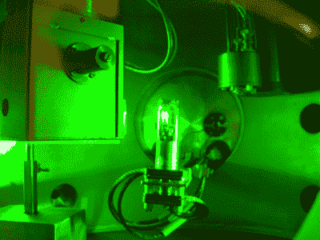
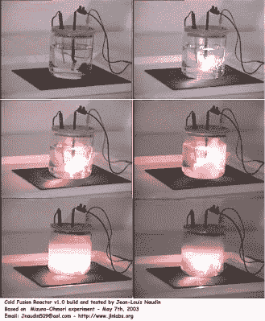
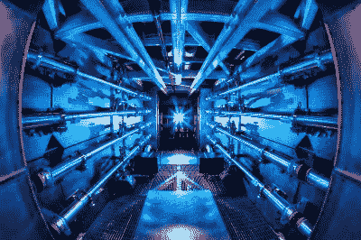

# 氘动力住宅和冷聚变炒作的回归

> 原文：<https://hackaday.com/2015/10/05/deuterium-powered-homes-and-the-return-of-cold-fusion-hype/>

我们收到[这份新闻稿](http://www.gu.se/english/about_the_university/news-calendar/News_detail//small-scale-nuclear-fusion-may-be-a-new-energy-source.cid1323710)声称一种新的聚变反应，在小规模下使用一种令人难以置信的奇异燃料材料:超高密度氘。我们以开放的心态研究了这个问题，如果我们是善意的，我们会得出这样的结论:有一个长达十年的研究项目正在由[叶小开·霍姆利德]进行，他是一个科学家，如果他的说法是真的，他将获得一两个诺贝尔奖。

如果我们放下善意，理性地对待它，这就不太对劲，而且在被与最初的研究无关的人可靠地重现之前，是不可信的。让我们深入研究氘动力反应的说法，并围绕我们在 90 年代发现的如此令人悲伤的冷聚变大肆宣传。

## 超高密度氘

新闻稿宣称:一种“新型的核聚变过程”。警钟已经敲响了。自大爆炸后的几秒钟以来，就没有新的核聚变过程。新的技术，新的策略来引发或控制同样的旧核聚变，当然，但是一种全新的核聚变是一种革命性的主张。可能是瑞典语翻译的不好。

新闻稿中的进一步声明包括一种不使用昂贵且具有放射性的氚原子的反应，这种反应在小规模下是可行的，并且不会释放有害的聚变副产品，如高速中子。这听起来好得令人难以置信。

 所以我们下载了[的论文，这篇新闻稿是根据](http://scitation.aip.org/content/aip/journal/adva/5/8/10.1063/1.4928572)的。实验的细节是粗略的，但作者声称他们获得的能量比输入的多，包括聚变副产品，所有这些都是在室温下进行的。

秘方似乎是超高密度的氘，“D(0)”不管那是什么意思。浏览作者的其他论文，看起来他声称已经制造了金属氢，这将是一个诺贝尔奖。在这之间的八年或十年里，没有其他实验室复制这项工作，这开始看起来有点可疑。

虽然金属氢可能存在于木星的核心内部，但地球上还没有任何实验室成功地重复制造金属氢，尽管自 1935 年以来就有人认为这是可能的，并且许多人都进行了尝试。康奈尔大学和法国原子能委员会的团队都尝试过，但在高达 320 万个大气压的压力下失败了。

嗯，没有实验室，除了[霍姆利德]的。但这肯定是真的，因为它在维基百科上！上面说[霍姆利德]实验室用[“里德堡物质”](https://en.wikipedia.org/wiki/Rydberg_matter)制造了金属氢。我们从来没有听说过这种东西，所以我们顺着维基百科的链接找到了兔子洞，只找到了一些我们不理解的晦涩难懂的东西和几乎完全由[叶小开·霍姆利德]引用的论文。

在这一点上，我们已经完成了超高密度氘，剩下的工作就交给它了。为什么？因为科学是基于共识和可复制的结果。由单个研究者得出的不可重复的实验结果不是结果——它们充其量只是轶事。不，我们这里有一个冷融合的例子。

## 冷聚变及其子代

1989 年的[冷聚变惨败](https://en.wikipedia.org/wiki/Cold_fusion)之所以引人注目，主要是因为它宣称清洁而丰富的能源主要来自咸水。关于媒体为何如此迅速地报道这件事，说法不一，但部分原因肯定是由于两位合著者之一的[[马丁·弗莱施曼](https://en.wikipedia.org/wiki/Martin_Fleischmann)]在当时是一位备受尊敬的化学家。两个早期的初步报告证实实验火上浇油，虽然后来都被撤回，并解释了异常。

但是随之而来的是正常的、严肃的科学工作。更多的实验室试图复制冷聚变结果，但都失败了。美国物理学会(APS)没有草率地驳回这些主张，而是召开了一次会议，收集了这个主题的所有实验证据。绝大多数实验室得出了进一步的负面结果，专家小组几乎一致宣布这个话题结束。

“庆祝”冷聚变十周年的《纽约时报》是第一批批判性质疑冷聚变的报纸之一，[在 1999 年](http://partners.nytimes.com/library/national/science/032399sci-cold-fusion.html)整理了一份很好的概述时间表，记录了他们当时关于这个话题的文章。像许多其他人一样，时报的作者最初对无限能源的承诺抱有开放的热情。但一个月后，随着负面证据的积累，他们开始退缩。当 APS 把冷聚变棺材钉死的时候，时代也紧随其后。

类似冷聚变的结果有过无数次小规模爆发，但同样没有可重复的结果。自从公众痛击冷聚变后，它的支持者们刚刚重新命名了他们的研究议程。基本上所有的新冷聚变运动都在他们的名字中包含了类似“低能量”的东西来代替“冷”，并且他们非常小心地避免使用“聚变”这个词。但是他们都有一个共同的信念，那就是(几乎)免费能源，冷聚变的最初承诺。可悲的是，一个[美国海军组织(SPAWAR)资助了一些最后的真正信徒(PDF，庸医)](http://lenr-canr.org/acrobat/KrivitSextraordin.pdf)。你的税收在起作用！

令人震惊的是，以“超高密度氘”为关键词进行搜索，会出现如此频繁的关于这一研究领域的报告，而且只看表面价值。如果有免费(甚至廉价)的清洁能源，我们会和任何人一样高兴。许愿并不能让它成真。与此同时，我们支持资助负责任的研究，而不是将其资助请求建立在炒作之上。让我们恼火的不是对突破的追求，而是对“结果”的模糊表述。

## 热融合

 与冷聚变的说法形成鲜明对比的是，这里有实际的热聚变。这很混乱，温度和压力是天文数字，但在某种程度上，背后的实际科学并不难解释:将原子核结合在一起会释放出巨大的能量。

在第一颗氢弹原型证明它可以在实践中发挥作用的几十年前，理论上就预测到了真正的核聚变。简而言之，毫无疑问，科学背后的平原老融合。剩下的只是(难以置信的复杂)细节。

这就是庸医科学和真正科学的区别。庸医科学是快速致富的计划；这是不劳而获的回报。很简单也很容易。另一方面，[国家点火装置](https://en.wikipedia.org/wiki/National_Ignition_Facility)是世界上最大的激光器，建造了近 20 年，花费了无数的工时，输出 500 万亿瓦的能量。)每拍。然而这些小丑仍然没有破解聚变点火。

但是你知道，如果他们可以，只要少花几十亿美元，在一个舒适的小实验室里，他们就会这么做。

(图片来源 [NIF 前置放大器](https://en.wikipedia.org/wiki/National_Ignition_Facility#/media/File:Preamplifier_at_the_National_Ignition_Facility.jpg):达米恩·杰米森/LLNL，CC-A-SA-3.0)