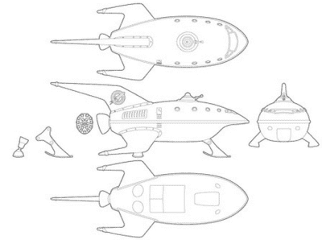
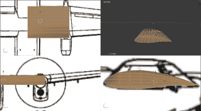
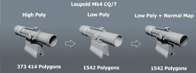
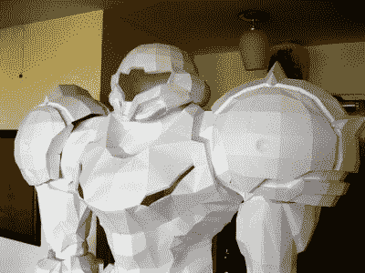

# 道具制作世界的开发工具

> 原文：<https://hackaday.com/2015/11/09/development-tools-of-the-prop-making-world/>

我们以前见过他们。像素完美的传送门 2 复制品钢铁侠电弧反应堆绝地光剑。随着通过互联网共享知识的增加，我们终于可以一窥隐藏在车库门、地下室和堆满螺母、螺栓和其他废料的征用咖啡桌后面的世界。那个世界是道具制造。随着 3D 打印机和激光切割机等 fab 设备开始流入更多人的手中，DIY 爱好者开发了有效的工作流程和相应的软件工具来减轻他们的负担。我想我应该简单地看一下一些软件工具，它们可以为在家的人们打开戴上呼吸器和护目镜并开始制作道具的可能性。

## 制作蓝图

在初始设计上花费的时间可以构成整个过程中零件位置的基础。 [VolpinProps](http://www.volpinprops.com/) 的幕后策划者【哈里森·克里克斯】不慌不忙地用 Adobe Illustrator 制作蓝图。不想花钱？没问题。 [Inkscape](https://inkscape.org/en/) 和 [LibreCad](http://wiki.librecad.org/index.php/Main_Page) land 作为开源矢量插图的替代方案。

Image Credit: [Volpin Props](http://www.volpinprops.com/product/planet-express-ship/)

一旦最初的图纸完成，CAD 和 3D 建模软件就可以用追踪原始参考的特征来充实 3D 细节。

## 使用 Blender 进入 3D 建模领域

在道具制作领域，复制品采用了与传统工程 CAD 和制图工作流程略有不同的方法。在许多情况下，“如果它看起来是对的，它就是对的”是一个足够紧密的约束，足以制作可信的道具，尽管数控机械可能会在旋转一些零件时发挥作用，但你不需要小数点后三位的精度来让一些人转向。根据这一标准， [Blender](https://en.wikipedia.org/wiki/Blender_(software)) 成为制作我们目标零件 3D 模型的绝佳选择。虽然它支持全面的渲染和动画功能，但我们可以利用优秀的网格编辑工具进行 3D 建模。

Image Credit: [flightgear forums](http://forum.flightgear.org/viewtopic.php?f=4&t=15000&sid=01276739879222ac6c30e3d665e91d61)

如果你正在寻找一个经典的基于节点的 3D 建模替代方案，试试锑。

## 直接抓取游戏文件

用 3D 电子游戏制作道具，为什么不从原始模型本身获取灵感呢？[Angus Deveson]在他的[模型抓取教程](http://hackaday.com/2014/10/13/3d-printing-models-from-computer-games/)中就是这样做的，使用 Milkshape 3D 将不常见的游戏文件格式转换成熟悉的 3DS 或 STL 格式，为 3D 打印做好准备。值得一提的是，存储在视频游戏中的原始 3D 文件可能是一个不够充分的起点。正如 RPF 论坛上[的【风暴领袖】所解释的，被称为“法线贴图”的 3D 渲染技巧使视频游戏开发者能够将低分辨率 3D 模型与高分辨率纹理相结合，从而增强细节的感知水平，而不依赖于原始的高分辨率模型。](http://www.therpf.com/showthread.php?t=185536)

Image Credit: [The RPF Forums](http://www.therpf.com/attachment.php?attachmentid=188663&d=1369424974)

最终结果是游戏中包含的 3D 模型以固有的低分辨率开始——对于一个详细的复制品来说可能太低了。然而，对于可折叠的 Pepakura (papercraft)模型，低分辨率模型可能就足够了。

最后，请记住*从游戏导出的模型中获利*是违反游戏服务条款的。

## 造纸工具

Image credit: [405th.com](http://www.405th.com/showthread.php?t=36607)

有了 Blender 中制作的 3D 模型，我们将该模型带入现实世界的第一步可能会以纸张的形式出现。一个低成本的 3D 模型展开软件包 Pepakura ，做你想做的事情。它将 3D 网格展开成扁平的矢量图形，我们可以打印、剪切和折叠成原始模型的副本。一旦用玻璃纤维或粗棉布加固，这种结构就足够耐用，穿在身上也不会散架。切割、折叠和加固的过程是一个漫长的过程，但幸运的是，切割步骤可以通过附近的激光切割机大大加快。由于不是所有的工作流程都是一样的，DIY CNC 爱好者们开发了额外的软件工具，如 [dxf2gcode](http://sourceforge.net/projects/dxf2gcode/) 用于简单的文件转换。最后，如果你仍然对支付 38 美元不感兴趣，Blender 艺术家已经到达现场，提供一个 [Blender 插件](http://wiki.blender.org/index.php/Extensions:2.6/Py/Scripts/Import-Export/Paper_Model)，它也可以将网格撕裂成可打印的 2d 文件格式。

## 社区

社区提供的悬浮滑板图形。图片来源:[RPF 论坛](http://www.therpf.com/showthread.php?t=84243&highlight=tutorial) [ [原始 PDF](http://www.angelfire.com/pa5/jdoud2/bttf_hoverboard_vector.pdf) ]

你可以独自迈出制作道具的第一步，但现实是，世界各地的人们都渴望分享他们的技术，并寻求技巧。为什么不加入他们呢？有了社区的支持，共同的努力可以产生共享的设计和世界范围反馈的复制品。为科幻任务当兵？前往 405 步兵论坛。需要一个大致的起点？试试 RPF 论坛。在这里的论坛上，道具变得栩栩如生，因为它们仍处于发展阶段，比如建造马克·瓦特尼的 EVA 套装的集体运动。

## 向前

当一个道具做得好的时候，现实生活和我们想象中的生活之间的界限变得模糊了，这是一件好事！感谢 Hackaday 的人们，感谢所有的道具制作人，他们模糊了真实和想象之间的界限，让现实世界变得更酷。