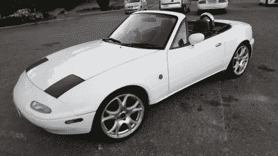
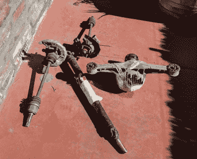
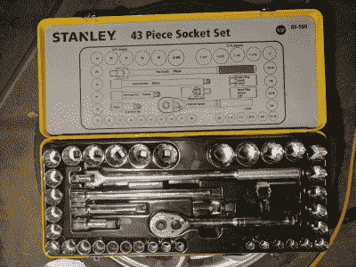
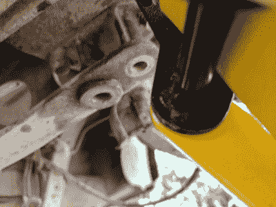
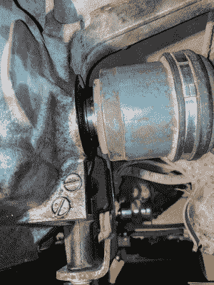
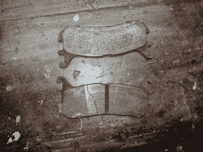
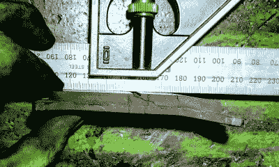

# 不同的差异&容易互换的陷阱

> 原文：<https://hackaday.com/2017/04/25/different-differentials-the-pitfalls-of-the-easy-swap/>

我喜欢汽车，也做汽车方面的事情。不过，我开始得相当晚，我才刚刚开始进入整个改造的过程。现在，就汽车而言，你几乎可以做任何你想做的事情——发动机互换、传动系统转换，你能想到的——都已经做到了。但是这样的工作需要高水平的制造技能、汽车知识，并且通常需要一个库存充足的机械车间来匹配。我们这些初来乍到的人倾向于从小处着手。

那么从哪里开始呢？嗯，有一个很大的 mods 领域可以做，通常被称为“附加”。这围绕着这样一个想法，即修改的安装过程就像遵循一组基本的指令来卸下旧的硬件和升级的部件一样简单。那些在我之前踏上这片土地的人会在这一点上咯咯地笑着——所以螺栓连接很少只是螺栓连接。如下，旅程我的马自达的差异升级将证明这一点。

The car in question, currently known as the “Junkbox MX-5” until it starts running well enough to earn a real name. It somehow looks passable here, but in person I promise you, it looks awful. Credit: Lewin Day

这一切都是从 2016 年 12 月我买车开始的。我刚刚开始为 Hackaday 写作，而我卑微的大发公司，在我不知道的情况下，已经奄奄一息了。我最近意识到，我不再年轻了，尽管我对汽车着迷，但我从未真正拥有过一辆跑车或在愤怒中驾驶过跑车。是时候改变了。

在意识到我最喜欢的 JDM 金属超出了我的预算后，我决定买一辆经典的汽车——我要一辆马自达 MX-5，美国人叫它 Miata。这是日本人对老式英国跑车的模仿——一款敞篷跑车，发动机前置，驱动后轮。我想要我能找到的最便宜的，而且可以肯定地说，我买到了。

当我去买那辆车时，它看起来还不错——当然是一些破旧的油漆，但它开起来棒极了！那是一辆 1990 年的车，配有较小的 1.6 升发动机，没有值得一提的性能部件，但我还是想要一个项目。我愉快地付了 3000 美元，一切都很好，持续了大约 15 分钟。你看，在回家的路上，一个可怕的，可怕的噪音开始从汽车的传动系统发出。我的心怦怦直跳。

在一瘸一拐地回家祈祷这东西不会完全爆炸后，我跑到网上寻求帮助。

“奇怪的减速噪音”
“刮擦 mx-5 减速”
“Miata 动力传动系统拖曳噪音”

令我欣慰的是，成千上万的人都有和我完全一样的问题——在减速时发出奇怪的拖拖拉拉或刮擦的声音。令我恼怒的是，不清楚问题出在哪里——是差速器、变速箱——还是排气隔热罩？最终，我去了一趟当地的 MX-5 专家，他表示这可能是变速箱或差速器的问题，但尽管有噪音，它可能还能行驶 50，000 公里左右，直到我能修好它。

现在稍微舒服些了，我决定在继续现实生活的同时忍受这些噪音。与此同时，这辆车给我带来了更多的麻烦，比如过热——最终通过更换散热器解决了这个问题。

我很想让我的钱物有所值，但我并不担心。我买了这辆车，希望能升级车上几乎所有的东西，所以我不太担心磨损的部分。经过大量研究后，我决定升级到限滑差速器(LSD)，它允许后轮之间更好的扭矩分配，以获得更好的抓地力和操控性。另外，它可以帮助你疯狂滑行。我决定从最近的 1.8 升汽车中选择一个 4.1 的比率单位，来源于一个州以上的救险车。

The Torsen LSD from a 1.8 litre MX-5, along with tailshaft & halfshafts with hubs attached. Apparently removing the halfshafts from the hubs is insanely difficult so I’m thankful the wrecker left them attached. Credit: Lewin Day

起初，我并不太担心互换。1.8 升 LSD 本身并不能直接换成 1.6 升的汽车。然而，如果来源于 1.8 升汽车的尾轴和半轴，一切都应该只是螺栓。听起来很简单，对吧？

嗯，这就是麻烦的开始。我只做了几个月像这样更大的机械工作，但是在阅读了一些教程后，我有信心在几个小时内完成这项工作。但是我读的教程假定我有一定程度的经验，我很快发现我没有。

第一个问题——工具！我偶然发现了一个很棒的手推车千斤顶，并找到了一些千斤顶，这样我就可以钻到车底了。在做好一切准备后，我溜到车底，准备开始卸下差速器支座的螺栓。我在一个便宜的 50 美元的工具包里装了一个 3/8 英寸的棘轮，很快我就失望了。传动系统和悬挂部件通常用非常大的紧固件固定，达到非常高的扭矩。我们在最初的五分钟内完成了 3/8 插座扩展，并在等待五金店开门时结束了一天的工作。

This socket set was integral to getting the job done. A good set of tools will make your wrenching activities much more pleasurable. Credit: Lewin Day

第二天，我回来了，带着一套结实的新插座。说这改变了我的经历完全是轻描淡写。突然，随着 300 毫米的延伸和 1/2 英寸的驱动断路器杆，固定在差速器上的螺母不是我的原始力量的对手。一瞬间，看似不可能完成的任务似乎又变成了一项只需一天的快速工作。直到下一个陷阱。

车上的东西经常卡住。把一个大螺栓穿过几个部分，王把它提高到 150 英尺磅，用泥土和水把它炸 27 年。拆下螺栓，你可能会发现它仍然粘在一起。当你试图把东西弄出来时，最初的本能可能是去拿一把锤子。但这并不容易——有时你是否真的击中了正确的东西并不明显。其他时候，你在球上，拍打自由的部分——只是意识到你刚刚把你的螺丝刀穿过刹车线。通常需要一些技巧、一杯茶，以及向相关论坛或脸书小组提一个简短的问题，来确定应该把锤子放在哪里，以及应该用多大的力度来挥动它。在这项工作中，有一个衬套将旧差速器固定在发电厂框架上，令人困惑——谢天谢地，澳大利亚马自达 MX-5 集团的优秀员工证实我可以不受惩罚地猛击，我做到了。

A stubborn bushing. Hammer away, they said, and hammer I did. Credit: Lewin Day

下一个问题是螺栓。尽管我订购了将差速器安装到 1.6 升汽车上所需的“一切”，但救难车只提供了两个螺母来配合将尾轴连接到差速器的四个螺栓。我怀疑它们可能在运输过程中丢失了，因为所有的东西都是散装运输的。我也没能按照我最初的计划重复使用旧坚果——它们的尺寸更小。最后，在最后一分钟，我去了一趟零件商店，买到了一些稍微大一点的合适的坚果。说螺栓是一个问题可能听起来很奇怪，但你可能会感到惊讶。汽车制造商通常使用比当地五金店更高等级的螺栓，并且螺距种类也更多。替换品可以在专业紧固件经销商处买到，但这些都在下午 5 点关门，周末也不开门——对于有全职工作的 shadetree 技工来说，这不是什么好消息。谢天谢地，汽车零件商店救了我一命，那里确实有我周六需要的正确螺距的螺母，尽管一包三个要 7 美元。不过，比起开车去报废场从最近的马自达上拔下一颗螺栓，这是个更好的选择。解决了这个问题，我觉得那天晚上我有信心完成这辆车。

The halfshaft, impudently refusing to seat fully in the differential. The green section should be fully flush up against the differential housing & seal. Credit: Lewin Day

我继续下一项工作——将新的半轴安装到新的差速器上。令我惊讶的是，他们不只是滑了进来。快速搜索发现，他们需要一个结实的锤子重重地敲打，所以，在与轴(仍然有连接的轮毂)多次角力后，我得到了左边的一个。受到新成功的鼓舞，我很兴奋，立即从右边开始，但没有用。反复的打击并没有迫使它完全深入。我再次恳求论坛的有识之士，他们都报告说这很难，但更多的锤应该做的工作。然而，在这个时候，疲劳开始出现，我决定在几天内以一个全新的头脑和身体结束。

现在有了我需要的一切，星期一，工作进行得很快。锤子的快速敲击使先前不动的半轴就位。我没有停下来问为什么。差速器用螺栓固定并注满液体，动力装置框架对齐，变速器加满油。我很兴奋——车就在附近！我们所要做的就是改装后刹车，然后开着它兜一圈。右侧瞬间合二为一——此时我对刹车已经非常熟悉了，当我发现我的车的后卡钳都不起作用时，我已经对后来的模型刹车进行了升级。

当时天已经黑了，因为我们正在做最后一个轮子。由于某种原因，刹车不在一起，我们不停地摸索，因为我们试图走捷径，不想拆卸卡钳比任何必要的恢复在一起。最终，我们意识到了这个问题。

是的，刹车垫严重弯曲。我只能推测这是由于升级时不正确的装修，但尽管如此。不想停下来，我们找到了一个备用垫，上面有刹车升级留下的零件，中途把所有东西都装回了一起，直到我们意识到备用垫是错误的类型，一切都结束了。我三个小时的差异升级现在要进入第四天了。

A good brake pad (top) versus the bent one (bottom). Note the highly irregular wear. Credit: Lewin Day

The bent pad up against a rule. Colorized for clarity. I’m still not 100% sure how this happens on a single piston caliper. Credit: Lewin Day

此时是星期三，配备了一套新的后刹车片，我再次拆卸了两个后刹车组件，并安装了一切。我懒洋洋地调整手刹，因为在几个小时的尝试中，尽管按照正确的指示，我从来没有能够得到它。当手刹很大程度上失灵时，我并不感到惊讶或不安。车轮重新装上后，汽车被轻轻地从支架上放下，准备行驶。

说我紧张是一种保守的说法。虽然这可能是一个“螺栓上”的工作，但传动系统组件在出现问题时更有能力造成很大的损害。虽然倒车出车道很顺利，但当我把车开到一个朋友的加长车道上进行测试时，没有立即听到灾难性的声音。随着发动机转速升至 5000 转/分，我松开了离合器，令我高兴的是，这辆车的两个后轮都像预期的那样旋转起来——没有将旋转的金属部件扔得到处都是。开车回家进一步证实了我的成功，可怕的刮擦声现在从我的传动系统中消失了。

我对这份工作非常满意，迫不及待地想在最近的赛道上测试赛车。还有很长的路要走，我相信这不会是 MX-5 突然和毫不客气地在我身上失败的最后一部分。然而，在一天结束时，我设法忍受了一项“简单的 3 小时附加工作”，即使它花了我 4 天时间——对此我更有经验了。

 [https://www.youtube.com/embed/SRZswnxF_4Q?version=3&rel=1&showsearch=0&showinfo=1&iv_load_policy=1&fs=1&hl=en-US&autohide=2&wmode=transparent](https://www.youtube.com/embed/SRZswnxF_4Q?version=3&rel=1&showsearch=0&showinfo=1&iv_load_policy=1&fs=1&hl=en-US&autohide=2&wmode=transparent)

