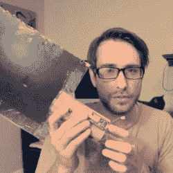

# 非常便宜的虚拟现实枪，带追踪功能，附加硬件 15 美元

> 原文：<https://hackaday.com/2016/08/28/dirt-cheap-vr-gun-with-tracking-for-15-of-added-hardware/>

如果你的头是唯一接受虚拟治疗的东西，虚拟现实就不会感觉很真实。为了获得真正的身临其境的体验，你必须能够使用你的身体，甚至以直观的方式与虚拟道具互动。例如，在第一人称射击游戏中，你希望能够像在现实生活中一样握枪并使用它。这正是[matthewhallberg]仅仅花了几美元就成功做到的。

这个项目试图开发一个虚拟现实射击演示和相关的硬件预算，完成跟踪，使枪可以瞄准独立于用户的观点。[matthewhallberg]称之为 Oculus Cardboard 项目，以使用谷歌 Cardboard 耳机进行虚拟现实部分和基于相机的物体跟踪进行枪支部分的组合方法命名。这款游戏是在 Unity 3D 中用 Vuforia 增强现实插件制作的。不算智能手机和谷歌 Cardboard 耳机，这些附加部件的价格仅为 15 美元左右。

【matthewhallberg】使用瓦楞纸板和打印输出，创造了一个带有按钮的手持桨状设备，既可以作为智能手机摄像头的控制器，也可以作为大型基准标记。手柄内部是电池和 ESP8266 微控制器。踏板上的按钮允许“前进”和“射击”触发。桨代表枪，当你四处移动它时，智能手机的摄像头会跟踪方向，因此可以独立于你的视角移动和指向枪。你可以在下面的视频中看到它的运行。

用基准标记追踪手持球拍并不是一个全新的想法；我们能够找到[这个项目](http://www.realiteer.com/diy)举例来说，它也非常聪明地模拟了一个触发器输入，当你挤压它时，通过使触发器物理地改变拨片的形状。挤压会改变基准，相机会看到这种变化并将其记录为输入。然而，[matthewhallberg]使用硬件按钮的方法确实允许更广泛的可靠输入(例如，移动和拍摄，而不仅仅是移动)。如果您有兴趣尝试一下，项目页面有所有需要的细节和源代码。

这并不是[matthewhallberg]第一次尝试最大限度地利用经济实惠的 Google Cardboard 设置。他使用了他早期的 DIY 虚拟现实滑雪板项目的一些想法和部分。

 [https://www.youtube.com/embed/CCvKtYwr87Q?version=3&rel=1&showsearch=0&showinfo=1&iv_load_policy=1&fs=1&hl=en-US&autohide=2&wmode=transparent](https://www.youtube.com/embed/CCvKtYwr87Q?version=3&rel=1&showsearch=0&showinfo=1&iv_load_policy=1&fs=1&hl=en-US&autohide=2&wmode=transparent)

