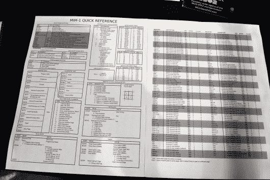
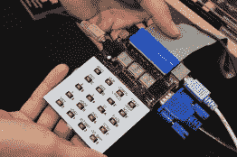

# Dis-Integrated 6502 运行程序；像电脑一样工作

> 原文：<https://hackaday.com/2017/05/20/dis-integrated-6502-running-programs-acting-like-computer/>

[Eric Schlaepfer]倾向于带着你不想错过的项目出现在 Maker Faire。今年也不例外。12 个月前，我们欣喜地看到他的 6502 处理器由一大堆分立的 MOSFETs 组成。当时，它刚刚建成并运行随机代码，愉快地闪烁着反映寄存器中活动的 led。今年，他赋予了这种闪烁的含义，并在他的 Monster 6502 处理器上运行真正的程序。

 [https://www.youtube.com/embed/tQIwS2GzXLI?version=3&rel=1&showsearch=0&showinfo=1&iv_load_policy=1&fs=1&hl=en-US&autohide=2&wmode=transparent](https://www.youtube.com/embed/tQIwS2GzXLI?version=3&rel=1&showsearch=0&showinfo=1&iv_load_policy=1&fs=1&hl=en-US&autohide=2&wmode=transparent)

在外围设备围绕处理器建立起来之前，处理器不是计算机。他已经用一种叫做 MIM-1 的新型主板完成了这项工作。它包括一个用于输入的键盘和六个用于即时输出的 7 段显示器。这使得用户可以直接控制处理器，查看和查看寄存器，设置断点，以及管理处理器的操作。它还带来了音频连接、VGA 和 PS/2 键盘连接，因此用户可以使用屏幕和键盘与 6502 上运行的代码进行交互。

      

MIM-1 甚至内置了 Y-modem 协议，允许您保存和加载程序。当[Eric]加载一个他自己写的游戏时，视频中令人满意地展示了这一点。音频和视频立刻打动了你——原来[Eric 的]哥哥是一名像素艺术家，他很乐意加入并帮助这个项目。但不要被运行游戏的廉价伎俩所迷惑…真正的高手首先是 Monster 6502 本身，其次是 MIM-1 板，它通过使用 STM32 来模拟它周围的所有计算机外围设备。这确实是一项了不起的工作。

请继续关注《怪物 6502》第 6502 页，因为我们怀疑一旦 BAMF 的兴奋过去，[Eric]将记录 MIM-1。