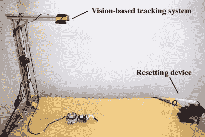

# 使用神经网络训练迪士尼新机器人肢体

> 原文：<https://hackaday.com/2018/07/03/disneys-new-robot-limbs-trained-using-neural-networks/>

迪士尼正在研发模块化的智能机器人肢体，它们可以用磁铁吸住。这种智能来自一个合理大小的神经网络，该网络还结合了一些模块性。这个机器人是他们的[快照机器人](https://www.disneyresearch.com/publication/snapbot/)，它的基本单元可以容纳多达八个肢体，到目前为止，他们已经训练了多达三个肢体。

模块化进一步扩展到三种类型的肢体选择。一个具有滚动和俯仰，另一个具有偏航和俯仰，第三个具有滚动、偏航和俯仰。有趣的是，在这三种类型中，偏航俯仰型似乎最有效。

在这个[大规模深度神经网络需要 GPU 甚至在线服务来在合理的时间内训练](https://hackaday.com/2017/09/08/hardware-for-deep-neural-networks/)的时代，令人耳目一新的是，它只有两层深度，可以在单核 3.4 GHz 英特尔 i7 处理器上在三个小时内进行训练。三个小时似乎仍然很长，但请记住，这不是在硅虚拟世界中的模拟。这是现实生活中伺服电机必须实际移动的地方。当然，他们不想坐在那里，在每次试图穿过桌子后重置它，所以他们内置了一个自动机制，在试图再次穿过桌子之前，将机器人拉回到起始位置。为了进一步加快训练速度，他们发现，一旦他们训练了一个肢体，他们就可以复制网络的最后一层，从而在两个肢体的训练中领先一步。

为什么要做培训？毕竟，我们已经看到了非常棒的多肢机器人进行手动编码，一个例子是[这个六足坦克，基于电影《幽灵在壳里》](https://hackaday.com/2016/06/03/hexapod-tank-from-ghost-in-the-shell-brought-to-life/)中的一个。他们也这样做了，然后将手动方法的结果与训练有素的方法的结果进行比较，训练有素的方法在相同的时间内走得更远。至少，我们可以从这个模块化的爬虫学到一两个技巧。

请查看他们的文章以了解详细信息，并在下面的学习环境中观看实际操作。

 [https://www.youtube.com/embed/MZZKcC2oZJM?version=3&rel=1&showsearch=0&showinfo=1&iv_load_policy=1&fs=1&hl=en-US&autohide=2&wmode=transparent](https://www.youtube.com/embed/MZZKcC2oZJM?version=3&rel=1&showsearch=0&showinfo=1&iv_load_policy=1&fs=1&hl=en-US&autohide=2&wmode=transparent)

我们感谢[[Jarrett](https://hackaday.io/Jarrett)向我们透露了这个消息。