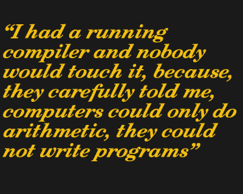
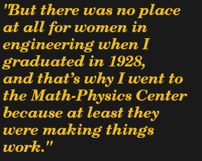

# 在计算机产业存在之前就将其颠覆:少将·格蕾丝·赫柏

> 原文：<https://hackaday.com/2017/12/05/disrupting-the-computer-industry-before-it-existed-rear-admiral-grace-hopper/>

比汇编更容易编写的特性通常被视为高级编程语言的最大优势。它们带来的另一个好处是便携性。有了高级语言，算法可以独立于底层硬件开发。一旦硬件变得过时，这就允许软件继续存在。

编译器是一个概念，当它第一次被介绍时遇到了阻力。当时，计算机是定制的机器，带有像 ENIAC、UNIVAC 和 Mark I 这样的名字。当时，IBM 的首席执行官估计全球对计算机的需求约为五台。在这种情况下，需要一个有远见的人来预见未来，计算机的数量将超过程序员的数量，硬件的发展将比软件快得多，编译器将有意义。一个有远见的人是格蕾丝·赫柏。

## 编译器

编译的代码通常比优化的汇编代码运行得慢。令人惊讶的是，这并不是实现它们的方式。他们被认为在技术上是不可能的。人们可能会认为，计算机科学在当时还太年轻，还不能完全理解这门学科的潜力。人们也可以得出这样的结论:它已经足够古老，它的实践者已经有了自己的信仰。在这种氛围下，将编程语言从一个受到挑战的概念转变为接下来几十年中最有影响力的技术之一，需要一种特殊的态度。名言“请求原谅比获得许可更容易。”今天用来解释 python 中动态绑定的，归功于她。

虽然是一个先锋，但[Hopper]并没有走在这条曲线的前面。[Alick Glennie]在同一年开发了另一个编译器。[Glennie]的“autocode”编译器远不如[Hopper]的 A-0 成功，后者后来发展成了 COBOL——面向商业的通用语言。这可能有两个原因。Autocode 相对来说更接近于机器码，是为曼彻斯特大学的英国 Mark 1 计算机定制的——可移植性不是它设计的一部分。

第二个原因是[Hopper]明确地希望她的语言提供足够的抽象，以允许更多的人获得计算的能力。在 1980 年的一次采访中，她指出了计算机早期用户中两个截然不同的群体:数学家和对数据处理感兴趣的人。她发现数据处理器的思维是以词为中心的，与数学家的符号方法相反。在她看来，开发第一种编译语言是为了让计算机对更多的人有用。在计算机主要是军事和学术事务的时代，COBOL 的目标是商业应用。

## 人

她一生中的杰出成就不胜枚举。[格蕾丝·赫柏]是耶鲁大学第一位获得数学博士学位的女性。更令人印象深刻的是，她一开始就不想学数学。珍珠港事件后，她加入了海军，并不得不三次退役，直到 1986 年他们才最终让她退役。耶鲁大学以她的名字命名了一所住宿学院。这让我们对她的另一句话有了正确的理解:

“如果你问我最自豪的成就是什么，答案是我多年来培养的所有年轻人；这比编写第一个编译器更重要。”

1931 年在瓦萨学院获得硕士学位后，她一直在教学，并在职业生涯中不断在不同的机构举办讲座。她给专业观众的讲座以前在这里做过专题报道。

与她杰出的职业生涯相比，她的个人生活鲜为人知。维基百科用一句话描述了一段 15 年的婚姻，其他资料也很少涉及细节。我们知道她在 40 多岁时与酗酒作斗争，并在专业人士的帮助下克服了它。众所周知，她会把工作带回家，并在早上提出前一天回家路上讨论过的问题的解决方案。

[格蕾丝·赫柏]是一个能在正确的时间把自己安排在正确的地方的人。她以独创性和克服障碍的动力做到了这一点，不是通过粉碎它们，而是通过寻找周围的方法。她还着眼于工作的有用性。

英雄是一件困难的事情。在坏人手中，他们设定了不可能达到的标准。没有人能成为格蕾丝·赫柏，只有她能。发明了编译器，高级编程语言在大多数应用中取代了机器代码。然而，我们可以努力成为像格蕾丝·赫柏一样的人:渴望成为优秀的导师，创造对他人有用的东西，并在遇到极限时寻求帮助。

## 进一步阅读

上面提到的[采访](http://archive.computerhistory.org/resources/text/Oral_History/Hopper_Grace/102702026.05.01.pdf)是一个很好的起点，可以让你一瞥【格蕾丝·赫柏】是谁。最好记住对话发生在 [ZX 频谱](https://en.wikipedia.org/wiki/ZX_Spectrum)发布的两年前，否则技术部分没有意义。54 页的采访篇幅很长，阅读时间可能会比预期的更长，因为阅读所有提到的人很容易分心。

她的传记《格蕾丝·赫柏和信息时代的发明》(作者是 Kurt W. Beyer)通常被认为是传记性的，但却是对她塑造的那个时代的合理的历史描述。