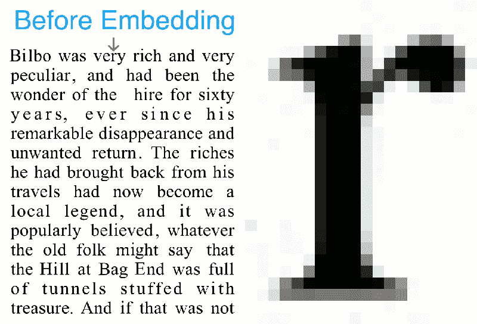

# 扭曲的文字说明了很多

> 原文：<https://hackaday.com/2018/05/31/distorted-text-says-a-lot/>

通过扫描二维码跳转到一个网站不再是一个令人兴奋的技术壮举，但如果你扫描你的格兰诺拉麦片棒上的成分列表，它会转到该公司的特定口味页面，[没有矩阵码](https://spectrum.ieee.org/tech-talk/computing/software/hiding-information-in-plain-text)？

纽约市哥伦比亚大学的聪明人“扰乱”了普通的字体字符，因此普通人的眼睛不会察觉这些变化。即使是普通的 OCR，在查看带有隐藏信息的段落时，也不会错过任何一个节拍。毕竟，这些“扰乱”的符号就像透过一滴水看到的完全清晰的字符。当摄像机寻找这些秘密信息时，这些微小的调整就足以说明问题。

这个系统极其简单。每个字符可以根据算法和第二变量而变形。改变第二个变量就像扭曲一个扭曲的透镜，或者一滴水，但残像可以被解码，变量可以被提取出来。这种编码可以保存到打印机，不像[纯数字隐藏信息](https://hackaday.com/2018/04/15/hide-secret-messages-in-plain-sight-with-zero-width-characters/)。

像这样的隐藏消息不仅限于传递便笺，元数据可以附加到任何文本中，并在必要时提取出来。文献可以包括笔记而不占用页面空间，因此教师可以包括有用的笔记，手机可以像 x 光机一样查看教师想要展示的内容。例如，你可以定义[“crypto”实际上意味着什么](https://hackaday.com/2018/04/23/what-does-crypto-actually-mean/)。

 [https://www.youtube.com/embed/dejrBf9jW24?version=3&rel=1&showsearch=0&showinfo=1&iv_load_policy=1&fs=1&hl=en-US&autohide=2&wmode=transparent](https://www.youtube.com/embed/dejrBf9jW24?version=3&rel=1&showsearch=0&showinfo=1&iv_load_policy=1&fs=1&hl=en-US&autohide=2&wmode=transparent)

