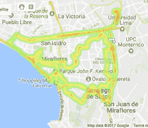

# 通过出租车车队进行分布式空气质量监测

> 原文：<https://hackaday.com/2017/11/20/distributed-air-quality-monitoring-via-taxi-fleet/>

当[詹姆斯]搬到秘鲁的利马时，他也带来了慢跑的习惯。他早上去海边的短途旅行包括穿过几条繁忙的街道，这些街道经常被老旧的、冒烟的柴油卡车占据。[詹姆斯]注意到他回家后喉咙会有点痒。最近一项将空气污染与痴呆症风险联系起来的研究让他想知道，城市如何能够逐街监测空气质量，而不是依赖几个分散的站点。[利马有很多出租车，为什么要给它们装上传感器并实时监控空气质量](https://www.hackster.io/james-puderer/distributed-air-quality-monitoring-using-taxis-69647e)？

 这款出租车数据记录器的主要目的是收集空气中的颗粒物数量，并通过谷歌地图叠加显示污染水平。[詹姆斯]使用[一个光散射粒子传感器](http://www.mouser.com/ds/2/187/honeywell-hpm32322550b-1099596.pdf)和一个 Raspi 3 通过安卓系统将数据发送到云端。由于 Pi 只有一个本地 UART，[James]将其用于粒子传感器，并通过 FTDI 串行适配器连接数据密集型 GPS 模块。还有一个定位驾驶室的 GPS 和一个温度/湿度/压力传感器，以获得更全面的环境图片。

休息后乘车继续步行，如果你想在利马周围开一会儿，就留下来看测试视频。对监测你个人的空气质量感兴趣吗？这里有一个使用灰尘传感器的 DIY 版本。

 [https://www.youtube.com/embed/ZsYfYwb5LDY?version=3&rel=1&showsearch=0&showinfo=1&iv_load_policy=1&fs=1&hl=en-US&autohide=2&wmode=transparent](https://www.youtube.com/embed/ZsYfYwb5LDY?version=3&rel=1&showsearch=0&showinfo=1&iv_load_policy=1&fs=1&hl=en-US&autohide=2&wmode=transparent)

 [https://www.youtube.com/embed/V8qBL2G1eOQ?version=3&rel=1&showsearch=0&showinfo=1&iv_load_policy=1&fs=1&hl=en-US&autohide=2&wmode=transparent](https://www.youtube.com/embed/V8qBL2G1eOQ?version=3&rel=1&showsearch=0&showinfo=1&iv_load_policy=1&fs=1&hl=en-US&autohide=2&wmode=transparent)

