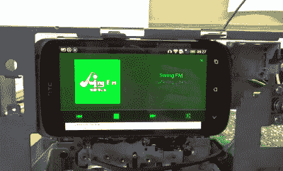

# 扔掉带子，在你的甲板上放一个机器人

> 原文：<https://hackaday.com/2018/05/21/ditch-the-tapes-put-an-android-in-your-deck/>

虽然我们在 Hackaday 从不质疑为什么一个人会承担一个特定的项目，但这肯定不会阻止我们亲爱的读者拿起他们的干草叉，在评论中要求这样的答案。也许没有任何帖子比那些用现代硬件注入旧音频设备的帖子更能引发这种愤怒。几乎在所有情况下，答案都是一样的:这个人喜欢老式硬件的外观和感觉，但不想局限于过时的媒体。

 由【阿图尔·梅纳兹】创作的[无带甲板项目也许完美地体现了这种情绪。他的作品将老式卡式录音机与小到可以放在磁带门后面的安卓手机结合在一起。一个模仿播放磁带外观的 Android 应用程序，配有“手写”的轨道信息，完成了这种幻觉。](http://www.mp3tapelessdeck.pl)

手机的输出被连接到来自磁带头的音频信号所在的走带设备，因此音量控制和 VU 表仍按预期工作。当动画“像带”在屏幕上播放时，看着仪表来回跳动看起来真的非常流畅，尽管这种效果在某种程度上受到物理回放控制似乎没有实现这一事实的阻碍。顺便说一下，如果去掉胶带门上的塑料窗，整个体验会更好；这样你就可以利用软件中的触摸和滑动界面。

我们已经看到了以前的尝试，试图使录音带的体验现代化，但是他们更倾向于新奇而不是任何东西。但这些甲板是足够好的，你可以喜欢他们非讽刺。虽然如果我们谈论便携式磁带播放器，[在我们冰冷的机械心中只有一个空间](https://hackaday.com/2018/04/16/custom-built-vacuum-tube-cassette-player/)。

[感谢尼古拉的提示]

 [https://www.youtube.com/embed/ICbvWoCVqrk?version=3&rel=1&showsearch=0&showinfo=1&iv_load_policy=1&fs=1&hl=en-US&autohide=2&wmode=transparent](https://www.youtube.com/embed/ICbvWoCVqrk?version=3&rel=1&showsearch=0&showinfo=1&iv_load_policy=1&fs=1&hl=en-US&autohide=2&wmode=transparent)

