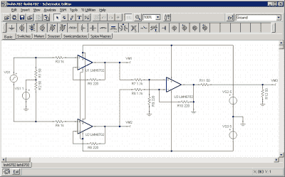

# DIY 有源亚 GHz 差分示波器探头

> 原文：<https://hackaday.com/2016/03/31/diy-active-sub-ghz-differential-scope-probe/>

购买昂贵的测量设备通常很贵，但是如果你愿意在这个项目上花点心思，一些工具是完全可以自己动手做的。[Christer Weinigel]需要对 500 MHz 左右的差分时钟信号进行一些测量。El-cheapo 探测器在这里是没用的。它们没有带宽，而且大多数现成的探头都是单端的，也就是说它们以地为参考。[Christer]需要两个平衡信号之间的差值，这两个信号都不接地。简而言之，[克里斯特]需要一个高频有源差分示波器探头，它们并不便宜。于是他[自己造了一个](http://blog.weinigel.se/2016/03/16/ghz-differential-probe-3.html)。

 探头中的电路实际上只是一个仪表放大器设计，输入级经过修改，输出阻抗为 50 欧姆。(如果您需要复习，请参见[这篇关于仪表放大器的文章](http://hackaday.com/2016/03/18/beyond-measure-instrumentation-amplifiers/)。)像这样的更高频率，对运算放大器的要求会更高，所以[Christer]花了一些时间[模拟电路，以确保它能与他选择的器件一起工作](http://blog.weinigel.se/2016/02/26/ghz-differential-probe.html)。然后他编了一堆 PCB 设计，让人做出来。实际结果[与模拟相当吻合。](http://blog.weinigel.se/2016/02/28/ghz-differential-probe-2.html)

通过对输入阻尼电阻进行一些细微调整，他得到了一个在最高 300 MHz 下完全平坦的工具，在最高 850 MHz 下完全可用。如果你想买其中的一个，它会花掉你几百块的拿铁，但是如果你便宜地得到 PCB，这一个可以以一两块的价格制造。当然，设计文件可供您自己使用。荣誉[克里斯特]。

编辑:巧合的是，Bil Herd 刚刚发布了一个介绍差分信号的视频。去看看。

感谢[nebk]的提示！