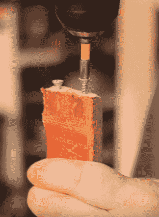

# DIY 书架不仅仅是看上去那么简单

> 原文：<https://hackaday.com/2018/01/14/diy-bookshelf-is-more-than-meets-the-eye/>

亲爱的读者，你可能会感到惊讶，并非 Hackaday 上的每个项目都需要与 led 一起跳动，或者通过 Twitter 更新世界上发生的事情。与你可能听说的相反，它们甚至不需要内置 Arduino。不，有时候你只需要一些木头，一些工具，和一个独特的想法，就可以完成一个非常漂亮的工作，这个想法可以重新利用原本会被扔进垃圾填埋场的东西。

[Keith 正派]的最新项目就是如此，它使用胶合板和旧书的书脊[创建一个秘密隔间“书架”](https://imgur.com/gallery/y5mDW)。这个概念可能最好被描述为一个侧放的可折叠桌子，虽然这个动作看起来有点僵硬，但它看起来很容易复制，这为它加分。

使用一个刳刨机，[Keith]在胶合板的顶部和底部切割出一个通道，这些“书”最终会被放进去。这个通道围绕着搁板的整个周边，尽可能保持笔直非常重要，这样就不会缠绕任何东西。为了确保事情尽可能顺利地进行，一些砂纸被用来清理内部边缘。

 下一步是撕开一些书，打捞它们的书脊。二手书几乎可以在跳蚤市场上免费买到，所以即使你没有一个装满旧书的家庭图书馆，如果你想打造自己的版本，也应该很容易得到一些。出于理智的考虑，书脊尺寸相同的书似乎是最理想的，所以要留意旧的百科全书之类的东西。

当书脊从书上取下时，它们会粘在单独的木板条上。这些板条在顶部和底部钻有孔，标准木螺钉被打入充当“滚轮”。真正的滚轴无疑会使动作更流畅，但如果你想便宜快速地完成它，你不能打败他的方法。

然后将板条粘在一块织物上，创造出所谓的铃鼓。织物背衬将所有板条连接在一起，这样推拉一个板条就会将它们作为一个整体一起移动。然后将书脊鼓插入布线的通道中，可以安装书架的背板以将其锁定在一起。

在这一点上，这个项目基本上完成了，但[Keith]确实做了额外的工作，密封了所有的书脊，并在书架上做了一些收尾工作，使它看起来更像一件真正的古董家具，而不是一些用螺丝固定在一起的废胶合板。

如果这个木工练习让你对枯树的奇妙世界感兴趣，你很幸运。我们已经从黑客的角度报道了几个[木工项目](https://hackaday.com/2017/01/23/woodworking-basics-for-the-hardware-hacker/)，所以你不会完全迷失。

 [https://www.youtube.com/embed/bMsZ9YtE1j0?version=3&rel=1&showsearch=0&showinfo=1&iv_load_policy=1&fs=1&hl=en-US&autohide=2&wmode=transparent](https://www.youtube.com/embed/bMsZ9YtE1j0?version=3&rel=1&showsearch=0&showinfo=1&iv_load_policy=1&fs=1&hl=en-US&autohide=2&wmode=transparent)

