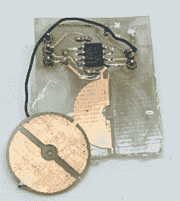

# 用 FR4 廉价 DIY 电容式旋转编码器

> 原文：<https://hackaday.com/2017/11/17/diy-capacitive-rotational-encoder-on-the-cheap-with-fr4/>

旋转编码器对许多应用至关重要，即使在业余爱好者的水平。在考虑他自己对即将到来的项目的旋转编码需求时，[Jan Mrázek]想到尝试制作自己的 [DIY 电容式旋转编码器](http://blog.honzamrazek.cz/2017/07/rotational-encoders-on-the-cheap-the-capacitive-way/)。如果成功的话，这种编码器可能既便宜又非常快；它也可以部分地直接制作在 PCB 上。

First prototype, two etched plates with transparent tape as dielectric material. Disc is 15 mm in diameter.

[Jan]选定的编码器设计是使用 PCB 元件制作一个简单的可调平板电容器，透明胶带作为电介质材料。这被用作 555 定时器在非稳态模式下的定时元件。因此，这种配置中的 555 产生方波，该方波与简单电容器中的极板重叠程度成比例变化。转动极板，方波的周期随之改变。响应时间会很快，555 和一些 PCB 空间当然是便宜的材料。

第一个原型给出了积极的结果，但有很多问题，包括噪音和可能对温度和湿度的敏感性。第二次尝试改进了设计并取得了更好的结果，ESP32 以 100 kHz 的速率可靠地读取了 140 个离散位置。看来分辨率和速度是有权衡的；降低速率允许更多的位置被可靠地检测到。仍然存在问题，但最终[Jan]认为高速电容编码器只需要一些 PCB 面积和一些 555 可能是可行的。

这个项目提醒人们 FR4(无论是覆铜的、蚀刻的还是空白的)在聪明的应用中出现:铜带和空白 FR4 可以用来[快速原型化 RF 滤波器](https://hackaday.com/2017/07/25/rapidly-prototyping-rf-filters/)，PocketNC 围绕 FR4[制造了一整套小型数控工具](https://hackaday.com/2016/06/04/fr4-machine-shield-is-a-cnc-milling-machine-from-fr4-pcb/)，我们自己的【Voja】写了一份关于[用 FR4](https://hackaday.com/2015/06/03/how-to-build-beautiful-enclosures-from-fr4-aka-pcbs/) 制作漂亮外壳的完整指南。