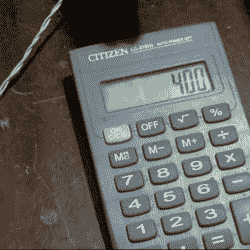

# DIY 线圈绕线机计数方式

> 原文：<https://hackaday.com/2018/06/16/diy-coil-winding-machine-counts-the-hacky-way/>

"等等，那是 423 还是 424？"当你在缠绕一个超过几百匝的变压器或线圈时，你会想要花一些时间在缠绕夹具上。这个视频，嵌入在下面，展示了一个简单但足够的机器——有一些扭曲。

第一次精心制作是增加了一个梭子，它与主轴同步来回移动，以将绕组放置得漂亮而平滑。在这里，它非常简单——一根螺纹杆和一组可互换的轮子，由一个大的 o 形环带驱动。我们喜欢简单地在皮带上添加一个扭转来交换方向的低技术解决方案。我们早就*想多了这个机制。*

但是这个黑客是由一个旧计算器制成的数字计数器。当然，我们在之前已经[见过这种情况，但这里有一个很棒的现实世界应用。](https://hackaday.com/2015/06/27/digital-counter-from-stuff-you-have-in-your-junk-drawer/)

谢谢[Jānis]的提示！

 [https://www.youtube.com/embed/62xKnsY--k8?version=3&rel=1&showsearch=0&showinfo=1&iv_load_policy=1&fs=1&hl=en-US&autohide=2&wmode=transparent](https://www.youtube.com/embed/62xKnsY--k8?version=3&rel=1&showsearch=0&showinfo=1&iv_load_policy=1&fs=1&hl=en-US&autohide=2&wmode=transparent)

