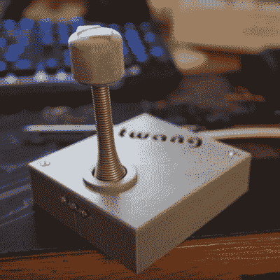

# DIY 地牢爬虫游戏在单个 LED 条上玩

> 原文：<https://hackaday.com/2018/01/24/diy-dungeon-crawler-game-plays-on-single-led-strip/>

一个聪明的一维游戏的令人愉快的版本由[生物]制作，他称之为[TWANG！](http://www.buildlog.net/blog/2018/01/twang/)因为操纵杆是由顶端装有加速度计的弹簧门挡制成的。游戏本身是在 RGB LED 灯带上进行的。因此，游戏世界、玩家、目标和敌人都显示在一行发光二极管上。

一款地牢爬虫类游戏如何在 1D 出现，这款不寻常的游戏是如何玩的？目标是玩家(一个绿点)达到目标(一个蓝点)以进入下一关。以不同方式移动的敌人(红点)使这变得更加困难。操纵杆向左或向右移动，使玩家的蓝点向左或向右前进，玩家可以通过操纵杆的“twang”运动进行攻击，从而消灭附近的敌人。通过玩亮度和颜色，惊人数量的游戏可以被塞进一维显示器！

鼻音的代码！github 上的[和 3D 打印实体件的模型是 Thingiverse](https://github.com/Critters/TWANG) 上的[。视频(嵌入下面)主要关注开发过程，但也解释了游戏元素，展示了一些流畅的动画和尖锐的反馈。](https://www.thingiverse.com/thing:1116899)

 [https://www.youtube.com/embed/9yf_VINmbTE?version=3&rel=1&showsearch=0&showinfo=1&iv_load_policy=1&fs=1&hl=en-US&autohide=2&wmode=transparent](https://www.youtube.com/embed/9yf_VINmbTE?version=3&rel=1&showsearch=0&showinfo=1&iv_load_policy=1&fs=1&hl=en-US&autohide=2&wmode=transparent)

使用弹簧门挡作为控制器既简洁又直观，但可能没有[使用真实的汽车作为视频游戏控制器](https://hackaday.com/2017/12/30/34c3-using-your-car-as-video-game-controller/)那么直观。