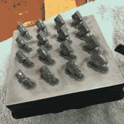

# DIY 笔记本电脑的目标是完全的硬件自由

> 原文：<https://hackaday.com/2017/10/24/diy-laptop-aims-for-complete-hardware-freedom/>

开源软件无疑已经从边缘理想主义走向主流，即使一般人并不真正了解它。从他们的网络浏览器到他们的智能手机操作系统，今天运行开源软件的人比计算历史上的任何时候都多，而且这个数字只会越来越大。虽然我们可以争论一些公司如何处理他们对开源社区的责任，但总的来说，这可能更接近我们许多人曾经相信我们会得到的开源乌托邦。

为了便于讨论，我们假设软件已经解决了。下一步是什么？好吧，如果我们已经得到了我们想要的所有开源软件，自然我们现在需要在开源硬件上运行它。就像我们的软件一样，我们想看看它是如何工作的，我们想修改它，如果我们愿意，我们可以自己修复它。这些目标正是[Lukas Hartmann]开始致力于[改革时所想的，这是完全开源笔记本电脑领域的最新成果](http://mntmn.com/reform/)。

A plate of fresh keycaps

[与之前的 no vena](https://hackaday.com/2014/01/12/bunnies-open-source-laptop-is-ready-for-production/)一样，此次改革利用四核 ARM Cortex-A9 恩智浦 i.MX6 SoC 来提供平板电脑级别的性能，尽管[Lukas]提到该设计可能会在未来迁移到升级的六核版本的芯片，这应该会给它带来更多的影响。SoC 与 Vivante GC2000 GPU 配对，后者可以在没有任何二进制 blobs 的情况下在 Linux 下使用。大多数硬件通过 USB 2.0 总线连接到系统，尽管网络由 [ThinkPenguin mini PCI-e 无线适配器](https://www.thinkpenguin.com/gnu-linux/penguin-wireless-n-mini-pcie)提供，板载 SATA 处理 128 GB SSD。

虽然这些天内部相对来说很普通，但[Lukas]在外壳和输入设备上所做的工作绝对令人印象深刻。他与工业设计师[ [Ana Dantas](http://www.ana-dantas.com/) ]合作，设计了这个系统的外观和感觉，几乎所有的东西都是用 3D 打印部件建造的。甚至连键盘盖和轨迹球都是在 [Formlabs Form 2](https://hackaday.com/2016/10/08/design-and-testing-of-the-form-2/) 上内部制造的。[Lukas]没有使用现成的 USB HID 解决方案，而是使用 Teensy LC 板来连接定制的输入硬件和操作系统。

[Lukas]仍在研究如何以及何时将改革公之于众。经过一些改进后，该团队希望能够提供套件和单独的部件，当然，如果你有设备，也可以把所有的文件放上去，这样你就可以自己制作了。为了获得公众对这款机器的外观和功能的反馈,亚马逊已经发布了一份改革的样品清单，并且【Lukas】要求任何有意见和建议的人[给他发一封电子邮件](mailto:lukas@mntmn.com)。

坦率地说，在 Reform、Novena 和 Olimex 之间，DIY 笔记本电脑领域的竞争是惊人的。现在我们只需要[更多的人致力于开放硬件智能手机](https://hackaday.com/2017/09/19/hackaday-prize-entry-the-50-raspberry-pi-smartphone/)。

感谢[阿德里安]的提示。