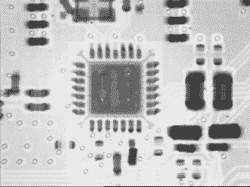

# DIY Linux 电脑和 6LoWPAN 网关

> 原文：<https://hackaday.com/2016/08/04/diy-linux-computer-and-6lowpan-gateway/>

我们把自己的 PCB 设计扔在一起，在这里或那里扔进一个微控制器。任何比这要求更高的东西，我们都会用树莓派或 BeagleBone(或者一个旧的 Linksys 路由器)。为什么我们不为一台小型 Linux 计算机快速组装一块 PCB 呢？因为我们不知道如何…但[乔纳斯]显然知道。当我们问他为什么这么做时，他回答说“因为我能！”

他的 [Ethernet-to-6LoWPAN gateway 项目](https://jopee.wordpress.com/6lowpan-gateway/)是一台伪装的小型、支持 OpenWRT 的 Linux 计算机。他围绕 Atmel AT91SAM9G25 400 MHz CPU 进行设计，并添加了一些内存、以太网和 CC2520 无线电芯片来处理无线方面，而不是另一个 Raspberry Pi 项目。这一切都是在一个四层板上完成的，电炉/煎锅回流。这似乎是我们力所能及的事情。[乔纳斯]有机会使用 x 光机来仔细检查他的回流工作，这可能是没有必要的，尽管它看起来真的很酷。

完成后，该项目将把一个 [6LoWPAN 网络](https://en.wikipedia.org/wiki/6LoWPAN)(可能是家庭自动化)和他的家庭有线网络连接在一起。这使得这款设备成为飞利浦顺化桥(Hue Bridge)等设备的竞争对手，这是一些争议的主题，当时他们[将其他设备封锁了几天](http://hackaday.com/2015/12/15/philips-says-no-internet-of-things-for-you/)，直到他们撤回。事实上，为了应对这种情况，[花了很大力气破解 Hue 设备](http://hackaday.com/2016/07/26/root-on-the-philips-hue-iot-bridge/)的固件，只是为了保险起见，以防飞利浦再次耍花招。

很快，这就没必要了。[Jonas]的设计是完全开放的，再加上运行在 OpenWRT 路由器操作系统之上的开放软件，这就是完整的堆栈。对于那些正在考虑投资家庭自动化技术，但又害怕不知名公司决定拔掉设备插头的人来说，这是个好消息。