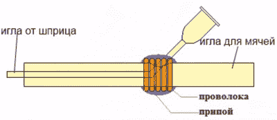

# DIY 迷你丁烷火炬会让 MacGyver 感到自豪

> 原文：<https://hackaday.com/2016/01/02/diy-mini-butane-torch-would-make-macgyver-proud/>

需要用一个迷你手电筒来摆脱困境吗？嗯，你可能想看一下这个视频，看看如何用一些随机的家用部件制作一个迷你丁烷火炬。

由[Roman UrsuHack]建造，几乎所有的部件都完全没有按照制造商的计划使用。这就是我们喜欢它的原因。为什么它也有点危险。

使用一个喷墨打印机墨盒填充注射器，一个自行车泵针，一些管道，几个压缩阀(它们看起来几乎像医疗设备，用于献血)，一个水瓶，一罐丁烷，大量的热熔胶和几个自行车泵配件，[Roman]创造了一个相当巧妙的小型丁烷火炬。

 我们特别喜欢他设计的喷嘴。通过在自行车泵针上切一个小孔，可以通过这个孔卡住注射器，为空气和气体提供一个基本的混合阀。

为了密封这个洞，他用细铜线缠绕在接头上，然后用焊剂填充，再用焊料覆盖——这是一个堵住洞的聪明方法！

然后通过注射器输送压缩空气，通过自行车泵喷嘴输送气体，稍微调整一下压力，你就可以得到一个非常漂亮的蓝色火炬火焰。他提到你可以使用水族馆的气泡泵，但是假设一个最坏的情况——向我们展示如何制作一个水瓶压缩空气罐。

 [https://www.youtube.com/embed/tuj6_RC9sKo?version=3&rel=1&showsearch=0&showinfo=1&iv_load_policy=1&fs=1&hl=en-US&autohide=2&wmode=transparent](https://www.youtube.com/embed/tuj6_RC9sKo?version=3&rel=1&showsearch=0&showinfo=1&iv_load_policy=1&fs=1&hl=en-US&autohide=2&wmode=transparent)

对于一个稍微更强大的解决方案，为什么不做一个迷你 HHO 火炬呢？注意:稍微危险一点。

安德鲁，谢谢你的提示！]