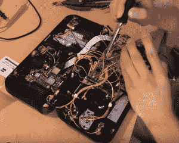

# DIY 任天堂 Switch 可能比实物更好

> 原文：<https://hackaday.com/2017/10/20/diy-nintendo-switch-may-be-better-than-real-thing/>

任天堂最新的*塞尔达*游戏设备 Switch 在为日本游戏巨头印刷钞票方面没有任何问题。其新颖的设计弥合了便携式和家用游戏机之间的差距，基本上同时成为两者，这显然引起了现代游戏玩家的共鸣，即使在发布 8 个月后，商店仍然报告有足够的机器来满足需求的问题。

但就我们的钱而言，我们宁愿拥有[Tim Lindquist]为他的夏季项目而努力的[Raspberry Pi 动力版。成品设备(他称之为“NinTIMdo RP”)的每个部分看起来都很专业，从他设计和印刷外壳的令人难以置信的工作，到顶部边缘显示音量和电池电量的 5 个 LED 显示屏等小细节。对于那些想知道的人，他的版本甚至允许你把它连接到电视上；模仿真实事物的手持到控制台的转换。](https://timee1994.weebly.com/nintimdo-rp.html)

[Tim]在 YouTube 上发布了一个制作 NinTIMdo RP 的精彩延时视频，涵盖了制作过程的每一步。它从查看他在 Autodesk Inventor 中创建的 3D 模型开始，然后直接进入印刷后的准备工作，在那里他用 Dremel 清理印刷孔，并安装黄铜螺纹插件以增强强度。大部分视频显示了他设法在机箱内装入的惊人数量的硬件，这是对设计投入了多少思想的真实证明。

在软件方面，Raspberry Pi 运行着非常流行的 [RetroPie](https://retropie.org.uk) 以及非常流畅的[仿真站前端](http://www.emulationstation.org/)。板上还有一个 Teensy 微控制器，用于处理低级功能，如控制音量、更新 LED 显示屏，以及将物理按钮映射到 Raspberry Pi 可以理解的 USB HID 设备。

案例[的微小源代码和 3D 模型已经上传到 GitHub](https://github.com/timlindquist/Nintimdo-RP) 上，但对于这样一个项目来说，这只是冰山一角。[Tim]确实提到他目前正在创建一个完整的构建教程；所以，如果圣诞老人今年没有在圣诞树下给你留一个开关，也许他至少可以给你一卷灯丝和足够的电子设备，让你自己动手制作。

虽然这[不是树莓派](https://hackaday.com/2015/04/22/retropie-portable-looks-like-snes-gameboy/)第一次将[装扮成任天堂游戏机](http://hackaday.com/2012/10/19/snes-emulator-has-its-slot-sealed-shut/)，但它可能代表了第一次有人试图用它来复制当代游戏设备。

 [https://www.youtube.com/embed/pOqiqRHrAHE?version=3&rel=1&showsearch=0&showinfo=1&iv_load_policy=1&fs=1&hl=en-US&autohide=2&wmode=transparent](https://www.youtube.com/embed/pOqiqRHrAHE?version=3&rel=1&showsearch=0&showinfo=1&iv_load_policy=1&fs=1&hl=en-US&autohide=2&wmode=transparent)

