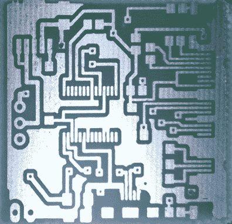
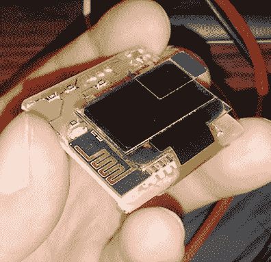

# 基于 ESP8266 的 DIY 智能手表需要分类

> 原文：<https://hackaday.com/2016/08/12/diy-smartwatch-based-on-esp8266-needs-classification/>

对于 DIY 爱好者来说，打造自己的智能手表是一项有趣的挑战。你需要缩小你的电子产品的尺寸，使用 SMD 元件，蚀刻你自己的 PCB，并最终把它们都塞进一个很酷的外壳里。[Igor]已经制造了他自己的基于 ESP8266 的智能手表，尽管他称之为手腕显示器，但我们认为结果完全像智能手表一样畅销。

他的设计基于他今年早些时候设计的无线显示通知器的 PCB。该设计使用 ESP-12E 模块，具有有机发光二极管显示器、LED、触摸开关和 FT232R USB/UART 接口。我们心爱的 TP4056 充电调节器负责锂离子电池，分压器让 ESP8266 的 ADC 回读电池电压。[Igor]使用墨粉转移法制作他自己的 PCB，并且他从他的[黑客层压机](http://hackaday.com/2016/02/29/pcb-laminator-is-its-own-project/)中获得了令人印象深刻的结果。

    

加上手工制作的塑料前板，所有东西都完美地融入果冻手表的橡胶外壳中。几个 Lua 位后，手表愉快地连接到一个 WiFi 网络，并显示其 IP 配置。为什么这不是手表？嗯，它缺少强制性的 RTC，尽管偶尔轮询一次 NTP 时间服务器很容易弥补这一点。我们的读者会如何分类这个做得很好的 DIY 构建？请在评论中告诉我们！