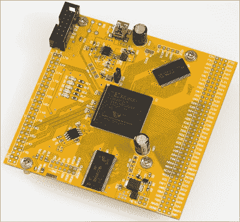

# 狄莺大型 BGA 封装

> 原文：<https://hackaday.com/2016/07/13/diying-huge-bga-packages/>

一天，安迪在易贝闲逛，发现了一些有趣的事情。四十块 Virtex-E FPGA，每块两英镑。这些是 FPGA 世界的大男孩，512 个用户 IO 引脚，近 200，000 个逻辑门，封装在 676 球 BGA 封装中。这些不是为业余爱好者设计的芯片。这些芯片不是为少于六层的电路板设计的。这些芯片甚至不是为中国常见的 6/6 密耳公差的电路板设计的。无论如何，一个 676 球的封装并不像一个大的*禁止爱好者进入的*标志。但是，你不能拒绝高级 PCB 设计的 2 级课程，[导致了一个最令人印象深刻的“我刚刚在易贝买了一些垃圾”的项目，我们已经看到了](http://andybrown.me.uk/2016/06/20/virtex-e/)。

[ Andy]为这些芯片设计的项目是一个通用开发板，这意味着断开 IO 引脚并连接一些 SRAM、SDRAM 和闪存。这个项目的第一个问题是逃避路由所有的球。Xilinx 发布了一份方便的应用笔记，推荐芯片下铜走线的具体设计参数。不幸的是，这是一个六层板，应用笔记中的设计规则针对 5/5 密耳走线。【安迪】的板房做不了六层板，他们的设计规则是 6/6mil 走线。为了解决这个问题，[安迪]只是没有路由内部球，并希望 5 英里的痕迹将工作。

PCB 上有 676 个小焊盘、时钟路由、电源实施、背面有太多去耦电容、差分对、静态 RAM、几个只是为了好玩而放置的 led，[Andy]必须将它焊接起来。奇怪的是，由于 FPGA 是 BOM 上价格较低的项目之一，他首先焊接了它，只是想看看它是否能工作。的确如此，这意味着是时候放置 RAM、闪存和几十个去耦电容了。一切都相对顺利，唯一的问题是电路板背面微小的 0402 去耦电容。这是迄今为止电路板上最难焊接的部分。[Andy]只设法用热风枪将大多数分离帽盖上。这足以让电路板上升，但他必须想出其他方法来为其他 30 个左右的电路板焊接这些盖子。

 [https://www.youtube.com/embed/xjgr5zzwcgE?version=3&rel=1&showsearch=0&showinfo=1&iv_load_policy=1&fs=1&hl=en-US&autohide=2&wmode=transparent](https://www.youtube.com/embed/xjgr5zzwcgE?version=3&rel=1&showsearch=0&showinfo=1&iv_load_policy=1&fs=1&hl=en-US&autohide=2&wmode=transparent)

