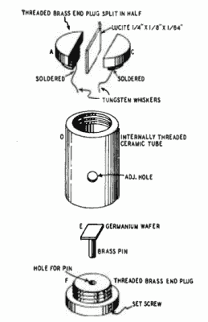
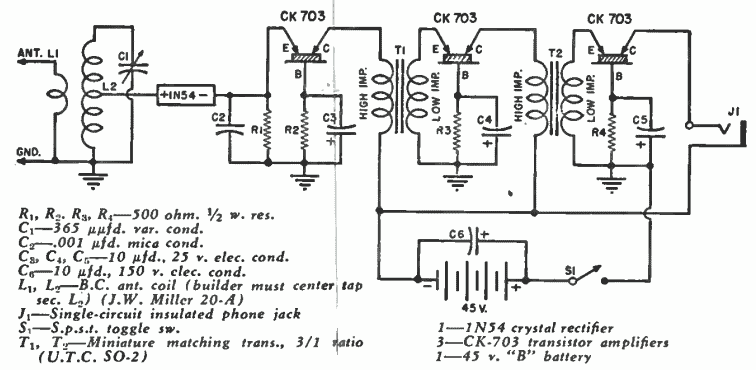

# 你认识鲁弗斯·特纳吗？

> 原文：<https://hackaday.com/2016/02/15/do-you-know-rufus-turner/>

在电子行业很难被人记住。爱迪生功不可没，西屋电气和特斯拉也是如此。在无线电时代，很多人知道马可尼和德·福里斯特(虽然每年记得他们的人越来越少)，但知道阿姆斯特朗或麦克斯韦的人就越来越少。在固态时代，我们倾向于记住像肖克利(即使还有其他人)这样的人，也许还有江崎。

如果你知道大部分或所有这些名字，而不去查它们，你就了解了你的电子历史。但你知道鲁弗斯·特纳这个名字吗？

## W3LF

特纳于 1907 年圣诞节出生在德克萨斯州的休斯顿。15 岁时，他迷上了晶体二极管，并在 17 岁时发表了第一篇关于无线电的文章。鲁弗斯·特纳(Rufus Turner)是第一个获得执照的黑人无线电操作员(W3LF)。他在华盛顿特区制造和操作无线电，在那里他就读于阿姆斯特朗理工学院。

特纳在加利福尼亚和马萨诸塞州成为了一名有执照的专业工程师。你甚至可能用了特纳研究过的东西。在 20 世纪 40 年代，他与 Sylvania 合作，帮助开发了 1N34A 锗二极管(如果你四处寻找，仍然可以买到)。

## 自制晶体管

1947 年，工业界创造了锗晶体管，透纳是第一批与他们一起工作的人。1949 年——在商业化之前——特纳在*无线电电子杂志*上发表了一篇文章“制造晶体管”——这是大多数电子爱好者第一次接触到这种设备；可以阅读[本 PDF 转载](http://www.americanradiohistory.com/Archive-Radio-Craft/1940s/Radio-Craft-RE-1949-May.pdf)第 38 页的文章。顺便说一句，这不是印刷错误。特纳详细展示了如何使用锗、陶瓷、黄铜和有机玻璃制作晶体管(见右图)。

到了 1950 年，你可以买到现成的晶体管，*广播电视新闻*发表了特纳的《[一种带晶体管放大器的晶体收音机](http://www.americanradiohistory.com/Archive-Radio-News/50s/Radio-News-1950-01-R.pdf)》(见第 38 页)。这是摄政 TR-1 上市前四年的三晶体管收音机。

你可以在下面看到特纳收音机的示意图。锗晶体管有时被称为“晶体三极管”，与你今天对晶体管的期望相比，它的性能非常差。

描述这种电路的文章是肖克利的书《半导体中的电子和空穴》中列出的少数几篇实际应用的文章之一。

## 特纳医生

特纳写了很多年的文章，涵盖了业余爱好和专业话题。他还写了关于技术写作、数学和其他他感兴趣的主题。1958 年，他在加州州立大学获得学士学位，然后在南加州大学获得英语硕士学位。到 1960 年，他已经是一名英语教授，并于 1966 年获得博士学位。尽管他在教英语，但他继续出版电子出版物，包括 1974 年的《齐纳二极管基础知识》和 1977 年的《集成电路基础知识》。

鲁弗斯·特纳于 1982 年去世，同年他的《电子图解词典》付印。二月是美国的黑人历史月，我认为这是纪念这位多产作家、教师和固态先锋的好时机。