# 不要忽视艺术家的用品商店

> 原文：<https://hackaday.com/2016/05/10/dont-ignore-the-artists-supply-store/>

这是一个周六的早晨，你发现自己有一种强烈的冲动，想要做一些涉及铜板或碳电极的东西。也许你需要一种金属粉末来做化学实验。铸造用品？纯铅？铜网？银线？奇怪的工具？腐蚀性极强的腐蚀剂？有一家商店出售这一切，黑客们通常不会经常光顾:艺术商店。

如果你知道去哪里找，商店里有很多有用的东西。艺术中的每一种表现方法都有自己的一套供给；各种进程和其中有用的东西的丰富集合。我在一个没有真正艺术品商店的城市长大。它有一个大盒子工艺品商店，用闪闪发光的塑料花和可怕的人造香味袭击你。当我搬到一个不同的城市，走到当地的艺术用品商店购买一些新的钢笔时，我最终停留了几个小时，只是看着他们出售的所有很酷的东西。

## 图画

绘图部分包含一些有用的东西。从硬到软，有不同成分的石墨和碳棒、方块和粉末。这些可以用于任何东西，从 [DIY 电阻器](http://www.troelsgravesen.dk/graphite.htm)，电极，刷子和高压实验。当然，也有相当不错的绘图工具可供选择。

 [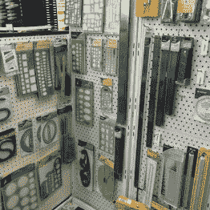](https://hackaday.com/2016/05/10/dont-ignore-the-artists-supply-store/2016-04-25-13-45-39/) A good selection of drawing tools, scales, and templates. [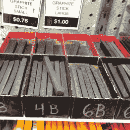](https://hackaday.com/2016/05/10/dont-ignore-the-artists-supply-store/2016-04-25-13-47-09/) Graphite in various shapes and hardnesses. [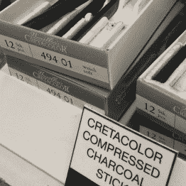](https://hackaday.com/2016/05/10/dont-ignore-the-artists-supply-store/2016-04-25-13-47-43/) Artists don’t mess around. This is likely to be pure carbon.

## 绘画

根据艺术商店的不同，绘画部分包含一些有用的化学物质。有时调和油的颜料可以是纯金属。该部分通常也适用于纯度高于平均水平的矿油精、丙酮等。用于稀释和修饰油漆。

 [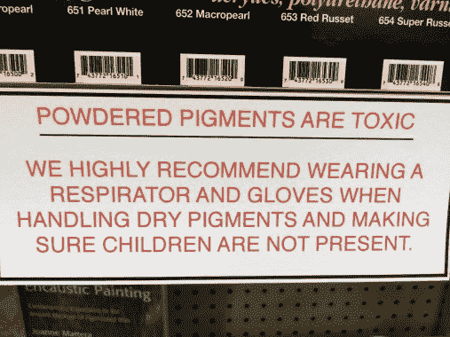](https://hackaday.com/2016/05/10/dont-ignore-the-artists-supply-store/2016-04-25-13-42-04-2/) A lot of these pigments are useful metals and compounds. [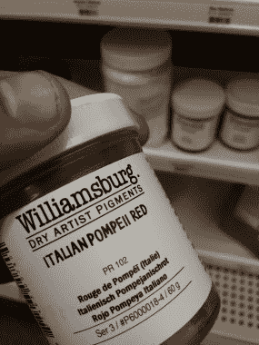](https://hackaday.com/2016/05/10/dont-ignore-the-artists-supply-store/2016-04-25-13-43-17/) Unfortunately this brand didn’t mention the ingredients, but things like this are likely to be pure Iron III oxide. [https://en.wikipedia.org/wiki/Iron(III)_oxide](https://en.wikipedia.org/wiki/Iron(III)_oxide) [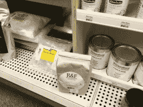](https://hackaday.com/2016/05/10/dont-ignore-the-artists-supply-store/2016-04-25-13-42-22/) Various interesting things for mixing encaustics. [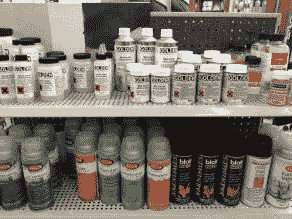](https://hackaday.com/2016/05/10/dont-ignore-the-artists-supply-store/2016-04-25-13-41-21-2/) Want a glaze that will never ever yellow in the sun? [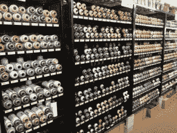](https://hackaday.com/2016/05/10/dont-ignore-the-artists-supply-store/2016-04-25-13-45-00-2/) Pro tip: Buy one expensive spray paint can and save the nozzle. It fits on the cheaper cans but gives a much better spray pattern. [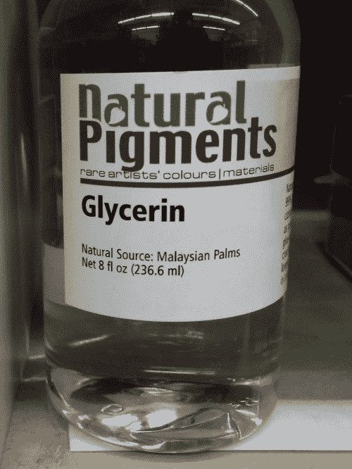](https://hackaday.com/2016/05/10/dont-ignore-the-artists-supply-store/2016-04-25-13-49-22-2/) Lots of pure chemicals here. The acetones and mineral spirits here will usually be more pure than the hardware store kind. Artists don’t want their paintings turning odd colors because of contaminants.

## 造型和陶瓷

建模部分真的很方便。除了各种普通粘土，还有其他有用的材料。橡皮泥，这是一个伟大的材料，用于制作模型的东西，树脂铸造大师，等等。Sculpey 和其他烤箱烘烤粘土作出可接受的快速部分。可以锉，加工的挺好，但是强度一般。

本节还包含了树脂铸造用树脂的完整选择。我经常发现硅橡胶、聚氨酯橡胶、透明树脂、水可塑聚合物等等。

此外，如果你足够幸运，有一家出售釉料的艺术商店，这就像镇上有一家化学用品商店一样好，只是他们可能会卖给你，而不会先检查你是否有吸毒习惯。

 [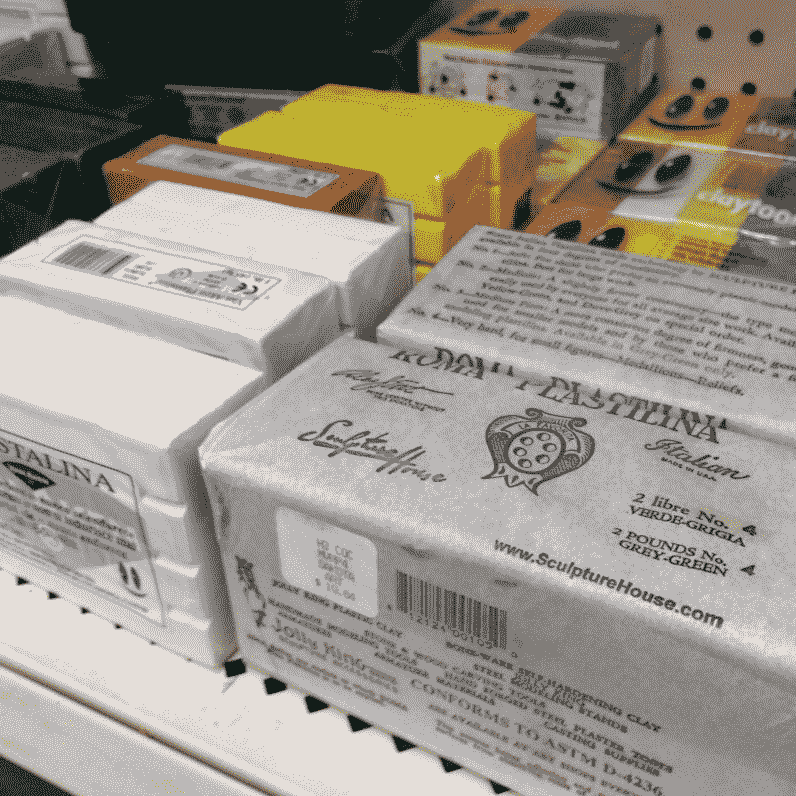](https://hackaday.com/2016/05/10/dont-ignore-the-artists-supply-store/2016-04-25-13-39-19/) Plasticine or modeling clay is extremely handy to have around. [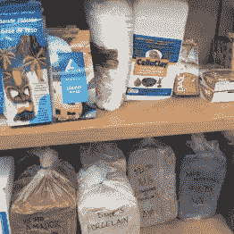](https://hackaday.com/2016/05/10/dont-ignore-the-artists-supply-store/2016-04-25-13-39-38/) Lots of interesting clays. [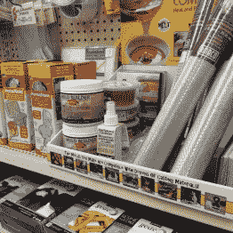](https://hackaday.com/2016/05/10/dont-ignore-the-artists-supply-store/2016-04-25-13-39/) Clear resin, soft resin, room temperature plastic, aluminum mesh, and more. I’ve also seen copper and brass mesh before. Neat. [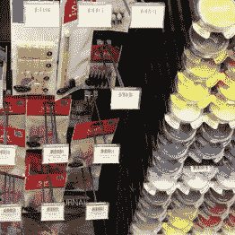](https://hackaday.com/2016/05/10/dont-ignore-the-artists-supply-store/2016-04-25-13-40-27/) Interesting tools and more pigments.

## 印刷

印刷部门堆满了有用的材料。本部分提供各种橡胶。我也见过铜和锌板出售。还有全套凿子可供选择。各种尺寸的橡胶辊，用于胶水或转移普鲁士蓝，用于检查机器配合。

 [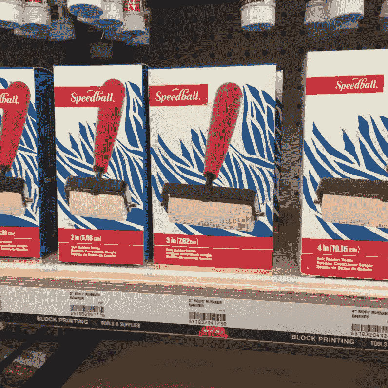](https://hackaday.com/2016/05/10/dont-ignore-the-artists-supply-store/2016-04-25-13-36-53/) Use this to apply glue. Also good for spreading prussian blue if you’re checking the fit on a surface. [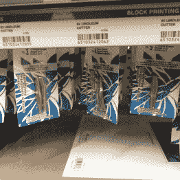](https://hackaday.com/2016/05/10/dont-ignore-the-artists-supply-store/2016-04-25-13-36/) Interestingly shaped blades. [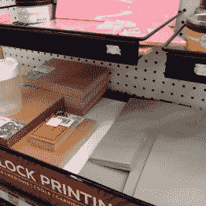](https://hackaday.com/2016/05/10/dont-ignore-the-artists-supply-store/2016-04-25-13-37-02/) Lots of rubbers and interesting plastics. [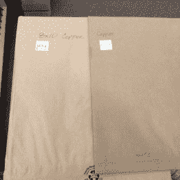](https://hackaday.com/2016/05/10/dont-ignore-the-artists-supply-store/2016-04-25-13-37-41/) Copper sheet for sale. I’ve seen zinc, tin, aluminum and more at other stores.

## 织物和皮革

织物部分包含有用的切割垫和夹具。也比一般的染料选择要好。包括带有比大盒子商店更多警告标签的染料。这些可以用来给塑料、细丝着色，甚至是用于[阳极氧化](http://astro.neutral.org/anodise_dye.shtml)的着色剂。皮革制品同样有自己的一套有趣的工具和用品。

 [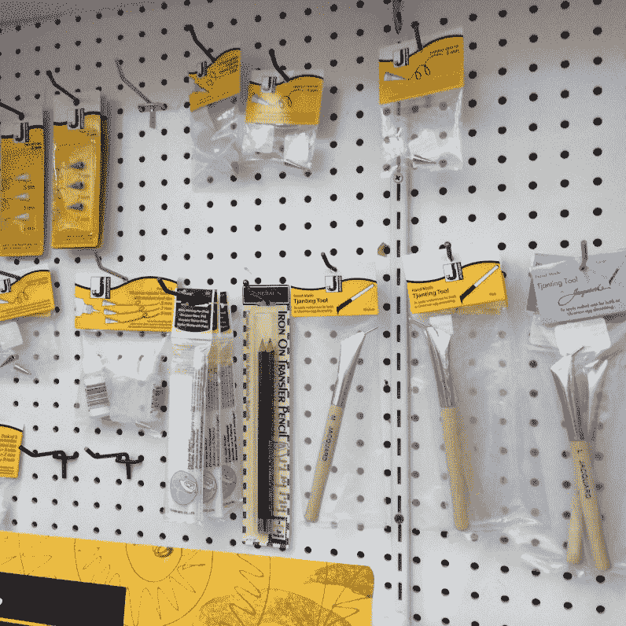](https://hackaday.com/2016/05/10/dont-ignore-the-artists-supply-store/2016-04-25-13-38-40/) Interesting tools. One of these looks extremely useful for applying glue precisely. [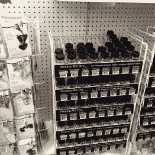](https://hackaday.com/2016/05/10/dont-ignore-the-artists-supply-store/2016-04-25-13-40-41/) The good kind of fabric and plastic dye. [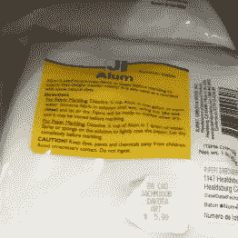](https://hackaday.com/2016/05/10/dont-ignore-the-artists-supply-store/2016-04-25-13-40-47/) Use this to dissolve a tap, according to AvE. [https://www.youtube.com/watch?v=7pN-fnUeA3o](https://www.youtube.com/watch?v=7pN-fnUeA3o) [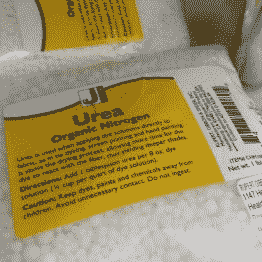](https://hackaday.com/2016/05/10/dont-ignore-the-artists-supply-store/2016-04-25-13-40-54/) Smells bad.

## 珠宝

根据艺术商店的不同，珠宝区可能是一个宝库。我甚至在一些商店里看到过纯银、纯金和纯铜线(在锁得很紧的柜子后面)。它通常有少量的精密手工工具可供选择——根据你所在的城镇，这可能是你在当地购买钳子和剪刀的最佳选择。一些商店甚至提供失蜡铸造、贵金属焊接、研磨用品(宝石)等。

 [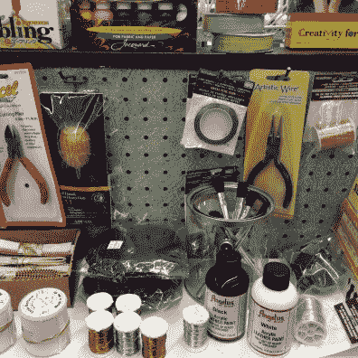](https://hackaday.com/2016/05/10/dont-ignore-the-artists-supply-store/2016-04-25-13-39-2/) Lots of wires, small tools, etc. Some jewlery sections are phenomenal for useful tools and materials. Depends on the store. [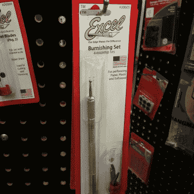](https://hackaday.com/2016/05/10/dont-ignore-the-artists-supply-store/2016-04-25-13-45-27/) Useful tools.

## 玻璃

一些商店的玻璃区可以包含从纯铅板到丙烷本生灯的任何东西。玻璃棒、管道、彩色玻璃、小烤箱、重型熨斗等等。不幸的是，这家商店不适合这种爱好。

## 混杂的

也有大量跨越学科的各式各样的对象。我挑选了一些让我印象深刻的东西。

 [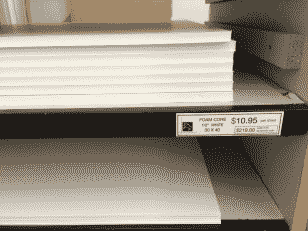](https://hackaday.com/2016/05/10/dont-ignore-the-artists-supply-store/2016-04-25-13-36-03/) Contains larger selections of common materials. Foam Core, Styrene, Hobby Wood, Metals, etc. [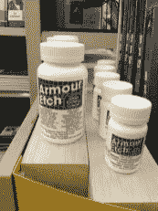](https://hackaday.com/2016/05/10/dont-ignore-the-artists-supply-store/2016-04-25-13-37-16/) Glass etching anyone? [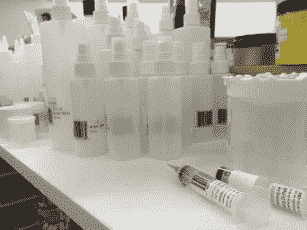](https://hackaday.com/2016/05/10/dont-ignore-the-artists-supply-store/2016-04-25-13-38-27/) Lab grade bottles and applicators. [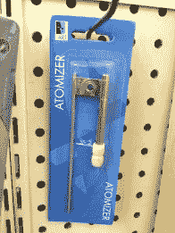](https://hackaday.com/2016/05/10/dont-ignore-the-artists-supply-store/2016-04-25-13-41-43/) Don’t know what I’d use this for, but it looks cool. [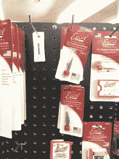](https://hackaday.com/2016/05/10/dont-ignore-the-artists-supply-store/2016-04-25-13-45-31/) Lots of little knives. [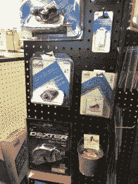](https://hackaday.com/2016/05/10/dont-ignore-the-artists-supply-store/2016-04-25-13-46-20/) Really useful for making straight cuts in a material. Way better than a carpet knife. [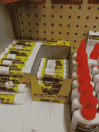](https://hackaday.com/2016/05/10/dont-ignore-the-artists-supply-store/2016-04-25-13-47-59/) This glue is way better than the regular kind for getting materials to stick to glass on a 3d printer. [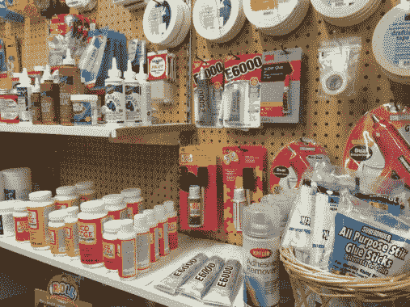](https://hackaday.com/2016/05/10/dont-ignore-the-artists-supply-store/2016-04-25-13-48-07/) Serious glues and tapes. [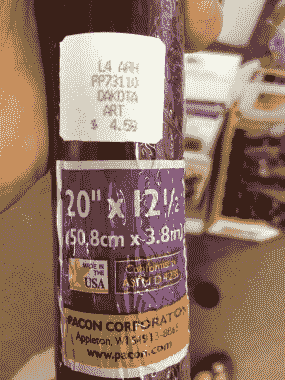](https://hackaday.com/2016/05/10/dont-ignore-the-artists-supply-store/2016-04-25-13-50-32/) Red filter anyone?

感谢[贝灵汉](https://goo.gl/maps/GQ6XUVoiD9n)的[达科他艺术商店](http://www.dakotaartstore.com/bellingham2010.html)让我带着相机绕着他们的商店跑了三十分钟。还有，跑到后面去找一些更奇怪的东西。如果你还没有去过当地的艺术品商店，我建议你去看看。

有没有其他人在你意想不到的商店买到他们的商品？如果你有一个最喜欢的地方来为你的黑客评分，请在下面留下评论。我还想听听我在旋风式旅行中错过的任何最喜欢的艺术商店发现。