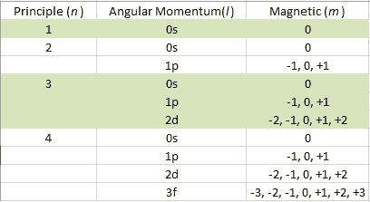
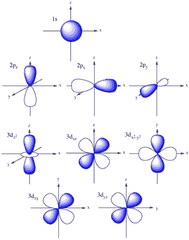
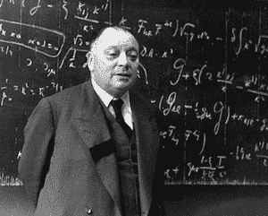
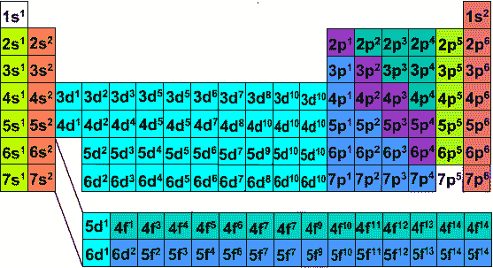

# 不懂元素周期表？这只是一个量子真值表

> 原文：<https://hackaday.com/2015/09/16/dont-know-much-about-the-periodic-table-2/>

17 世纪晚期的凌晨时分，艾萨克·牛顿被锁在他的实验室里探索自然的秘密。巨大的绿色烟雾从各种形状和大小的釜中涌出，而其他的发出嘶嘶声，吐出新的和神秘的化学混合物，就像微型火山爆发出未知的知识。在闪烁的烛光下，牛顿继续以炼金术为主题写了一百多万字。他不得不秘密地这样做，因为这种做法在当时是不受欢迎的。事实上，现在大家都知道炼金术是他最感兴趣的“科学”。他对通过难以捉摸的魔法石将铅变成黄金的迷恋现在已经很明显了。他甚至拒绝了剑桥大学的教授职位，转而选择了英格兰铸币局局长，在那里他监管着英国的黄金储备。

在牛顿时代，人们对物质的基本结构知之甚少。元素周期表的第一个版本在他死后 140 多年才问世。现代原子结构在那之后的 30 年里都没有出现。今天，我们知道我们不能把铅变成金子，否则就会让世界着火。炼金术被认为是伪科学，我们选择现代化学来描述元素之间的相互作用。每个走出高中的人都知道原子和元素周期表是什么。他们知道什么是亚原子粒子及其相关的电荷。在这篇文章中，我们将超越基础。我们将从量子力学的角度来看原子结构，这将让你对元素周期表为什么是这个样子有一个新的理解。事实上，你可以只用量子数来构建整个周期表。

## 量子数

我们都习惯于看到各种原子的图画和图表，原子核被电子包围，电子的轨道呈同心圆的形状。虽然这种描述在某些情况下是有用的，但它不是原子的准确描述。这个模型最重要的问题是电子在具体位置的可视化。在量子力学中，围绕原子旋转的电子的位置由它的波函数来描述，这仅仅给出了你可能在哪里找到它的概率。这个概念叫做电子密度。波函数的平方揭示了原子核周围三维空间中电子密度的分布，称为轨道。这种分布可以通过[薛定谔]方程来计算，其结果形成了所谓的量子数。

有三种不同的量子数:

*   主轨道的大小。
*   角动量(*l*)–轨道的形状。
*   磁性(*m*)–空间中轨道的方位和轨道数。

三个量子数的值以整数给出。主量子数( *n* )决定了轨道的大小，其值的范围可以是 1、2、3 等等。角动量( *l* )和磁( *m* )数依赖于主数。对于 *l* ，该值是从 0 到(*n*–1)的范围。这些值用字母 **s** 、 **p** 、 **d** 和 **f** 表示。用等式(2 *l* + 1)可以找到 *m* 的取值范围，取值如下(–*l*…0…+*l*)。一旦你做了计算，你就可以构建一个更容易理解的图表:

还有一个与上述三个无关的第四量子数叫做电子自旋。它被写成+1/2 和-1/2。所有的电子都有自旋，它们只能是这两个值中的一个。这个旋转稍后将发挥关键作用。现在，我们需要对轨道在空间中的存在有更多的了解。

## 轨道形状

[Source](http://butane.chem.uiuc.edu/pshapley/GenChem2/Intro/2.html)

根据我们的图表，有四种不同的 *l* 值，或者说四种不同的轨道形状。最简单的是 **s** ，形状为球形。在 *n* = 2 [外壳](https://hackaday.com/wp-content/uploads/2015/09/table_06.png)中， **p** 轨道可用，看起来有点像花生。对于这个轨道，它可以有三个不同的值 *m* 。记住， *m* 数字告诉我们空间的方向。但更重要的是，它告诉我们，可用的轨道数。在 **p** 的情况下， *m* 值为-1，0 和 1。所以在笛卡尔坐标系的 xyz 轴上，我们可以有 3 个轨道。继续向上移动到 *n* = 3，我们就到了 **d** 子壳层，给了我们多达 5 个轨道。当 *n* = 4 时， **f** 子壳最多可以容纳 7 个轨道。看看左边的图像，对这些轨道在太空中的样子有个直观的了解。注意 **f** 轨道没有成像，因为它很难可视化。

一旦你理解了量子数是如何产生轨道的，我们就可以继续看当我们用电子填充它们时会发生什么。

## 电子构型

我们现在有足够的知识开始解决周期性难题。但首先，我们必须参观沃尔夫冈·泡利先生的实验室，并获得一条关键信息(往往被忽视)。他的[泡利不相容原理](https://en.wikipedia.org/wiki/Pauli_exclusion_principle)告诉我们，没有两个电子可以有相同的量子数。even 是什么意思？

好吧，让我们来看看最简单的原子——氢。它有一个质子和一个电子。在其最低能量或基态，电子将存在于 *n* = 1 壳层中的最小轨道 **s** 中。下一个元素是有两个电子的氦。泡利先生说，没有两个电子可以共享相同的量子数。现在让我们记住第四个有点模糊的自旋量子数。这使得两个氦电子在 *n* = 1 壳层中共享同一个 **s** 轨道，只要它们的自旋相反。当两个电子共享同一个轨道(自旋相反)时，就说它们是成对的。另外，这种配对赋予了电子一种非常有趣且有点神秘的属性，这将引发一个悖论，几乎让所有的量子物理学都陷入停顿。如果你需要更多的轻松阅读，我会在这里详细介绍。

[Wolfgang Pauli  1900 – 1958](https://nevalalee.wordpress.com/tag/wolfgang-pauli/)

我们现在有足够的知识从头开始构建元素周期表。氢的电子组态可以写成 1s ¹ ，其中:

*   1 =主量子数( *n* )或壳层。【T2

*   **s** =角动量数( *l* )或子壳。
*   ¹ =子壳层的电子数。

氦会是 1s ² 。这将填充我们的 *n* = 1 外壳，现在我们必须转移到 *n* = 2 外壳。锂和铍将分别是 1s ² 2s ¹ 和 1s ² 2s ² 。现在 *n* = 2 外壳中的 **s** 子外壳已满。下一个可用的轨道是 **p** 子壳。所以硼就是 1s²2s²2p¹。我们可以继续这样填充轨道:

*   c = 1s²2s²2p²
*   n = 1s²2s²2p³
*   o = 1s²2s²2p⁴
*   f = 1s²2s²2p⁵
*   ne = 1s²2s²2p⁶

现在我们到达了第一种惰性气体，氖。请注意，整个 **p** 子外壳已满。为什么满了？因为 **p** 子壳有三个 *m* 值。这些都是一个轨道，每个轨道可以放两个电子。完整的 **p** 子外壳意味着两件事。1)氖应该非常稳定，2)我们必须移动到 *n* = 3 壳层。你现在应该能够算出钠的电子构型了–1s²2s²2p⁶3s¹。你也应该注意到我们重复了很多信息。习惯上用最后一种惰性气体来缩写核心电子。对于钠，我们可以写成 Na = {Ne}3s ¹ 。

如果你继续下去，你可以建立整个周期表。考虑下图。

[Source](http://electronconfiguration.info/)

这里我们有周期表，只显示每个元素的价，或外层电子。正是这些最外层的电子决定了元素的反应性。有些模式应该很突出。看一下右边品红色列中的惰性气体。所有(不包括 He)都有一个完全满的 **p** 子壳。这解释了为什么他们不会与任何东西发生反应。它左边浅绿色一栏中的元素被称为卤素。卤素意味着“产生盐”,因为它们只需要一个电子来填充它们的 **p** 子壳层，所以非常活泼。他们从哪里得到单个电子呢？一个只有一个价电子的元素怎么样，比如最左边一列黄色的那些。 [NaCl](https://hackaday.com/wp-content/uploads/2015/09/table_071.jpg) 有印象吗？

正如你所看到的，人们可以拿起元素周期表的全部，并开始理解元素如何通过价电子的结构相互联系和反应。虽然许多关系在数百年前就已经为人所知，但直到量子力学的发展，我们才精确地理解每个元素中的电子是如何配置的。令人惊讶的是，对自然构成的这种理解可以追溯到一个非常简单的问题，并有一个深刻的答案——“它是粒子还是波？”

**来源**

[“贝壳”形象](http://chemistry.stackexchange.com/questions/18466/difference-between-shells-subshells-and-orbitals)。

[“NaCl”图像](https://www.insidescience.org/blog/2013/08/30/common-salt-could-help-make-cheaper-electronics)。

《化学:原子第一》,作者博奇·朱莉娅。第三章和第四章，ISBN-9781259208416