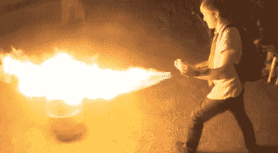

# 不要在家里尝试这是老生常谈的一个原因

> 原文：<https://hackaday.com/2017/04/19/dont-try-this-at-home-is-cliche-for-a-reason/>

哦，大声哭出来。那是最后一根稻草。我们已经看了太多危险的 YouTube 视频。我们真的被一个错误的反馈系统诅咒了吗？这个系统不公平地奖励在线视频中的危险行为？显然答案是肯定的。现在真正的问题变成了，我们能做些什么吗？

## 封闭球场上的职业车手

营销就是把东西放在消费者面前，让他们的大脑发出“太棒了！”。快速、响亮、闪亮、燃烧和锋利的东西都在这个任务的桌面上。这是你大脑的原始部分给你震动，就好像你的杏仁核忘记了如何逃离 saber tooths(saber teth？)并学会了如何点赞和订阅。

过去，人们在复制电视上看到的特技时会受伤甚至丧命。为了避免诉讼，公司开始添加免责声明——*不要在家里尝试*或我最喜欢的:*封闭课程上的职业司机*。

但问题是，商业广告是大生意。如果有人受伤了，在法庭上追究责任就能得到钱。当制作和分发视频内容的能力因互联网的到来而变得大众化时，我们失去了那些警告以及随之而来的常识。

追溯到 2009 年的这个遥控真车黑客事件，我一直无法摆脱在这样一个项目中缺乏对危险的考虑。我把它包括在标题里，标题以“(危险地)”结尾。虽然我没有因为这个标题的评论而受到指责，但我却因为倡导像头盔这样有争议的东西而受到指责，比如把你的身体绑在移动的物体上。在[这篇文章](https://hackaday.com/2009/10/18/1480w-scooter-motor-guarantees-head-trauma/)中的“头盔”上按 Ctrl-F 键，就能明白我的意思了。

这些黑客之所以这么做，是因为感觉棒极了，他们想记录下这种感觉。他们不是明星，他们是黑客，除了在 Hackaday 这样的地方，世界大多忽略了他们。我们可能会讨论缺乏安全措施的问题，但大多数人认为，任何有能力这样做的人都会认真考虑风险。这可能是一个错误的假设。

## 这都是关于潜艇的

从那以后，情况变得越来越糟。我不能把这一切都归咎于 YouTube，但我会努力的。有一天，YouTube 改变了一切。他们将简单的上传、巨大的可发现性和(最重要的)广告收入分成完美地结合在一起。对于一些人来说，这变成了一项业务，而不仅仅是一种与其他黑客社区联系的方式。

这是用户群的增长。这是一个恶性循环——你需要更多的人喜欢和订阅，这样他们的影响力就会将你的频道推向更多的人喜欢和订阅。问题是，最快的方法还是那个棘手的杏仁核。对一些人来说，这很有趣，但对另一些人来说，这是速度、火球和巨响，不考虑生命、肢体或眼球。

## 我们远非无可指责

我和其他人一样喜欢火球和跑车。我们当然已经发表了很多关于日益危险的黑客攻击的文章，让所有人都可以看到。例如，我们已经报道了几个来自[kreosan]的黑客攻击，像[在微波炉外微波东西](http://hackaday.com/2015/09/11/microwaving-things-outside-of-the-microwave/)和[建造一个微波枪](http://hackaday.com/2016/10/22/trio-of-magnetrons-power-a-microwave-rifle/)。

[Short sleeves and flamethrowers](http://hackaday.com/2014/05/30/furze-sets-fire-to-everything-with-pyro-gloves/). What could go wrong?

但即使是更主流的内容似乎也变得越来越危险。我们亲爱的[柯林·福尔泽]犯了危险的行为。他不仅在没有任何安全装置的情况下测试喷气发动机时烧伤了自己，而且[还将后果变成了另一个广告支持的视频](http://hackaday.com/2016/03/05/even-colin-furze-gets-burned/)。

这让我想到了压垮骆驼的那根稻草。这是一个基于伤害他人的想法的黑客。(幸运的是)这是一个蹩脚的机器人，它被设计用来识别人脸，并向它检测到的任何眼睛发射激光。从字面上看，它是用来射你的眼睛的。它使用红色激光，除非你故意盯着它不眨眼，否则可能不会对眼睛造成伤害，但视频中没有讨论这一点，不知道用不同的激光复制这一点的人很容易对他们的视力造成不可挽回的伤害。

## 火箭科学家运用常识，你也应该如此

我本打算用“这不是火箭科学”这个标题，但你不会看到火箭科学家穿着短袖和人字拖咯咯笑着跑开，通过点燃保险丝来测试新的发动机设计。那些聪明绝顶的人安全地躲在一个安全距离的掩体里，他们的手悬停在紧急关闭开关上，而消防设备挂在触手可及的地方。火箭科学家知道很多安全知识，你也应该知道。

这很简单。我们不需要发明任何东西来增加我们黑客的安全性。运用常识。为您的演示穿着合适的服装——根据具体情况，使用合理的防火服、头盔等。佩戴防护眼镜、激光护目镜和耳塞；无论何时需要。认真对待烟雾和微粒，佩戴呼吸装置。[在](http://hackaday.com/2016/12/06/hack-safely-fire-safety-in-the-home-shop/)周围放一个灭火器。如果您正在制作视频或发布相关图片(这是您绝对应该做的),请拍一张照片或给我们一个您选择的安全预防措施的快速视频剪辑。

我还是想在 YouTube 上看到牛逼的项目。但是我也想看到点击停止的危险趋势。让我们安全地做危险的事情。让我们注意那些安全措施。这种组合真是太棒了。

现在离开我的草坪，并系好安全带。