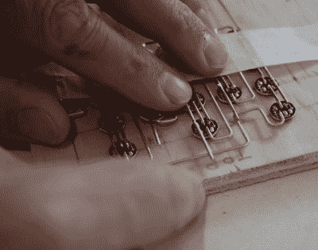

# 浮木二进制时钟不是空洞的成就

> 原文：<https://hackaday.com/2018/07/02/driftwood-binary-clock-is-no-hollow-achievement/>

是时候让我们在这里有另一个很棒的时钟了。[Mattaw]从 0 岁起就喜欢二进制时钟，他决定用浮木制作一个令人惊叹的时尚二进制时钟，浮木是大自然中可钻孔、可填充的外壳。

RGB 发光二极管上漂亮的布线工作是用 18g 铜做的。为了在焊接过程中保持发光二极管对齐，他钻了一个网格状的孔，深度足以让它们面朝下。有一个红外遥控器来设置时间，颜色和闹钟文件的选择，目前设置为 modem_sound.mp3。

在木头下面，有一对 Arduino Nanos，一个 mp3 解码板，和一个 RTC 模块。你会问为什么是两辆 Nanos？嗯，红外中断一直，呃，中断 LED 计时。远程功能是不可协商的，所以[mattaw]专门用一个 Nano 来接收远程命令，并串行传输到另一个 Nano。这里还有一个不错的触摸:在一个角落或缝隙中有一个 LDR，可以监控环境光，所以 led 永远不会太亮。别再等了，来看看吧——休息之后我们有 10 个视频。

信不信由你，这不是我们看到的第一个二进制时钟。[这个时钟的蜂蜜](https://hackaday.com/2018/05/26/watch-the-honeycomb-clock-gently-track-time/)使用 RGB 发光二极管告诉时间模拟风格。

 [https://www.youtube.com/embed/ZqCrlqB0cHU?version=3&rel=1&showsearch=0&showinfo=1&iv_load_policy=1&fs=1&hl=en-US&autohide=2&wmode=transparent](https://www.youtube.com/embed/ZqCrlqB0cHU?version=3&rel=1&showsearch=0&showinfo=1&iv_load_policy=1&fs=1&hl=en-US&autohide=2&wmode=transparent)

 [https://www.youtube.com/embed/vD0Ud94MTJ4?version=3&rel=1&showsearch=0&showinfo=1&iv_load_policy=1&fs=1&hl=en-US&autohide=2&wmode=transparent](https://www.youtube.com/embed/vD0Ud94MTJ4?version=3&rel=1&showsearch=0&showinfo=1&iv_load_policy=1&fs=1&hl=en-US&autohide=2&wmode=transparent)

