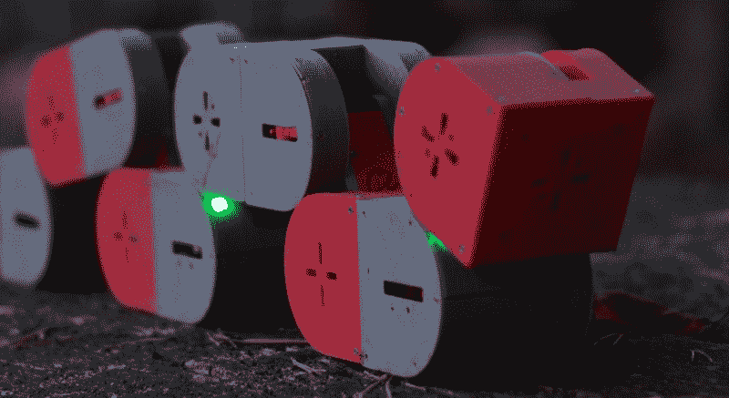
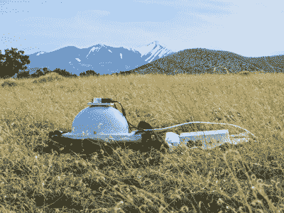
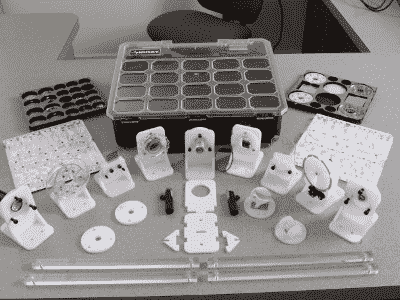

# Dtto Explorer 模块化机器人赢得 2016 年黑客日奖

> 原文：<https://hackaday.com/2016/11/05/dtto-explorer-modular-robot-wins-2016-hackaday-prize/>

Dtto，[一个以搜救为目的的模块化机器人](https://hackaday.io/project/9976-dtto-explorer-modular-robot)，刚刚被评为 2016 年黑客日奖的获奖者。除了该奖项的声望，Dtto 还将获得 150，000 美元的大奖以及在加州帕萨迪纳 Supplyframe 设计实验室的实习机会。

今年的[黑客日奖](https://hackaday.io/prize)在五轮挑战中有超过 1000 个完整的内容，要求人们*建造一些重要的东西*。我们来看看获得前五名的项目。他们举例说明了五个挑战主题:辅助技术，自动化，公民科学家，一切皆有可能，设计你的概念。

### [Dtto —探险家模块化机器人](https://hackaday.io/project/9976-dtto-explorer-modular-robot)

大奖获得者(150，000 美元和在 Supplyframe 设计实验室的居住权):Dtto 是一个模块化机器人，由 3D 打印零件、伺服电机、磁铁和随时可用的电子设备制成。每个模块由两个盒子组成，一边是圆形的，由一根横杆连接。利用磁体的吸引力，模块可以在许多不同的方向上彼此结合。各部分可以使用伺服电机自行分离。

Dtto 的突破性之处在于，它避开了传统的高成本任务，让世界各地的机器人专家和爱好者都可以进行模块化机器人实验。虽然很容易忽略这个概念，但是在测试期间由模块构建的[多种不同的机制充分体现了系统的强大功能。](https://youtu.be/1elP9JI4qFY)

### [负担得起的反射转换成像圆顶](https://hackaday.io/project/11951)

Second Place ($25,000): Reflectance Transformation Imaging is a method of photographing artifacts multiple times with a fixed camera location but changing lighting locations. When these images are combined into an interface after the fact, it allows for different textures, surface features, and material properties to be observed. Currently there are no commercial version of hardware available for this technique.

### [激光切割光学平台](https://hackaday.io/project/10707)

第三名(10，000 美元):光学工作台是一系列夹具，用于固定和精确对准光学实验的元件。传统上，这意味着高度专业化的设备，起价数万美元。但是学校、黑客空间和个人不需要顶级设备就可以开始学习光学。该项目为回收的光学器件和辅助材料设计了支架，以进行实验，甚至包括一个标准化的手提箱设计。